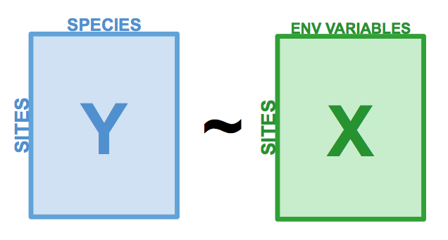

# Redundancy analysis

Redundancy Analysis (RDA) is a direct extension of multiple regression, as it models the effect of an explanatory matrix $X$ (n x p) on a response matrix $Y$ (n x m). The difference here is that we can model effect of an explanatory matrix on a **response *matrix***, rather than a single response variable. For example, RDA allows us to model the effect of environmental variables on the entire community, rather than on species richness. This is done by performing an ordination of $Y$ to obtain ordination axes that are linear combinations of the variables in $X$.

```{r, echo=FALSE, out.width="70%", fig.cap="The basic structure of a redundancy analysis (RDA).", fig.align="center", purl = FALSE}

```

Note that the explanatory variables in $X$ can be **quantitative, qualitative or binary variables**. If they are quantitative, explanatory variables in $X$ must be **centered**, **standardized** (if explanatory variables are in different units), **transformed** (to limit the skew of explanatory variables) or **normalized** (to linearize relationships) following the same principles as in PCA. Collinearity between the $X$ variables should also be reduced before RDA. We began this process while exploring the data: our community data is Hellinger-transformed, and our environmental variables are centered and standardized. However, we still have some collinearity issues that have not been solved.

Sometimes, we have more explanatory variables than we need to understand the drivers of our response variable. The best way to build a model is always to use **ecological reasoning** when determining which variables should be included or excluded. However, if there are still too many variables included in the model, or if some of them are highly collinear, explanatory variables can be selected by forward, backward or stepwise **selection** that remove non-significant explanatory variables. However, this approach should always be taken after the *ecological* selection of variables, according to your knowledge of the system. We will see more about this later!

## How the RDA works

Redundancy analysis as a two-step process [@legendre2012]. The first step is a multiple regression, where each object in $Y$ is regressed on the explanatory variables in $X$, which results in a matrix of fitted values $Y_{fit}$. This step is calculated through the following linear equation:

$$Y_{fit} = X[X'X]^{-1}X'Y$$

In the second step, we apply a principal components analysis (PCA) on the fitted matrix $Y_{fit}$ to reduce dimensionality, i.e. to obtain the eigenvalues and eigenvectors. We then obtain a matrix $Z$ which contains the canonical axes, which correspond to *linear* combinations of the explanatory variables in the space of $X$. The *linearity* of the combinations of the $X$ variables is a fundamental property of RDA. In the analysis of community composition, these canonical axes are interpreted as complex environmental gradients.

```{r ord-diagram, echo=FALSE, out.width="40%", fig.cap="The computation process of an RDA, from Legendre & Legendre (2012).", fig.align="center", purl = FALSE}
knitr::include_graphics("images/constrained_ord_diagram.png")
```

Once the RDA is computed, several statistics can be computed to interpret the explanatory power of the included variables and whether the observed relationships are significant. These include:

* $R^2$, which measures the strength of the canonical relationship between $Y$ and $X$ by calculating the proportion of the variation of $Y$ explained by the variables in $X$,  
* Adjusted $R^2$, which also measures the strength of the relationship between $Y$ and $X$, but applies a **correction** of the $R^2$ to take into account the number of explanatory variables. *This is the statistic that should be reported.*
* The F-statistic corresponds to an overall test of significance of an RDA by comparing the computed model to a null model. This test is based on the null hypothesis that the strength of the linear relationship calculated by the $R^2$ is not larger than the value that would be obtained for unrelated $Y$ and $X$ matrices of the same size. Note that F-statistics can also be used to sequentially test the significance of each canonical axis.

## Running an RDA in R

An RDA can be computed using the function `rda()` from the `vegan` package, as follows:

**Step 1**: Standardize and/or transform the data.

We already applied a Hellinger transformation to our community matrix, and standardized our explanatory variables in the section: \@ref(exploration). However, we noticed that the variable `das` was collinear with several other variables. We will begin by removing this variable:

```{r}
# We'll use our standardized environmental data, but we will remove 'das', which was correlated with many other variables:
env.z <- subset(env.z, select = -das)
```

**Step 2**: Run the RDA.
```{r}
# Model the effect of all environmental variables on fish community composition
spe.rda <- rda(spe.hel ~ ., data = env.z)
```

**Step 3**: Extract key results of the RDA.
```{r, eval = FALSE}
summary(spe.rda)
```

The first section of the summary contains the pieces we need to verify the performance of our RDA. Let us break it down:

```{r, output.lines = 5:9, echo = F}
summary(spe.rda)
```

* **Constrained Proportion**: variance of $Y$ explained by $X$ (73.41%)
* **Unconstrained Proportion**: unexplained variance in $Y$ (26.59%)

> How would you report these results? You could say: "The included environmental variables explain **73.41%** of the variation in fish community composition across sites."

The rest of the RDA summary is not printed here, because it is long. Aside from the section printed above, the summary contains:

* **Eigenvalues, and their contribution to the variance **  
* **Accumulated constrained eigenvalues**, including the cumulative proportion of explained variance by each axis in the final RDA ordination. These axes represent the rescaled environmental variables. If you need to select a subset of axes for other analyses, you can use this cumulative proportion to select the first few axes until you reach a threshold of your choice.  
* **Scores** for species, sites, and the explanatory variables, which are the coordinates of each of these objects in the RDA space. The default scaling is of type 2 (we will come back to this).


### Selecting variables

If we want to simplify this model, we can perform a forward selection (or backwards or stepwise). These types of selections help us select variables that are **statistically important**. *However, it is important to note that selecting variables ecologically is much more important than performing selection in this way. If a variable of ecological interest is not selected, this does not mean it has to be removed from the RDA.* 

Here, we will be performing forward selection on our 11 environmental variables. To do this, we can use the `ordiR2step()` function (or using the `forward.sel` function of package `packfor`):

```{r, echo = TRUE, eval = TRUE, message = FALSE}
# Forward selection of variables:
fwd.sel <- ordiR2step(rda(spe.hel ~ 1, data = env.z), # lower model limit (simple!)
               scope = formula(spe.rda), # upper model limit (the "full" model)
               direction = "forward",
               R2scope = TRUE, # can't surpass the "full" model's R2
               pstep = 1000,
               trace = FALSE) # change to TRUE to see the selection process!
```

> Here, we are essentially adding one variable at a time, and retaining it if it significantly increases the model's adjusted $R^2$.

**Which variables are retained by the forward selection?**
```{r}
# Check the new model with forward-selected variables
fwd.sel$call
```

**What is the adjusted R2 of the RDA with the selected variables?**
```{r}
# Write our new model
spe.rda.signif <- rda(spe.hel ~ alt + oxy + dbo, data = env.z)
# check the adjusted R2 (corrected for the number of explanatory variables)
RsquareAdj(spe.rda.signif)
```

The explanatory variables (altitude, oxygen and biological oxygen demand) now explain *59%* of the variance in $Y$ (species abundances across sites, or community composition). When we correct for the number of variables in $X$, the adjusted $R^2$ tells us that three selected variables explain *54%* of the variance in species abundances. 

> Because the adjusted $R^2$ is corrected for the number of explanatory variables, it is comparable across models and datasets. For this reason, you should report the adjusted $R^2$ when writing up the result of an RDA for an article, or in a study which compares the explanatory power of different models.


### Significance testing

The significance of your RDA can be tested using the function `anova.cca()`. 

```{r, output.lines = 6:9}
anova.cca(spe.rda.signif, step = 1000)
```

You can also test the significance of each variable with `by = "term"`.
```{r, output.lines = 6:11}
anova.cca(spe.rda.signif, step = 1000, by = "term")
```

You can also test the significance of each canonical axis with `by = "axis"`. Recall that these axes represent the variation in explanatory variables in fewer dimensions. 

```{r, output.lines = 6:11}
anova.cca(spe.rda.signif, step = 1000, by = "axis")
```

Our full model is statistically significant (p = 0.001), and every variable included in this model is significant as well (p = 0.001). Every canonical axis resulting from the RDA is also statistically significant (p = 0.001). 

### RDA plot

One of the most powerful aspects of RDA is the **simultaneous visualization** of your response and explanatory variables (*i.e.* species and environmental variables).

As with the PCA in (Workshop 9)[https://github.com/QCBSRworkshops/workshop09], there are two types of scaling:

| Type 1                                             | Type 2                                            |
| ---------------------------------------------------|---------------------------------------------------|
| Distances among objects reflect their similarities | Angles between variables reflect their correlation|

```{r, fig.show = "hold", out.width = "50%"}
# Type 1 scaling
ordiplot(spe.rda.signif, scaling = 1, type = "text")
# Type 2 scaling
ordiplot(spe.rda.signif, scaling = 2, type = "text")
```

<div class = "split">
<div class = "split-left">

***Scaling 1*** shows similarities between objects in the **response matrix**.  

* Sites (numbers) that are closer together have *more similar* communities.  
* Species that are closer together occupy more sites *in common*.  

</div>
<div class = "split-right">

***Scaling 2*** shows the effects of **explanatory variables**. 

* Longer arrows mean this variable *strongly* drives the variation in the community matrix.  
* Arrows pointing in opposite directions have a *negative* relationship.  
* Arrows pointing in the same direction have a *positive* relationship.  

</div>
</div>

#### Customizing RDA plots

Both `plot()` and `ordiplot()` make quick and simple ordination plots, but you can customize your plots by extracting scores with `scores()` and manually setting the aesthetics of `points()`, `text()`, and `arrows()`. Here is an example of a custom triplot. Feel free to play around with the colours and other parameters to make it your own!

```{r}
# Custom triplot code!

## extract % explained by the first 2 axes
perc <- round(100*(summary(spe.rda.signif)$cont$importance[2, 1:2]), 2)

## extract scores - these are coordinates in the RDA space
sc_si <- scores(spe.rda.signif, display="sites", choices=c(1,2), scaling=1)
sc_sp <- scores(spe.rda.signif, display="species", choices=c(1,2), scaling=1)
sc_bp <- scores(spe.rda.signif, display="bp", choices=c(1, 2), scaling=1)

## Custom triplot, step by step

# Set up a blank plot with scaling, axes, and labels
plot(spe.rda.signif,
     scaling = 1, # set scaling type 
     type = "none", # this excludes the plotting of any points from the results
     frame = FALSE,
     # set axis limits
     xlim = c(-1,1), 
     ylim = c(-1,1),
     # label the plot (title, and axes)
     main = "Triplot RDA - scaling 1",
     xlab = paste0("RDA1 (", perc[1], "%)"), 
     ylab = paste0("RDA2 (", perc[2], "%)") 
)
# add points for site scores
points(sc_si, 
       pch = 21, # set shape (here, circle with a fill colour)
       col = "black", # outline colour
       bg = "steelblue", # fill colour
       cex = 1.2) # size
# add points for species scores
points(sc_sp, 
       pch = 22, # set shape (here, square with a fill colour)
       col = "black",
       bg = "#f2bd33", 
       cex = 1.2)
# add text labels for species abbreviations
text(sc_sp + c(0.03, 0.09), # adjust text coordinates to avoid overlap with points 
     labels = rownames(sc_sp), 
     col = "grey40", 
     font = 2, # bold
     cex = 0.6)
# add arrows for effects of the expanatory variables
arrows(0,0, # start them from (0,0)
       sc_bp[,1], sc_bp[,2], # end them at the score value
       col = "red", 
       lwd = 3)
# add text labels for arrows
text(x = sc_bp[,1] -0.1, # adjust text coordinate to avoid overlap with arrow tip
     y = sc_bp[,2] - 0.03, 
     labels = rownames(sc_bp), 
     col = "red", 
     cex = 1, 
     font = 2)
```


## Challenge 1

```{r, echo = FALSE, eval = FALSE}
# Challenge 1: Run an RDA to model the effects of environmental variables on mite species abundances.
```

Run an RDA to model the effects of environmental variables on mite species abundances.

> The `mite` dataset is part of the `vegan` package, so you do not need to have it stored as a .csv in your repository.

To get started, load the `mite` data:
```{r}
# Load mite species abundance data
data("mite")

# Load environmental data
data("mite.env")
```

Recall some useful functions:
```{r, eval = FALSE}
decostand()
rda()
ordiR2step()
anova.cca()
ordiplot()
```

```{r, echo = FALSE, eval = FALSE}
# Challenge 1: Solution! Spoilers ahead!!
```

### Challenge 1: Solution

**Step 1:** Transform and standardize the data.
```{r}
# Hellinger transform the community data
mite.spe.hel <- decostand(mite, method = "hellinger")

# Standardize quantitative environmental data
mite.env$SubsDens <- decostand(mite.env$SubsDens, method = "standardize")
mite.env$WatrCont <- decostand(mite.env$WatrCont, method = "standardize")
```

**Step 2:** Select environmental variables.
```{r}
# Initial RDA with ALL of the environmental data
mite.spe.rda <- rda(mite.spe.hel ~ ., data = mite.env)

# Forward selection of environmental variables
fwd.sel <- ordiR2step(rda(mite.spe.hel ~ 1, data = mite.env),
                      scope = formula(mite.spe.rda),
                      direction = "forward",
                      R2scope = TRUE, pstep = 1000, trace = FALSE)
fwd.sel$call
```

**Step 3:** Run the RDA and check its explanatory power.

```{r}
# Re-run the RDA with the significant variables
mite.spe.rda.signif <- rda(mite.spe.hel ~ WatrCont + Shrub +
                           Substrate + Topo + SubsDens,
                           data = mite.env)

# Find the adjusted R2 of the model with the retained env variables
RsquareAdj(mite.spe.rda.signif)$adj.r.squared

```

**Step 4:** Test model significance.
```{r}
anova.cca(mite.spe.rda.signif, step = 1000)
```

We find that four explanatory variables are retained after forward selection: WatrCont, Shrub, Substrate, and Topo. The selected environmental variables significantly explain **43.7% (p = 0.001)** of the variation in mite species abundances.

**Step 5:** Plot the RDA results!

```{r, fig.show = "hold", out.width="50%"}
# Scaling 1
ordiplot(mite.spe.rda.signif,
         scaling = 1,
         main = "Mite RDA - Scaling 1")
# Scaling 2
ordiplot(mite.spe.rda.signif,
         scaling = 2,
         main = "Mite RDA - Scaling 2")
```
<div class = "split">
<div class = "split-left">

***Scaling 1*** shows similarities between objects in the **response matrix**.  

* The sites (black circles) are overall similar  
* A few species (red +) stand out from the cluster near the middle, meaning they do not occupy many sites in common with other species. These species might therefore be rare or unique in some ecological way. 

</div>
<div class = "split-right">

***Scaling 2*** shows the effects of **explanatory variables**. 

* Substrate density and water content have long arrows, and therefore strong effects
* Shrubs have an opposite effect to WatrCont and SubsDens, because Shrub arrows are in opposite directions to these variables. 
* Sites vary a lot in terms of SubsDens, and less in terms of WatrCont.

</div>
</div>