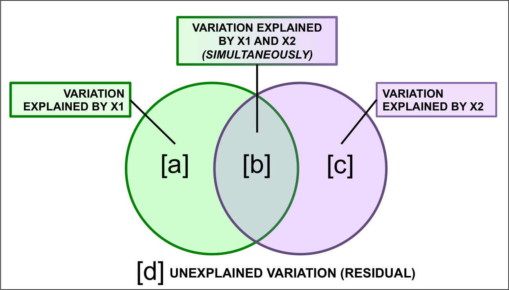

# Partitionnement de la variation

Le partitionnement de la variation est un type d'analyse qui combine à
la fois la RDA et la RDA partielle pour diviser la variation d'une
matrice de variable réponse en deux, trois ou quatre jeux de données
explicatives. Par exemple, on pourrait partitionner la variation dans une matrice de communauté en fonctiond e variables abiotiques et biotiques, ou de variables locales et à large
échelle.

```{r echo=FALSE, out.width="60%", fig.cap="La structure d'un partitionnement de la variation.", fig.align="center", purl = FALSE}
knitr::include_graphics("images/VarPart_Matrices.png")
```

Le résultat d'un partitionnement de la variation est
généralement représenté par un diagramme de Venn sur lequel sont annotés
les pourcentages de variance expliquée par chacun des jeux de données
explicatives. Dans le cas où on partionnerait la variation entre deux matrices explicatives, le résultat pourrait être représenté comme suit: 

```{r, echo=FALSE, out.width="80%", fig.cap="Représentation des résultats d'un partitionnement de la variation.", fig.align="center", purl = FALSE}

```

Ici, les fraction représentent:  

* **La fraction $[a + b + c]$** est la variance expliquée par *$X1$ *et* $X2$ ensemble, calculée à partir d'une RDA de $Y$ par $X1 + X2$.  
* **La fraction $[d]$** est la variance inexpliquée par *$X1$ *et* $X2$ ensemble, obtenue à partir de la même RDA que ci-dessus.  
* **La fraction $[a]$** est la variance expliquée par $X1$ *seulement*, calculée en faisant une RDA partielle de $Y$ par $X1 | X2$ (en contrôlant pour $X2$).    
* **La fraction $[c]$** est la variance expliquée par $X2$ *seulement*, calculée en faisant une RDA partielle de $Y$ par $X2 | X1$ (en contrôlant pour $X1$).    
* **La fraction $[b]$** est calculée par soustraction, c'est-à-dire $b = [a + b] + [b + c] - [a + b + c].$ Comme $[b]$ n'est pas le résultat d'une RDA, il est impossible de tester sa significativité. Elle peut également être négative, ce qui indique que la matrice de réponse est mieux expliquée par la combinaison de $X1$ et $X2$ que par l'une ou l'autre des matrices prise individuellement.

## Partitionnement de la variation dans R

Pour démontrer comment le partitionnement des variations fonctionne dans `R`, nous allons partitionner la variation de la composition des espèces de poissons entre les variables chimiques et topographiques. La fonction `varpart()` de `vegan` nous facilite la tâche. 

```{r}
# Partitionner la variation de la composition des espèces de poissons 
spe.part.all <- varpart(spe.hel, env.chem, env.topo)
spe.part.all$part # access results!
```

On peut ensuite visualiser les résultats avec la fonction `plot()`.

```{r, strip.white = TRUE, fig.width = 6, fig.height = 6}
# Visualiser les résultats avec un diagramme Venn
plot(spe.part.all,
     Xnames = c("Chem", "Topo"), # noms des matrices explicatives
     bg = c("seagreen3", "mediumpurple"), alpha = 80,
     digits = 2,
     cex = 1.5)
```

Les variables chimiques expliquent **24.1%** de la variation de la composition des espèces de poissons, les variables topographiques expliquent **11.2%** de la variation de la composition des espèces de poissons, et ces deux groupes de variables **conjointement** expliquent **23.3%** de la variation de la composition des espèces de poissons. 

:::explanation
Soyez prudent lorsque vous rapportez les résultats du partitionnement de la variation ! La fraction partagée [b] ne représente pas un effet *d'interaction* des deux matrices explicatives. Considérez-la comme un *chevauchement* entre $X1$ et $X2$. Elle représente la fraction *partagée* de la variation expliquée lorsque les deux sont incluses dans le modèle, c'est-à-dire la partie de la variation qui ne peut être attribuée à $X1$ ou $X2$ séparément. En d'autres termes, le partitionnement de la variation ne peut pas démêler les effets de la chimie et de la topographie pour 23.3% de la variation de la composition de la communauté de poissons.
:::

## Tester la significativité

La sortie de la fonction `varpart()` rapporte le $R^2$ ajusté pour chaque fraction, mais vous remarquerez que le tableau n'inclut aucun test de signification statistique. Cependant, la colonne `Testable` identifie les fractions qui peuvent être testées pour leur signification en utilisant la fonction `anova.cca()`, tout comme nous l'avons fait avec le RDA ! 

```{r, echo = FALSE, eval = FALSE}
# Tester la significativité
```

**X1 [a+b]: Chimie sans tenir compte de topographie**

```{r}
# [a+b] Chimie sans tenir compte de topographie
anova.cca(rda(spe.hel, env.chem))
```

**X2 [b+c] Topographie sans tenir compte de chimie**
```{r}
# [b+c] Topographie sans tenir compte de chimie
anova.cca(rda(spe.hel, env.topo))
```

**X1 | X2 [a] Chimie seulement (ajusté pour tenir compte de topographie)**
```{r}
# [a] Chimie seulement
anova.cca(rda(spe.hel, env.chem, env.topo))
```

> C'est une RDA partielle!

**X2 | X1 [c] Topographie (ajusté pour tenir compte de chimie)**
```{r}
# [c] Topographie seulement
anova.cca(rda(spe.hel, env.chem, env.topo))
```

Toutes les fractions testables dans le partitionnement de la variation sont statistiquement significatives!

## Défi 3

```{r, echo = FALSE, eval = FALSE}
# Défi 3

# Partitionnez la variation de l’abondance des espèces de mites entres des variables de substrat (`SubsDens`, `WatrCont`) et des variables spatiales significatives.
# * Quelle est la proportion de variance expliquée par le substrat? par l'espace?
# * Quelles sont les fractions significatives?
# * Diagramme Venn des résultats!
```

Partitionnez la variation de l’abondance des espèces de mites entres des variables de substrat (`SubsDens`, `WatrCont`) et des variables spatiales significatives.

* Quelle est la proportion de variance expliquée par le substrat? par l'espace?  
* Quelles sont les fractions significatives?  
* Diagramme Venn des résultats!  

Chargez les variables spatiales:
```{r}
data("mite.pcnm")
```

Rappel de fonctions utiles:
```{r, eval = FALSE}
ordiR2step()
varpart()
anova.cca(rda())
plot()
```

### Défi 3: Solution

```{r, echo = FALSE, eval = FALSE}
# Défi 3 - Solution! Spoilers ci-dessous!
```

**Étape 1:** Sélection de variables spatiales significatives.

Il y a *beaucoup* de variables spatiales dans ce jeu de données (22 !). Nous devrions sélectionner les plus importantes, pour éviter de surcharger le modèle.

```{r}
# Modèle RDA avec tous les variables spatiales
full.spat <- rda(mite.spe.hel ~ ., data = mite.pcnm)

# Sélection progressive des variables spatiales
spat.sel <- ordiR2step(rda(mite.spe.hel ~ 1, data = mite.pcnm),
               scope = formula(full.spat),
               R2scope = RsquareAdj(full.spat)$adj.r.squared,
               direction = "forward",
               trace = FALSE)
spat.sel$call
```

**Étape 2:** Créer sous-groupes de variables explicatives.

```{r}
# Variables de substrat
mite.subs <- subset(mite.env, select = c(SubsDens, WatrCont))

# Variables spatiales significatives
mite.spat <- subset(mite.pcnm,
                    select = names(spat.sel$terminfo$ordered))
                    # pour rapidement accèder aux variables sélectionnées
```

**Étape 3:** Partitionnement de la variation dans la matrice d'abondances.

```{r}
mite.part <- varpart(mite.spe.hel, mite.subs, mite.spat)
mite.part$part$indfract # extraire résultats
```

* Quelle est la proportion de variance expliquée par le substrat? **5.9%**
* Quelle est la proportion de variance expliquée par l'espace? **19.4%**

**Étape 4:** Quelles sont les fractions significatives?

**[a]: Substrat seulement**
```{r, output.lines = 5:8}
anova.cca(rda(mite.spe.hel, mite.subs, mite.spat))
```


**[c]: Espace seulement**
```{r, output.lines = 5:8}
anova.cca(rda(mite.spe.hel, mite.spat, mite.subs))
```

**Étape 5:** Visualiser les résultats avec un diagramme Venn.
```{r, fig.height=6, fig.width=6}
plot(mite.part,
     digits = 2,
     Xnames = c("Subs", "Space"), # titre des fractions
     cex = 1.5,
     bg = c("seagreen3", "mediumpurple"), # ajoutez des couleurs!
     alpha = 80)
```

**Alors, quels sont les effets de substrat et de l'espace sur les abondances d'espèces de mites?**

**Indice:** Pourquoi on trouve un effet si important de l'espace?

L'espace explique la plupart de la variation dans la communauté: elle explique **19.4% (p = 0.001)** de la variation seule, et **24.8%** est expliqué *conjointement* par l'espace et le substrat. Le susbtrat n'explique que **~6% (p = 0.001)** de la variation entre sites sans l'effet de l'espace. Notez également que la moitié de la variation n'est pas expliquée par les variables que nous avons incluses dans le modèle (regardez les résidus !), le modèle pourrait donc être amélioré.

> Cet effet élevé de l'espace *pourrait* être un signe qu'un processus écologique spatial est important ici (comme la dispersion, par exemple). *Cependant, il pourrait aussi nous indiquer que nous manquons une variable environnementale importante dans notre modèle, qui varie elle-même dans l'espace!