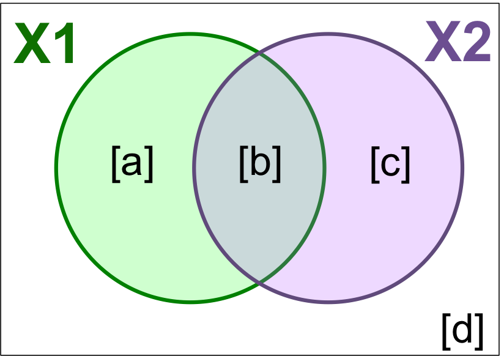
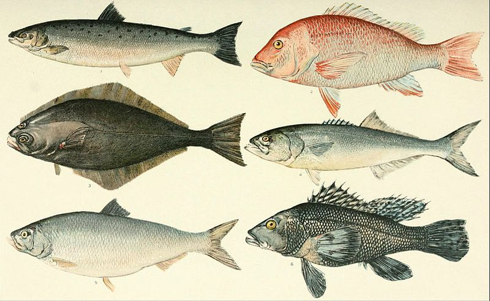

```{r setup, echo = FALSE}
knitr::opts_chunk$set(
  comment = "#",
  collapse = TRUE,
  warning = FALSE,
  message = FALSE,
  cache = FALSE,
  fig.width=6, fig.height=6,
  fig.retina = 3,
  fig.align = 'center'
)
options(repos=structure(c(CRAN="http://cran.r-project.org")))
```

```{r output-lines, echo = FALSE}
# sometimes cache needs to be set to true in the knitr setup chunk for this to take effect
# in xaringan::infinite_moon_reader()
library(knitr)
hook_output <- knit_hooks$get("output")
knit_hooks$set(output = function(x, options) {
   lines <- options$output.lines
   if (is.null(lines)) {
     return(hook_output(x, options))  # pass to default hook
   }
   x <- unlist(strsplit(x, "\n"))
   more <- "..."
   if (length(lines)==1) {        # first n lines
     if (length(x) > lines) {
       # truncate the output, but add ....
       x <- c(head(x, lines), more)
     }
   } else {
     x <- c(more, x[lines], more)
   }
   # paste these lines together
   x <- paste(c(x, ""), collapse = "\n")
   hook_output(x, options)
 })
```


class: inverse, center, middle

```{r install_pkgs, message=FALSE, warning=FALSE, include=FALSE, results=0}
# Standard procedure to check and install packages and their dependencies, if needed.

list.of.packages <- c("remotes", "Hmisc", "labdsv", "MASS", "vegan", "ggplot2")

new.packages <- list.of.packages[!(list.of.packages %in% installed.packages()[,"Package"])]

if(length(new.packages) > 0) {
  install.packages(new.packages, dependencies = TRUE)
  print(paste0("The following package was installed:", new.packages))
} else if(length(new.packages) == 0) {
    print("All packages were already installed previously")
  }

# Load all required libraries at once
lapply(list.of.packages, require, character.only = TRUE, quietly = TRUE)
```

# About this workshop

[](https://r.qcbs.ca/workshop10/pres-en/workshop10-pres-en.html)    [](https://r.qcbs.ca/workshop10/book-en/workshop10-script-en.R) 
[](https://r.qcbs.ca/workshop10/book-en/index.html)
[](https://r.qcbs.ca/workshops/r-workshop-09/)
[](https://github.com/QCBSRworkshops/workshop10)

---

<p style="font-size:75%">

.center[
**QCBS members who contributed to this workshop**

by modifying and improving its content as part of the <br> *Le*arning *a*nd *D*evelopment *A*ward
]


.pull-left[
.right[

**2022** - **2021** - **2020**

Mathieu Vaillancourt

Katherine Hébert

Pedro Henrique P. Braga

Gabriel Muñoz

Kevin Cazelles

Marie Hélène Brice  


**2019** - **2018** - **2017**

Marie Hélène-Brice

Pedro Henrique P. Braga

Katherine Hébert

<br>
]
]

.pull-right[
.left[

**2016** - **2015** - **2014**

Monica Granados

Emmanuelle Chrétien

Bérenger Bourgeois

Amanda Winegardner

Xavier Giroux-Bougard

Vincent Fugère

]
]
</p>


<br>
.center[
__If you would like to contribute too__, visit [r.qcbs.ca/contributing](https://r.qcbs.ca/contributing/) <br> and don't hesitate to [get in touch](mailto:qcbs.csbq.r@gmail.com) with us!
]

---

# Required material

This workshop requires the latest [RStudio](https://rstudio.com/products/rstudio/download/#download) and [R](https://cran.rstudio.com/) versions.

You must also install and load these packages:

* [Hmisc](https://cran.r-project.org/package=Hmisc)
* [labdsv](https://cran.r-project.org/package=labdsv)
* [MASS](https://cran.r-project.org/package=MASS)
* [vegan](https://cran.r-project.org/package=vegan)
* [ggplot2](https://cran.r-project.org/package=ggplot2)

<br>

```R
install.packages(c('Hmisc', 'labdsv', 'MASS', 'vegan', 'ggplot2'))
```

<br>
You can download this workshop's datasets from [r.qcbs.ca/workshops/r-workshop-10](http://r.qcbs.ca/workshops/r-workshop-10/).


---
# Learning objectives

__Objective__: Perform advanced multivariate analyses on community data. 

--

<br>

Using constrained ordination methods, we will learn:


- To explore how environmental variables may be __driving__ patterns in species assemblage across sites.

--

- To __describe and predict__ relationships between community composition data and environmental variables.


---
class: inverse, center, middle

## Introduction


---

## Introduction

This workshop is an extension of Workshop 9, which covered the basics of unconstrained analyses:

* Distance metrics and transformations
* Hierarchical clustering
* Unconstrained ordinations (PCA, PCoA, CA, nmDS)

These identify ***patterns*** in community composition data or in descriptors, without exploring how environmental variables could be ***driving*** these patterns.

---
# Introduction

In this workshop, we will focus instead on .alert[**constrained**] analyses:

* Redundancy analysis (RDA)
* Partial redundancy analysis
* Variation partitioning
* Linear discriminant analysis (LDA)

These analyses allow us to **describe** and **predict** relationships between community composition data and environmental variables. (This means we can ***test hypotheses***!)

???
Other methods that were excluded for 3 hour workshop format, but are in the book
Multivariate regression tree (MRT)

---
# Download today's script and data

All workshop materials are found at [github.com/QCBSRworkshops/workshop10](https://github.com/QCBSRworkshops/workshop10).

For this workshop, you will need:
* [R script](https://qcbsrworkshops.github.io/workshop10/book-en/workshop10-script-en.R)
* Data:
  * [DoubsEnv](https://raw.githubusercontent.com/QCBSRworkshops/workshop10/main/pres-en/data/doubsenv.csv)
  * [DoubsSpe](https://raw.githubusercontent.com/QCBSRworkshops/workshop10/main/pres-en/data/doubsspe.csv)
  * [DoubsSpa](https://raw.githubusercontent.com/QCBSRworkshops/workshop10/main/pres-en/data/doubsspa.csv)
  * [Test data for linear discriminant analyses](https://raw.githubusercontent.com/QCBSRworkshops/workshop10/main/pres-en/data/classifyme.csv)

<br><br><br><br><br><br><br>
.small[.comment[To download the data, do right click + save on the page that opens.]]

---
# Required packages

Please make sure you have downloaded, installed, and loaded these packages:

* [Hmisc](https://cran.r-project.org/package=Hmisc)
* [labdsv](https://cran.r-project.org/package=labdsv)
* [MASS](https://cran.r-project.org/package=MASS)
* [vegan](https://cran.r-project.org/package=vegan)

???
Unused packages in 3-hr version:
mvpart package .alert[(from wiki)]

---
# Follow along!

As always, we recommend that you:
* create your own script (or add comments to the provided script);
* avoid copy-pasting or running the code directly from the script;
* remember to set the working directory to the folder in which your files are stored.

---

class: inverse, center, middle

# Data exploration & preparation

---
# Today's data:

#### Doubs River Fish Dataset (Verneaux 1973)

.pull-left[Description of fish communities along the Doubs River:
 * 27 species
 * 30 sites
 * 11 environmental variables


 ]

.pull-right[

]

---
# Load the Doubs River dataset

.alert[Make sure the datasets are in your working directory!]

Load the species data (`doubsspe.csv`):

```{r, echo = TRUE}
# Make sure the files are in your working directory!
spe <- read.csv("data/doubsspe.csv", row.names = 1)
spe <- spe[-8,] # remove site with no data
```

Load the environmental data (`doubsenv.csv`):

```{r, echo = TRUE}
env <- read.csv("data/doubsenv.csv", row.names = 1)
env <- env[-8,] # remove site with no data
```

.alert[Note]: Only execute once!

---
# Exploring the fish community dataset

Let's briefly explore the fish community dataset:
```{r, echo = TRUE}
names(spe) # names of objects (species)
dim(spe) # dataset dimensions
```

Let's take a closer look at the objects (species):
```{r, echo = TRUE, results = 'hide'}
head(spe) # look at first 5 rows
str(spe) # structure of objects in dataset
summary(spe) # summary statistics for all objects (min, mean, max, etc.)
```

---
# Distribution of species frequencies

Let's take a quick look at how the community is structured.

```{r, echo = TRUE, results = 'hide', fig.width = 6, fig.height = 3.5}
# Count number of species frequencies in each abundance class
ab <- table(unlist(spe))
# Plot distribution of species frequencies
barplot(ab, las = 1, # make axis labels perpendicular to axis
        xlab = "Abundance class", ylab = "Frequency", # label axes
        col = grey(5:0/5)) # 5-colour gradient for the bars
```
.alert[Notice]: There are many 0s!

---
# Distribution of species frequencies

How many 0s are in the dataset?
```{r}
sum(spe == 0)
```
<br>
What proportion of the dataset does that represent?
```{r}
sum(spe==0)/(nrow(spe)*ncol(spe))
```

---
# Transforming the community data

.alert[**Over 50%**] of our dataset consists of 0s, which is common in community datasets.

--

However, we don't want these common absences to **artificially increase** the similarity between sites.
* To avoid this, we can .alert[transform] the community data.


Let's use the .alert[Hellinger] transformation:
```{r}
# The decostand() function in the vegan package makes this easy for us:
library(vegan)
spe.hel <- decostand(spe, method = "hellinger")
```

---
# Exploring the environmental dataset

Let's briefly explore the environmental dataset:
```{r, echo = TRUE}
names(env) # names of objects (environmental variables)
dim(env) # dataset dimensions
head(env) # look at first 5 rows
```

For a closer look at the objects (environmental variables):
```{r, echo = TRUE, results = 'hide'}
str(env) # structure of objects in dataset
summary(env) # summary statistics for all objects (min, mean, max, etc.)
```

---
# Collinearity

.small[
```{r, fig.height = 4, fig.width = 8}
# We can visually look for correlations between variables:
heatmap(abs(cor(env)), ## Compute pearson correlation (note they are absolute values)
        col = rev(heat.colors(6)), 
        Colv = NA, Rowv = NA)
legend("topright", 
       title = "Absolute Pearson R",
       legend =  round(seq(0,1, length.out = 6),1),
       y.intersp = 0.7, bty = "n",
       fill = rev(heat.colors(6)))
```
]
.alert[Note:] Some variables look correlated... .small[(das vs. alt, das vs. deb, das vs. dur, das vs. nit, oxy vs. dbo, etc.)]

---
# Standardizing the environmental variables

You cannot compare the effects of variables with different units.

Before moving on to further analyses, .alert[standardizing] your environmental variables is therefore crucial.

```{r}
# Scale and center variables
env.z <- decostand(env, method = "standardize")

# Variables are now centered around a mean of 0:
round(apply(env.z, 2, mean), 1)

# and scaled to have a standard deviation of 1
apply(env.z, 2, sd)
```

---

class: inverse, center, middle

# Canonical analyses

---
# Canonical analyses

Canonical analyses allow us to:
- identify **relationships** between a response matrix and explanatory matrix/matrices
- test .alert[hypotheses] about these relationships
- make predictions

---

class: inverse, center, middle

# Canonical analyses
## Redundancy analysis (RDA)

---
# Redundancy analysis (RDA)

RDA is constrained ordination.
- RDA is a direct extension of multiple regression.
- RDA models the effect of an explanatory matrix on a response matrix
   .comment[.small[(instead of a single response variable)].]

.center[ ]

Variables can be quantitative, qualitative, or binary (0/1).
- .alert[transform] and/or .alert[standardize] them prior to running an RDA.

---
# Running an RDA in R

**Step 1**: Standardize and/or transform the data.

```{r}
# We'll use our standardized environmental data
# But we will remove 'das', which was correlated with many other variables:
env.z <- subset(env.z, select = -das)
```

--

**Step 2**: Run the RDA.
```{r}
# Model the effect of all environmental variables on fish community composition
spe.rda <- rda(spe.hel ~ ., data = env.z)
```

--

**Step 3 **: Extract key results of the RDA.
```{r, output.lines = 5:9}
summary(spe.rda)
```

---
# RDA output in R

Let us take a closer look at the RDA summary:

```{r, output.lines = 5:9, echo = FALSE}
summary(spe.rda)
```

<br>
* **Constrained Proportion**: variance of $Y$ explained by $X$ .alert[(73.41%)]
* **Unconstrained Proportion**: unexplained variance in $Y$ .alert[(26.59%)]

<br><br>
How would you report these results?

--

* .comment[The included environmental variables explain .alert[73.41%] of the variation in fish community composition across sites.]

---
# Selecting variables

Using .alert[forward selection], we can select the explanatory variables that are statistically "important".

<br>
**Which variables significantly contribute to our model's explanatory power?**

--
<br>
```{r}
# Forward selection of variables:
fwd.sel <- ordiR2step(rda(spe.hel ~ 1, data = env.z), # lower model limit (simple!)
               scope = formula(spe.rda), # upper model limit (the "full" model)
               direction = "forward",
               R2scope = TRUE, # can't surpass the "full" model's R2
               pstep = 1000,
               trace = FALSE) # change to TRUE to see the selection process!
```

.small[Here, we are essentially adding one variable at a time, and retaining it if it significantly increases the model's adjusted R2.]

???

Note that selecting variables ecologically is much more important than doing forward selection in this way. If a variable of ecological interest is not selected, this does not mean it has to be removed in every case.

---
# Selecting variables

- Which variables are retained by the forward selection?
```{r}
# Check the new model with forward-selected variables
fwd.sel$call
```

--
<br>
- What is the adjusted R2 of the RDA with the selected variables?
```{r}
# Write our new model
spe.rda.signif <- rda(spe.hel ~ alt + oxy + dbo, data = env.z)
# check the adjusted R2
RsquareAdj(spe.rda.signif)
```

---
# Significance testing

Use `anova.cca()` to test the significance of your RDA.
```{r, output.lines = 6:9}
anova.cca(spe.rda.signif, step = 1000)
```

You can also test the significance of each variable with `by = "term"`!
```{r, output.lines = 6:11}
anova.cca(spe.rda.signif, step = 1000, by = "term")
```

---
# RDA plot

One of the most powerful aspects of RDA is the **simultaneous visualization** of your response and explanatory variables .comment[(i.e. species and environmental variables)].
<br>
--
<br>
There are 2 scaling options:
<br>

| Type 1                                             | Type 2                                            |
| ---------------------------------------------------|---------------------------------------------------|
| distances among objects reflect their similarities | angles between variables reflect their correlation|


---
# RDA plot: Type 1

.pull-left[
```{r, fig.height = 6.5, fig.width = 6, strip.white = TRUE}
ordiplot(spe.rda.signif,
         scaling = 1,
         type = "text")
```
]

.pull-right[
######Scaling 1 shows similarities between objects in the **response matrix**.

.small[
* Sites (numbers) that are .alert[closer together] have *more similar* communities.
* Species that are .alert[closer together] occupy more sites *in common*.
]
]
---
# RDA plot: Type 2

.pull-left[
```{r, fig.height = 6.5, fig.width = 6, strip.white = TRUE}
ordiplot(spe.rda.signif,
         scaling = 2,
         type = "text")
```
]

.pull-right[
######Scaling 2 shows the effects of **explanatory variables**.
.small[
* .alert[Longer] arrows mean this variable *strongly* drives the variation in the community matrix.
* Arrows pointing in .alert[opposite directions] have a *negative* relationship.
* Arrows pointing in the .alert[same direction] have a *positive* relationship.
]
]

---
# Customizing RDA plots

Both `plot()` and `ordiplot()` make quick and simple ordination plots, but you can customize your plots by extracting scores with `scores()` and manually setting the aesthetics of `points()`, `text()`, and `arrows()`.

```{r, echo = FALSE}
## extract % explained by the first 2 axes
perc <- round(100*(summary(spe.rda.signif)$cont$importance[2, 1:2]), 2)

## extract scores - these are coordinates in the RDA space
sc_si <- scores(spe.rda.signif, display="sites", choices=c(1,2), scaling=1)
sc_sp <- scores(spe.rda.signif, display="species", choices=c(1,2), scaling=1)
sc_bp <- scores(spe.rda.signif, display="bp", choices=c(1, 2), scaling=1)

## Custom triplot, step by step

# Set up a blank plot with scaling, axes, and labels
plot(spe.rda.signif,
     scaling = 1, # set scaling type 
     type = "none", # this excludes the plotting of any points from the results
     frame = FALSE,
     # set axis limits
     xlim = c(-1,1), 
     ylim = c(-1,1),
     # label the plot (title, and axes)
     main = "Triplot RDA - scaling 1",
     xlab = paste0("RDA1 (", perc[1], "%)"), 
     ylab = paste0("RDA2 (", perc[2], "%)") 
)
# add points for site scores
points(sc_si, 
       pch = 21, # set shape (here, circle with a fill colour)
       col = "black", # outline colour
       bg = "steelblue", # fill colour
       cex = 1.2) # size
# add points for species scores
points(sc_sp, 
       pch = 22, # set shape (here, square with a fill colour)
       col = "black",
       bg = "#f2bd33", 
       cex = 1.2)
# add text labels for species abbreviations
text(sc_sp + c(0.03, 0.09), # adjust text coordinates to avoid overlap with points 
     labels = rownames(sc_sp), 
     col = "grey40", 
     font = 2, # bold
     cex = 0.6)
# add arrows for effects of the expanatory variables
arrows(0,0, # start them from (0,0)
       sc_bp[,1], sc_bp[,2], # end them at the score value
       col = "red", 
       lwd = 3)
# add text labels for arrows
text(x = sc_bp[,1] -0.1, # adjust text coordinate to avoid overlap with arrow tip
     y = sc_bp[,2] - 0.03, 
     labels = rownames(sc_bp), 
     col = "red", 
     cex = 1, 
     font = 2)
```

See Workshop 10's script or the [book](https://qcbsrworkshops.github.io/workshop10/book-en/index.html) for more details!

---
# Challenge 1 

Run an RDA to model the effects of environmental variables on mite species abundances.

<br>
.small[
First, load the mite data:
```{r}
# Load mite species abundance data
data("mite")

# Load environmental data
data("mite.env")
```

Recall some useful functions:
```{r, eval = FALSE}
decostand()
rda()
ordiR2step()
anova.cca()
ordiplot()
```
]

---
# Challenge 1: Solution

**Step 1:** Transform and standardize the data.
```{r}
# Hellinger transform the community data
mite.spe.hel <- decostand(mite, method = "hellinger")

# Standardize quantitative environmental data
mite.env$SubsDens <- decostand(mite.env$SubsDens, method = "standardize")
mite.env$WatrCont <- decostand(mite.env$WatrCont, method = "standardize")
```

---
# Challenge 1: Solution

**Step 2:** Select environmental variables.
```{r}
# Initial RDA with ALL of the environmental data
mite.spe.rda <- rda(mite.spe.hel ~ ., data = mite.env)

# Forward selection of environmental variables
fwd.sel <- ordiR2step(rda(mite.spe.hel ~ 1, data = mite.env),
                      scope = formula(mite.spe.rda),
                      direction = "forward",
                      R2scope = TRUE, pstep = 1000, trace = FALSE)
fwd.sel$call
```

---
# Challenge 1: Solution

**Step 3:** Run RDA and check its explanatory power.

```{r}
# Re-run the RDA with the significant variables
mite.spe.rda.signif <- rda(mite.spe.hel ~ WatrCont + Shrub +
                           Substrate + Topo + SubsDens,
                           data = mite.env)

# Find the adjusted R2 of the model with the retained env variables
RsquareAdj(mite.spe.rda.signif)$adj.r.squared

```

---
# Challenge 1: Solution

**Step 4:** Test model significance.
```{r}
anova.cca(mite.spe.rda.signif, step = 1000)
```

The selected environmental variables significantly explain .alert[43.7% (p = 0.001)] of the variation in mite species abundances.

---
# Challenge 1: Solution

**Step 5:** Plot the RDA results!
.pull-left[
```{r, fig.height = 6, fig.width = 5.8}
ordiplot(mite.spe.rda.signif,
         scaling = 1,
         frame = F,
         main = "Mite RDA - Scaling 1")
```
]
.pull-right[
```{r, fig.height = 5.8, fig.width = 6}
ordiplot(mite.spe.rda.signif,
         scaling = 2,
         frame = F,  
         main = "Mite RDA - Scaling 2")
```
]

---

class: inverse, center, middle

# Canonical analyses
## Partial RDA

---
# Partial RDA

The partial RDA is a special case of RDA that allows you to control for **covariates**.

In other words, we can model the linear effects of matrix $X$ on matrix $Y$ *while* controlling for a matrix $W$ of covariates.

.center[ ]

---
# Applications of partial RDA

Because partial RDA allows us to control for covariates, we can:
* Assess effects of environmental variables on community composition while accounting for variation that **isn't** the focus of the study.
* **Isolate** the effect of one or more groups of explanatory variables

.center[ ]

--
.center[.comment[Partial RDA is often used in community ecology to separate the effects of environmental variables from the effect of spatial variables.]]

---
# Example: Partial RDA on Doubs River data

In `R`, we can run a partial RDA using the `rda()` function.

As a demonstration, let's assess the effect of water chemistry on fish species abundances (`spe.hel`) while controlling for the effect of topography.

```{r}
# Subset environmental data into topography variables and chemistry variables
env.topo <- subset(env.z, select = c(alt, pen, deb))
env.chem <- subset(env.z, select = c(pH, dur, pho, nit, amm, oxy, dbo))

# Run a partial RDA
spe.partial.rda <- rda(spe.hel, env.chem, env.topo)
```

--

<br>
.small[
**Note:** You can also use a formula syntax like `Y ~ X + Condition(W)`, where `Condition()` allows you to control for covariates.

```{r, eval = FALSE}
# Alternative syntax for the partial RDA:
spe.partial.rda <- rda(spe.hel ~ pH + dur + pho + nit + amm + oxy + dbo + # these are the effects we are interested in
                       Condition(alt + pen + deb), # these are the covariates
                       data = env.z)
```
]

---
# Interpreting partial RDA output in `R`

```{r, eval = TRUE, collapse=FALSE, output.lines=(5:10)}
summary(spe.partial.rda)
```
<br>

* **Conditioned Proportion**: variance of $Y$ explained by $W$ .alert[(41.53%)]
* **Constrained Proportion**: variance of $Y$ explained by $X$ .alert[(31.89%)]
* **Unconstained Proportion**: unexplained variance in $Y$ .alert[(26.59%)]
<br>
<br>
.center[How would you report these results?]

--

.center[.comment[Water chemistry explains 31.9% of the variation in fish community composition across sites, while topography explains 41.5% of this variation.]]


---
# Interpreting a partial RDA in `R`

We are still missing some important details for our interpretation of this model!
<br>
<br>
.pull-left2[
1\. What is the model's **explanatory power**?
```{r}
# Extract the model's adjusted R2
RsquareAdj(spe.partial.rda)$adj.r.squared
```
]

--

.pull-right2[
<br>
<br>
.small[.comment[Our model explains .alert[24.1%] of the variation in fish abundance across sites.]]
]

--

.pull-left2[
2\. Is the model **statistically significant**?
```{r output.lines=-c(2,9,10)}
# Test whether the model is statistically significant
anova.cca(spe.partial.rda, step = 1000)
```
]

--

.pull-right2[
<br>
<br>
.small[.comment[It is also statistically significant (.alert[p = 0.001])!]]
]

---
# Plot the partial RDA

We can visualise the effects of the environmental variables on the fish community with the `ordiplot()` function.

.small[
```{r, fig.height=4.5, fig.width=4.5}
ordiplot(spe.partial.rda, 
         scaling = 2,
         frame = FALSE, 
         main = "Doubs River partial RDA - Scaling 2")
```
]

--

.alert[Note]: The topography variables (covariates) aren't plotted. Why is that?

???

Scaling 2 shows the effects of explanatory variables, meaning it shows the effects of the X matrix on the Y matrix (after the effect of matrix W has been controlled for). The covariates are only controlled for, so they do not show up in the scaling 2 biplot.

Recall: In scaling 2, arrow length shows effect size, arrow direction shows the direction of the relationship (opposite directions means the variables have a negative relationship, while same direction indicates a positive relationship)

---
# Challenge 2 

.small[
Run a partial RDA to model the effects of environmental variables on mite species abundances (`mite.spe.hel`), while controlling for substrate variables (`SubsDens`, `WatrCont`, and `Substrate`).
* What is the variance explained by substrate variables?
* Is the model significant?
* Which axes are significant?

<br>

Recall some useful functions:
```{r, eval = FALSE}
rda()
summary()
RsquareAdj()
anova.cca() # hint: see the 'by' argument in ?anova.cca
```
]

---
# Challenge 2: Solution

**Step 1:** Transform and standardize the data.

.comment[Our datasets have already been transformed and standardized!]


**Step 2:** Run a partial RDA.

```{r, output.lines=c(5:10)}
# Compute partial RDA
mite.spe.subs <- rda(mite.spe.hel ~ Shrub + Topo
                     + Condition(SubsDens + WatrCont + Substrate),
                     data = mite.env)

# Check summary
summary(mite.spe.subs)
```
--
Shrub and Topo explain .alert[9.8%] of the variation in mite species abundances, while substrate covariables explain .alert[42.8%] of this variation.

---
# Challenge 2: Solution

**Step 3:** Interpret the results!

* What is the variance explained by substrate variables?
```{r}
RsquareAdj(mite.spe.subs)$adj.r.squared
```
--
<br>
* Is the model significant?
```{r}
anova.cca(mite.spe.subs, step = 1000)
```

---
# Challenge 2: Solution

* Which axes are significant?
```{r}
anova.cca(mite.spe.subs, step = 1000, by = "axis")
```

---

class: inverse, center, middle

# Canonical analyses
## Variation partitioning

---
# Variation partitioning

Partitions the variation of response variables among 2, 3, or 4 explanatory datasets.
* e.g. large-scale and small-scale
* e.g. abiotic and biotic


.center[]

---
# Variation partitioning

.center[]

---
# Variation partitioning in R

To demonstrate how variation partitioning works in `R`, let us partition the variation of fish species composition between chemical and physiographic variables.

.small[.alert[Note]: Make sure you've loaded the `vegan` package!

```{r}
spe.part.all <- varpart(spe.hel, env.chem, env.topo)
spe.part.all$part # access results!
```
]

---
# Variation partitioning plot

```{r, strip.white = TRUE, fig.width = 6, fig.height = 6}
plot(spe.part.all,
     Xnames = c("Chem", "Topo"), # name the partitions
     bg = c("seagreen3", "mediumpurple"), alpha = 80, # colour the circles
     digits = 2, # only show 2 digits
     cex = 1.5)
```

---
# Significance testing

.center[]

* The shared fraction [b] .alert[cannot] be tested for significance.
* But, we can test the significance of the remaining fractions!

???
The adjusted-R2 of fraction [b] cannot be tested for significance, because it is the result of subtracting and adding other adjusted-R2's from partial RDAs, "behind the scenes". It can also be negative, which indicates that the response matrix is better explained by the combination of X1 and X2 than by either matrix on its own.

---
# Significance testing: X1 [a+b]

.center[]

.small[
```{r}
# [a+b] Chemistry without controlling for topography
anova.cca(rda(spe.hel, env.chem))
```
]

---
# Significance testing: X2 [b+c]

.center[]

.small[
```{r}
# [b+c] Topography without controlling for chemistry
anova.cca(rda(spe.hel, env.topo))
```
]

---
# Significance testing: Individual fractions

.center[]
.small[
```{r}
# [a] Chemistry alone
anova.cca(rda(spe.hel, env.chem, env.topo))
```

.alert[Note:] Recognize this? It's a partial RDA!
]
---
# Significance testing: Individual fractions

.center[]

.small[
```{r}
# [c] Topography alone
anova.cca(rda(spe.hel, env.topo, env.chem))
```
]

---
# Challenge 3 

.small[
**Partition the variation in the mite species data according to substrate variables (`SubsDens`, `WatrCont`) and significant spatial variables.**
* What proportion of the variation is explained by substrate variables? By space?
* Which individual fractions are significant?
* Plot your results!


Load the spatial variables:
```{r}
data("mite.pcnm")
```

Recall some useful functions:
```{r, eval = FALSE}
ordiR2step()
varpart()
anova.cca(rda())
plot()
```
]

---
# Challenge 3: Solution

**Step 1:** Forward selection of significant spatial variables.

```{r}
# Write full RDA model with all variables
full.spat <- rda(mite.spe.hel ~ ., data = mite.pcnm)

# Forward selection of spatial variables
spat.sel <- ordiR2step(rda(mite.spe.hel ~ 1, data = mite.pcnm),
               scope = formula(full.spat),
               R2scope = RsquareAdj(full.spat)$adj.r.squared,
               direction = "forward",
               trace = FALSE)
spat.sel$call
```

---
# Challenge 3: Solution

**Step 2:** Group variables of interest.

```{r}
# Subset environmental data to retain only substrate variables
mite.subs <- subset(mite.env, select = c(SubsDens, WatrCont))

# Subset to keep only selected spatial variables
mite.spat <- subset(mite.pcnm,
                    select = names(spat.sel$terminfo$ordered))
                    # a faster way to access the selected variables!
```

---
# Challenge 3: Solution

**Step 3:** Partition the variation in species abundances.
```{r}
mite.part <- varpart(mite.spe.hel, mite.subs, mite.spat)
mite.part$part$indfract # access results!
```

* What proportion of the variation is explained by substrate variables?
 * .alert[5.9%]

* What proportion of the variation is explained by spatial variables?
  * .alert[19.4%]

---
# Challenge 3: Solution

**Step 4:** Which individual fractions are significant?
<br><br>

**[a]: Substrate only**
```{r, output.lines = 5:8}
anova.cca(rda(mite.spe.hel, mite.subs, mite.spat))
```


**[c]: Space only**
```{r, output.lines = 5:8}
anova.cca(rda(mite.spe.hel, mite.spat, mite.subs))
```


---
# Challenge 3: Solution

**Step 5:** Plot the variation partitioning results.

```{r, fig.height=5.5, fig.width=6}
plot(mite.part, 
     digits = 2, 
     Xnames = c("Subs", "Space"), # label the fractions
     cex = 1.5,
     bg = c("seagreen3", "mediumpurple"), # add colour!
     alpha = 80) # adjust transparency
```

---
# Challenge 3: Solution

**So, what can we say about the effects of substrate and space on mite species abundances?**

In breakout rooms, summarise and interpret these results as if you were writing an article. 
**Hint:** Why is the model showing such an important effect of space?

--

<br>.comment[
Space explains a lot of the variation in species abundances here: **19.4%** of the variation is explained by space alone, and **24.8%** is *jointly* explained by space and substrate. Substrate only explains **~6%** of the variation in community composition across sites on its own!

Space could be so important because:
* some spatial ecological process is at work, like dispersal
* or, some unmeasured variable might be important, and vary in space
]

???

Breakout rooms: 5-10 minutes. 

Answer: This large effect of space *could* be a sign that some spatial ecological process is important here (like dispersal, for example). *However*, it could also be telling us that we are missing an important environmental variable in our model, which itself varies in space!

Also note that half of the variation is not explained by the variables we included in the model (look at the residuals!), so the model could be improved 

---
class: inverse, center, middle

exclude: true

# Multivariate regression tree (MRT)

---
exclude: true

# Multivariate regression tree (MRT)

.center[]

MRT is a constrained clustering technique.
* Splits a response matrix (Y) into clusters based on thresholds of explanatory variables (X)

---
exclude: true

# Multivariate regression tree (MRT)

.center[]

An MRT consists of:
* .alert[Branch]: each group formed by a split
* .alert[Node]: splitting point (threshold value of an explanatory variable)
* .alert[Leaf]: terminal group of sites

---
exclude: true

# Multivariate regression tree (MRT)

MRT has many advantages:
* Doesn't assume a linear relationship between Y and X matrices
* Results are easy to visualize (it's a tree!)
* Clearly identifies importance of explanatory variables
* Robust (missing values, collinearity)
* Can handle raw explanatory variables

---
exclude: true

# MRT: Tree selection

When you run an MRT, 2 things happen:
1. Constrained partitioning of the data
2. .alert[Cross-validation] to identify best predictive tree
<br>

The "best" tree varies depending on your study goals. Usually you want a tree:
* that is .comment[parsimonious]
* but still has an .comment[informative] number of groups
* Basically: what makes sense for your question?

---
exclude: true

# MRT in R

In what follows we will be using .alert[`mvpart` that is currently archived on CRAN]. We install it from GitHub using the package remotes:

```{R mvpart_install, eval=FALSE}
remotes::install_github("cran/mvpart")
library(mvpart)
```

---
exclude: true

# MRT in R

```{r, results = 'hide', fig.show = 'hide', eval = TRUE}
# remove this chunk when the MRT section is back in. It is needed for the LDA section.
env <- subset(env, select = -das)
```

```{r, results = 'hide', fig.show = 'hide', eval = F}
# First, remove the "distance from source" variable
env <- subset(env, select = -das)

# Create multivariate regression tree
# library(mvpart)
doubs.mrt <- mvpart(as.matrix(spe.hel) ~ ., data = env,
                    xv = "pick", # interactively select best tree
                    xval = nrow(spe.hel), # number of cross-validations
                    xvmult = 100, # number of multiple cross-validations
                    which = 4, # plot both node labels
                    legend = FALSE, margin = 0.01, cp = 0)
```

---
exclude: true

# MRT in R: Tree selection

```{r, eval = FALSE, results = 'hide', fig.height = 5, fig.width = 5.5, fig.align = 'center'}
doubs.mrt <- mvpart(as.matrix(spe.hel) ~ ., data = env,
                    xv = "pick", # interactively select tree size
                    xval = nrow(spe.hel), # number of cross-validations
                    xvmult = 100, # number of multiple cross-validations
                    which = 4, # plot both node labels
                    legend = FALSE, margin = 0.01, cp = 0, plot.add = FALSE)
```
.small[
* Green points: Relative error
* Blue points: Cross-validated relative error (CVRE)
* Red dot: Which tree has the smallest CVRE
* Orange dot: Smallest tree within one standard error of the CVRE
* Lime green bars: # of times each tree size was chosen
]
---
exclude: true

# MRT in R: Tree selection

```{r, echo = FALSE, results = 'hide', fig.height = 5, fig.width = 5.5, fig.align = 'center', eval =F}
doubs.mrt <- mvpart(as.matrix(spe.hel) ~ ., data = env,
                    xv = "pick", # interactively select tree size
                    xval = nrow(spe.hel), # number of cross-validations
                    xvmult = 100, # number of multiple cross-validations
                    which = 4, # plot both node labels
                    legend = FALSE, margin = 0.01, cp = 0,
                    plot.add = FALSE)
```

.small[
* Pick the "best" tree by clicking on a blue dot that corresponds to your chosen tree size!
* We don't have an *a priori* expectation about how to partition this data, so we'll select the .comment[smallest tree within 1 standard error of the overall best-fit tree] (i.e. the orange dot).
]

---
exclude: true

# MRT in R: Tree plot

```{r, echo = FALSE, results = 'hide', fig.height = 5.5, fig.width = 5.5, eval=F}
doubs.mrt <- mvpart(as.matrix(spe.hel) ~ ., data = env,
                    xv = "1se", # interactively select tree size
                    xval = nrow(spe.hel), # number of cross-validations
                    xvse = 1,
                    xvmult = 100, # number of multiple cross-validations
                    which = 4, # plot both node labels
                    legend = FALSE, margin = 0.01, cp = 0, prn = FALSE)
```
.small[
* The species matrix is partitioned according to an .alert[altitude threshold (361.5)]
  * Barplots: species abundances in the sites included in each group
* Residual error = 0.563, which means the model's R2 is .alert[43.7%]
]
---
exclude: true

# MRT in R: Comparing trees

We can also compare solutions, to help us chose the best tree.

For example, let's look at a 10-group solution!
```{r, echo = FALSE, results = 'hide', fig.height = 4.5, fig.width = 12, eval=F}
mvpart(as.matrix(spe.hel) ~ ., data = env,
        xv = "none", # no cross-validation
        size = 10, # set tree size
        which = 4,
        legend = FALSE, margin = 0.01, cp = 0, prn = FALSE)
```

.small[
* This is much .alert[harder to interpret] (so many groups!)
* Higher explanatory power, .alert[BUT] predictive power (CV Error = 0.671) is basically the same as the previous solution (CV Error = 0.673).
]
---
exclude: true

# MRT in R: Comparing trees

Let's look at a solution with fewer (4) groups!
.tiny[
```{r, echo = FALSE, results = 'hide', fig.height = 4.5, fig.width =8,  eval=F}
mvpart(as.matrix(spe.hel) ~ ., data = env,
        xv = "none", # no cross-validation
        size = 4, # set tree size
        which = 4,
        legend = FALSE, margin = 0.01, cp = 0, prn = FALSE)
```
]
.small[
* This is easier to interpret!
* Higher explanatory power .alert[(lower Error)] than our original solution
* .alert[Higher predictive power] than both previous solutions (CV Error)
]
---
exclude: true

# MRT in R: Complexity parameter

To find out how much variance is explained by each node in the tree, we need to look at the complexity parameter (CP).
```{r,  eval=F}
doubs.mrt$cptable
```

* CP @ nsplit 0 = R2 of the whole tree
* CP at subsequent nodes = R2 of each node (see full summary to see which node corresponds to which variable threshold)

---
exclude: true

# MRT in R: Summary output

We can access more information about the tree (such as which node corresponds to which variable threshold):
.tiny[
```{r,  eval=F}
summary(doubs.mrt)
```
]

---
exclude: true

# MRT in R: Indicator species

You might also be interested in finding out which species are significant .alert[indicator species] for each grouping of sites.

.xsmall[
```{r labdsv,  eval=F}
library(labdsv)

# Calculate indicator values (indval) for each species
doubs.mrt.indval <- indval(spe.hel, doubs.mrt$where)

# Extract the significant indicator species (and which node they represent)
doubs.mrt.indval$maxcls[which(doubs.mrt.indval$pval <= 0.05)]

# Extract their indicator values
doubs.mrt.indval$indcls[which(doubs.mrt.indval$pval <= 0.05)]
```
]

TRU has the highest indicator value (0.867) overall, and is an indicator species for the first (alt >= 361.5) leaf of the tree.

---
exclude: true

# Challenge 4 
.small[
Create a multivariate regression tree for the mite data.
* Select the smallest tree within 1 SE of the CVRE.
* What is the proportion of variance (R2) explained by this tree?
* How many leaves does it have?
* What are the top 3 discriminant species?
]
<br>
.small[
Remember to load the mite data:
```{r}
data("mite")
data("mite.env")
```

Recall some useful functions:
```{r, eval = FALSE}
?mvpart() # hint: pay attention to the 'xv' argument!
summary()
```
]
---
exclude: true

# Challenge 4: Solution

Step 1: Create the multivariate regression tree
```{r, results = 'hide', fig.height = 4.5, fig.width = 4.5,  eval=F}
mite.mrt <- mvpart(as.matrix(mite.spe.hel) ~ ., data = mite.env,
                   xv = "1se", # choose smallest tree within 1 SE
                   xval = nrow(mite.spe.hel),
                   xvmult = 100,
                   which = 4, legend = FALSE, margin = 0.01, cp = 0,
                   prn = FALSE)
```

---
exclude: true

# Challenge 4: Solution

```{r, echo = FALSE, results = 'hide', fig.height = 5, fig.width = 5,  eval=F}
mite.mrt <- mvpart(as.matrix(mite.spe.hel) ~ ., data = mite.env,
                   xv = "1se", # choose smallest tree within 1 SE
                   xval = nrow(mite.spe.hel),
                   xvmult = 100,
                   which = 4, legend = FALSE, margin = 0.01,
                   cp = 0, prn = FALSE)
```
.small[
* What is the proportion of variance (R2) explained by this tree?
  * 1 - Error = 0.252, so the tree explains .alert[25.2%] of the variance in the species matrix.

* How many leaves does it have?
  * 2 leaves
]
---
exclude: true

# Challenge 4: Solution

Which species are significant .alert[indicator species] for each grouping of sites?
```{r, results = 'hide',  eval=F}
# Calculate indicator values (indval) for each species
mite.mrt.indval <- indval(mite.spe.hel, mite.mrt$where)

# Extract the significant indicator species (and which node they represent)
mite.mrt.indval$maxcls[which(mite.mrt.indval$pval <= 0.05)]

# Extract their indicator values
mite.mrt.indval$indcls[which(mite.mrt.indval$pval <= 0.05)]
```

---

class: inverse, center, middle
# Linear discriminant analysis (LDA)

---

# Linear discriminant analysis (LDA)

The LDA divides your response variable into groups according to a factor by finding combination of the variables that give **best possible separation between groups.** This is useful because:

* It can tell you how well your descriptor variables explain an *a priori* grouping of your response variable;
* Which is great for making predictions about how to classify new data!
  
  .small[.comment[e.g. classifying whether a fish comes from a lake or ocean population, based on morphology]]

.center[

]

???
The grouping is done by maximizing the among-group dispersion versus the within-group dispersion.

---

# LDA in R: Doubs fish dataset

<br>
We know that environmental variables generally change with latitude. This might lead us to ask the following question:

<br>
--

<br><br><br><br>
.center[
**If we classify our Doubs River sites according to latitude, how well do environmental variables explain these groupings?**

.comment[We can use an LDA to answer this question!]

]
---

# LDA in R: Doubs fish dataset

Let us begin by loading spatial coordinates for the Doubs River sites:
```{r}
# load spatial data for Doubs sites
spa <- read.csv("data/doubsspa.csv", row.names = 1)
spa$site <- 1:nrow(spa) # add site numbers
spa <- spa[-8,] # remove site 8
```

--

<br><br>
We can then assign sites into 3 groups based on their latitude:
```{r}
# group sites based on latitude
spa$group <- NA # create "group" column
spa$group[which(spa$y < 82)] <- 1
spa$group[which(spa$y > 82 & spa$y < 156)] <- 2
spa$group[which(spa$y > 156)] <- 3
```

---

# LDA in R: Latitude groups

Let us quickly plot the latitude groupings to see if they make sense:
<br><br>

```{r, fig.width = 7.5, fig.height = 6, echo = FALSE}
ggplot(data = spa) +
  geom_point(aes(x = x, 
                 y = y, 
                 col = as.factor(group)), 
             size = 4) +
  labs(color = "Groups", 
       x = "Longitude", 
       y = "Latitude") +
  scale_color_manual(values = c("#3b5896", "#e3548c", "#ffa600")) +
  theme_classic() + # formatting the plot to make it pretty
  theme(axis.title = element_text(size = 18),
        axis.text = element_text(size = 16),
        legend.title = element_text(size = 20),
        legend.text = element_text(size = 18))
```

---

# LDA in R

.alert[Note]: Usually we would check the multivariate homogeneity of within-group variances before proceeding (see Borcard et al. 2011). If you need to do this, check the `betadisper()` function in the `vegan` package.
<br><br>
For the purposes of this workshop, we will move straight to doing the LDA:
```{r}
# load required library
library(MASS)

# run the LDA grouping sites into latitude groups based on env data
LDA <- lda(env, spa$group)
```
---

# LDA in R

Our sites have now been reorganised into groups that are as distinct as possible, based on the environmental variables.

```{r}
# predict the groupings
lda.plotdf <- data.frame(group = spa$group, lda = predict(LDA)$x)
```
<br>
```{r echo = FALSE, fig.width = 6.5, fig.height = 5.5}
library(ggplot2)
# Plot the newly reorganised sites according to the LDA
ggplot(lda.plotdf) +
  geom_point(aes(x = lda.LD1, 
                 y = lda.LD2, 
                 col = factor(group)), 
             size = 4) +
  labs(color = "Groups") +
  scale_color_manual(values = c("#3b5896", "#e3548c", "#ffa600")) +
  theme_classic() + # formatting the plot to make it pretty
  theme(axis.title = element_text(size = 18),
        axis.text = element_text(size = 16),
        legend.title = element_text(size = 20),
        legend.text = element_text(size = 18))
```


---

# LDA in R: Grouping accuracy

We can then determine how sites were grouped based on the LDA, and whether this grouping is accurate.

.small[
```{r}
# Classification of the objects based on the LDA
spe.class <- predict(LDA)$class

# Posterior probabilities that the objects belong to those groups
spe.post <- predict(LDA)$posterior

# Table of prior vs. predicted classifications
(spe.table <- table(spa$group, spe.class))

# Proportion of corrected classification
diag(prop.table(spe.table, 1))
```
] 

All sites were correctly classified (*Proportion of corrected classification = 1*) into the latitude groups based on environmental variables.

---
# LDA in R: Predictions

We can now use this relationship to classify **new** sites into latitude groups.

--

Let's **predict the grouping** of five new sites using our LDA results:
.small[
```{r}
# Load the new site data
classify.me <- read.csv("data/classifyme.csv", header = TRUE)
# remove das
classify.me <- subset(classify.me, select = -das)

# Predict grouping of new sites
predict.group <- predict(LDA, newdata = classify.me)

# View site classification
predict.group$class
```
]
---

# Challenge 4 

Create four equally-spaced latitude groups in the `mite.xy` dataset. Then, run an LDA to classify mite sites into latitude groupings based on environmental variables (`SubsDens` and `WatrCont`). 

**What proportion of sites was correctly classified in group1? in group2?**

<br>
To begin, load the `mite.xy` data:

```{r}
data(mite.xy)
```

<br>
Recall some useful functions:

```{r, eval = FALSE}
lda()
predict()
table()
diag()
```


???

If you need to speed things up, show the following slide (Step 1) to let the participants make the same groupings.

---
# Challenge 4: Solution

**Step 1:** Make four equally spaced latitude groups.

```{r}
# assign numbers to sites
mite.xy$site <- 1:nrow(mite.xy)

# figure out the spacing to make 4 equally spaced latitude groups 
(max(mite.xy[,2])-min(mite.xy[,2]))/4

# use this to group sites into 4 latitude groups
mite.xy$group <- NA # create "group" column
mite.xy$group[which(mite.xy$y < 2.5)] <- 1
mite.xy$group[which(mite.xy$y >= 2.5 & mite.xy$y < 4.9)] <- 2
mite.xy$group[which(mite.xy$y >= 4.9 & mite.xy$y < 7.3)] <- 3
mite.xy$group[which(mite.xy$y >= 7.3)] <- 4
```


---

# Challenge 4: Solution

**Step 2:** Run the LDA.
.small[
```{r}
LDA.mite <- lda(mite.env[,1:2], mite.xy$group)
```
]

--

**Step 3:** Check whether the groupings are correct.

.small[
```{r}
# group sites based on the LDA
mite.class <- predict(LDA.mite)$class

# get the table of prior versus predicted classifications
(mite.table <- table(mite.xy$group, mite.class))

# proportion of correct classification
diag(prop.table(mite.table, 1))
```
]

---

# Challenge 4: Solution

We can answer the challenge question with this part:

```{r}
# proportion of correct classification
diag(prop.table(mite.table, 1))
```

<br>
**So, what proportion of sites was correctly classified in group1? in group2?**

--

* .alert[60%] were correctly classified into group1, and .alert[64.7%] were classified into group2.

<br><br>

.center[*That's it! We did it!*]
---
class: inverse, center, bottom

# Thank you for attending this workshop!


