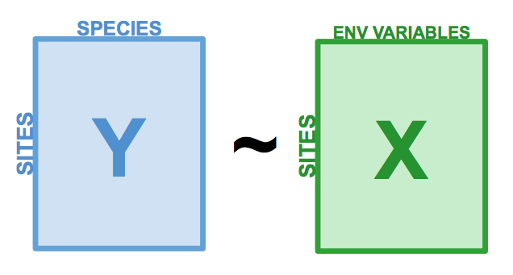
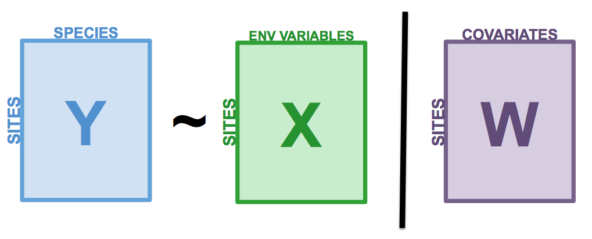

```{r setup, echo = FALSE}
knitr::opts_chunk$set(
  comment = "#",
  collapse = TRUE,
  warning = FALSE,
  message = FALSE,
  cache = FALSE,
  fig.width=6, fig.height=6,
  fig.retina = 3,
  fig.align = 'center'
)
options(repos=structure(c(CRAN="http://cran.r-project.org")))
```

```{r output-lines, echo = FALSE}
library(knitr)
hook_output <- knit_hooks$get("output")
knit_hooks$set(output = function(x, options) {
   lines <- options$output.lines
   if (is.null(lines)) {
     return(hook_output(x, options))  # pass to default hook
   }
   x <- unlist(strsplit(x, "\n"))
   more <- "..."
   if (length(lines)==1) {        # first n lines
     if (length(x) > lines) {
       # truncate the output, but add ....
       x <- c(head(x, lines), more)
     }
   } else {
     x <- c(more, x[lines], more)
   }
   # paste these lines together
   x <- paste(c(x, ""), collapse = "\n")
   hook_output(x, options)
 })
```


class: inverse, center, middle

```{r install_pkgs, message=FALSE, warning=FALSE, include=FALSE, results=0}
# Standard procedure to check and install packages and their dependencies, if needed.

list.of.packages <- c("remotes", "Hmisc", "labdsv", "MASS", "vegan")

new.packages <- list.of.packages[!(list.of.packages %in% installed.packages()[,"Package"])]

if(length(new.packages) > 0) {
  install.packages(new.packages, dependencies = TRUE)
  print(paste0("The following package was installed:", new.packages))
} else if(length(new.packages) == 0) {
    print("All packages were already installed previously")
  }

# Load all required libraries at once
lapply(list.of.packages, require, character.only = TRUE, quietly = TRUE)
```

# About this workshop
[](https://github.com/QCBSRworkshops/workshop10)
[](https://wiki.qcbs.ca/r_workshop10)
[](https://qcbsrworkshops.github.io/workshop10/workshop10-en/workshop10-en.html)
[](https://qcbsrworkshops.github.io/workshop10/workshop10-en/workshop10-en.pdf)
[](https://qcbsrworkshops.github.io/workshop10/workshop10-en/workshop10-en.R)

---

# Required packages

* [Hmisc](https://cran.r-project.org/package=Hmisc)
* [labdsv](https://cran.r-project.org/package=labdsv)
* [MASS](https://cran.r-project.org/package=MASS)
* [vegan](https://cran.r-project.org/package=vegan)
* [ggplot2](https://cran.r-project.org/package=ggplot2)

<br>

```R
install.packages(c('Hmisc', 'labdsv', 'MASS', 'vegan', 'ggplot2'))
```

---
# Learning objectives

##### Use R to perform unconstrained ordinations


---
class: inverse, center, middle

## Introduction


---

## Introduction

This workshop is an extension of Workshop 9, which covered the basics of unconstrained analyses:

* Distance metrics and transformations
* Hierarchical clustering
* Unconstrained ordinations (PCA, PCoA, CA, nmDS)

These identify patterns in community composition data or in descriptors, .alert[**without**] exploring how environmental variables could be driving these patterns.

---
# Introduction

In this workshop, we will focus instead on .alert[**constrained**] analyses:

* Redundancy analysis (RDA)
* Partial redundancy analysis
* Variation partitioning
* Linear discriminant analysis (LDA)

These analyses allow us to .alert[**describe**] and .alert[**predict**] relationships between community composition data and environmental variables. (This means we can .alert[**test hypotheses**]!)

???
Other methods that were excluded for 3 hour workshop format, but are in the book
Multivariate regression tree (MRT)

---
# Download today's script and data

All data and code are found at [qcbs.ca/wiki/r_workshop10](http://qcbs.ca/wiki/r_workshop10)

For this workshop, you will need:
* R script
* Data:
  * DoubsEnv data
  * DoubsSpe data
  * DoubsSpa data
  * Test data for linear discriminant analyses

---
# Required packages

Please make sure you have downloaded, installed, and loaded these packages:
* [Hmisc](https://cran.r-project.org/package=Hmisc)
* [labdsv](https://cran.r-project.org/package=labdsv)
* [MASS](https://cran.r-project.org/package=MASS)
* [vegan](https://cran.r-project.org/package=vegan)
* rdaTest package .alert[(from wiki)]

???
Unused packages in 3-hr version:
mvpart package .alert[(from wiki)]
MVPARTwrap package .alert[(from wiki)]

---
# Follow along!

As always, we recommend that you:
* create your own script (or add comments to the provided script)
* avoid copy-pasting or running the code directly from the script
* remember to set the working directory to the folder in which your files are stored

---

class: inverse, center, middle

# Data exploration & preparation

---
# Today's data:

#### Doubs River Fish Dataset (Verneaux 1973)

.pull-left[Description of fish communities along the Doubs River:
 * 27 species
 * 30 sites
 * 11 environmental variables


 ]

.pull-right[

]

---
# Load the Doubs River dataset

.alert[Make sure the datasets are in your working directory!]

Load the species data (*doubsspe.csv* ):

```{r, echo = TRUE}
# Make sure the files are in your working directory!
spe <- read.csv("data/doubsspe.csv", row.names = 1)
spe <- spe[-8,] # remove site with no data
```

Load the environmental data (*doubsenv.csv* ):

```{r, echo = TRUE}
env <- read.csv("data/doubsenv.csv", row.names = 1)
env <- env[-8,] # remove site with no data
```

.alert[Note]: Only execute once!

---
# Exploring the fish community dataset

Let's briefly explore the fish community dataset:
```{r, echo = TRUE}
names(spe) # names of objects (species)
dim(spe) # dataset dimensions
```

Let's take a closer look at the objects (species):
```{r, echo = TRUE, results = 'hide'}
head(spe) # look at first 5 rows
str(spe) # structure of objects in dataset
summary(spe) # summary statistics for all objects (min, mean, max, etc.)
```

---
# Distribution of species frequencies

Let's take a quick look at how the community is structured.

```{r, echo = TRUE, results = 'hide', fig.width = 6, fig.height = 3.5}
# Count number of species frequencies in each abundance class
ab <- table(unlist(spe))
# Plot distribution of species frequencies
barplot(ab, las = 1, # make axis labels perpendicular to axis
        xlab = "Abundance class", ylab = "Frequency", # label axes
        col = grey(5:0/5)) # 5-colour gradient for the bars
```
.alert[Notice]: There are many 0s!

---
# Distribution of species frequencies

How many 0s are in the dataset?
```{r}
sum(spe == 0)
```
<br>
What proportion of the dataset does that represent?
```{r}
sum(spe==0)/(nrow(spe)*ncol(spe))
```

---
# Transforming the community data

.alert[**Over 50%**] of our dataset consists of 0s, which is common in community datasets.
<br>

However, we don't want these common absences to **artificially increase** the similarity between sites.
* To avoid this, we can .alert[transform] the community data.
<br>


Let's use the .alert[Hellinger] transformation:
```{r}
# The decostand() function in the vegan package makes this easy for us:
library(vegan)
spe.hel <- decostand(spe, method = "hellinger")
```
---
# Exploring the environmental dataset

Let's briefly explore the environmental dataset:
```{r, echo = TRUE}
names(env) # names of objects (environmental variables)
dim(env) # dataset dimensions
head(env) # look at first 5 rows
```

For a closer look at the objects (environmental variables):
```{r, echo = TRUE, results = 'hide'}
str(env) # structure of objects in dataset
summary(env) # summary statistics for all objects (min, mean, max, etc.)
```
---
# Collinearity

```{r, fig.height = 5, fig.width = 9}
# We can visually look for correlations between variables:
pairs(env)
```
.alert[Note:] Some variables look correlated... .small[(das vs. alt, das vs. deb, das vs. dur, das vs. nit, oxy vs. dbo, etc.)]

---
# Standardizing the environmental variables

You cannot compare the effects of variables with different units.
<br>
Before moving on to further analyses, .alert[standardizing] your environmental variables is therefore crucial.

```{r}
# Scale and center variables
env.z <- decostand(env, method = "standardize")

# Variables are now centered around a mean of 0:
round(apply(env.z, 2, mean), 1)

# and scaled to have a standard deviation of 1
apply(env.z, 2, sd)
```

---

class: inverse, center, middle

# Canonical analyses

---
# Canonical analyses

Canonical analyses allow us to:
- identify relationships between a response matrix and explanatory matrix/matrices
- test hypotheses about these relationships
- make predictions

---

class: inverse, center, middle

# Canonical analyses
## Redundancy analysis (RDA)

---
# Redundancy analysis (RDA)

RDA is constrained ordination.
- RDA is a direct extension of multiple regression.
- RDA models the effect of an explanatory matrix on a response matrix
   .comment[.small[(instead of a single response variable)].]

.center[ ]

Variables can be quantitative, qualitative, or binary (0/1).
- .alert[transform] and/or .alert[standardize] them prior to running an RDA.

---
# Running an RDA in R

Prepare the data
```{r}
# We'll use our standardized environmental data
# But we will remove 'das', which was correlated with many other variables:
env.z <- subset(env.z, select = -das)
```

--
Run the RDA
```{r}
# Model the effect of all environmental variables on fish community composition
spe.rda <- rda(spe.hel ~ ., data = env.z)
```

--
Extract key results of the RDA
```{r, eval = FALSE, results = 'hide'}
summary(spe.rda, display = NULL)
```

---
# RDA output in R

.center[ ]

* **Constrained Proportion**: variance of Y explained by X .alert[(73.41%)]
* **Unconstrained Proportion**: unexplained variance in Y .alert[(26.59%)]


How would you report these results?
* .comment[The included environmental variables explain .alert[73.41%] of the variation in fish community composition across sites.]

---
# Selecting variables

Using .alert[forward selection], we can select the explanatory variables that are statistically "important".

<br>
.comment[**Which variables significantly contribute to our model's explanatory power?**]
--
```{r}
# Forward selection of variables:
fwd.sel <- ordiR2step(rda(spe.hel ~ 1, data = env.z), # lower model limit (simple!)
               scope = formula(spe.rda), # upper model limit (the "full" model)
               direction = "forward",
               R2scope = TRUE, # can't surpass the "full" model's R2
               pstep = 1000,
               trace = FALSE) # change to TRUE to see the selection process!
```

.small[Here, we are essentially adding one variable at a time, and retaining it if it significantly increases the model's adjusted R2.]

---
# Selecting variables

- Which variables are retained by the forward selection?
```{r}
# Check the new model with forward-selected variables
fwd.sel$call
```
--
- What is the adjusted R2 of the RDA with the selected variables?
```{r}
# Write our new model
spe.rda.signif <- rda(spe.hel ~ alt + oxy + dbo, data = env.z)
# check the adjusted R2
RsquareAdj(spe.rda.signif)
```

---
# Significance testing

Use .alert[anova.cca()] to test the significance of your RDA.
```{r}
anova.cca(spe.rda.signif, step = 1000)
```

You can also test the significance of each variable!
```{r, results = 'hide'}
anova.cca(spe.rda.signif, step = 1000, by = "term")
```

---
# RDA plot

One of the most powerful aspects of RDA is the **simultaneous visualization** of your response and explanatory variables .comment[(i.e. species and environmental variables)].
<br>
--
<br>
There are 2 scaling options:
<br>

| Type 1                                             | Type 2                                            |
| ---------------------------------------------------|---------------------------------------------------|
| distances among objects reflect their similarities | angles between variables reflect their correlation|


---
# RDA plot: Type 1

.pull-left[
```{r, fig.height = 6.5, fig.width = 6, strip.white = TRUE}
ordiplot(spe.rda.signif,
         scaling = 1,
         type = "text")
```
]

.pull-right[
######Scaling 1 shows similarities between objects in the .comment[response matrix].

.small[
* Sites (numbers) that are .alert[closer together] have more similar communities.
* Species that are .alert[closer together] occupy more sites in common.
]
]
---
# RDA plot: Type 2

.pull-left[
```{r, fig.height = 6.5, fig.width = 6, strip.white = TRUE}
ordiplot(spe.rda.signif,
         scaling = 2,
         type = "text")
```
]

.pull-right[
######Scaling 2 shows the effects of .comment[explanatory variables].
.small[
* .alert[Longer] arrows mean this variable strongly drives the variation in the community matrix.
* Arrows pointing in .alert[opposite directions] have a negative relationship
* Arrows pointing in the .alert[same direction] have a positive relationship
]
]
---
# Customizing RDA plots

Both plot() and ordiplot() make quick and simple ordination plots, but you can customize your plots by manually setting the aesthetics of points, text, and arrows.

```{r, echo = FALSE}
## extract % explained
perc <- round(100*(summary(spe.rda.signif)$cont$importance[2, 1:2]), 2)
## scores
sc_si <- scores(spe.rda.signif, display="sites", choices=c(1,2), scaling=1)
sc_sp <- scores(spe.rda.signif, display="species", choices=c(1,2), scaling=1)
sc_bp <- scores(spe.rda.signif, display="bp", choices=c(1, 2), scaling=1)
## plot
plot(spe.rda.signif, scaling=1, main="Triplot RDA - scaling 1", type="none", xlab=paste0("RDA1 (", perc[1], "%)"), ylab = paste0("RDA2 (", perc[2], "%)"), xlim=c(-1,1), ylim=c(-1,1))
points(sc_si, pch=21, col="black", bg="steelblue", cex=1.2)
points(sc_sp, pch=22, col="black", bg = "#f2bd33", cex=1.2)
text(sc_sp, labels = rownames(sc_sp), col="black", cex=0.6)
arrows(0,0, sc_bp[,1], sc_bp[,2], col="red", lwd = 3)
text(x = sc_bp[,1] -0.1, y = sc_bp[,2] - 0.03, labels=rownames(sc_bp), col="red", cex=1, font = 2)
```

See the wiki page for more details!

---
# Challenge 1 

Run an RDA to model the effects of environmental variables on mite species abundances.

<br>
.small[
First, load the mite data:
```{r}
# Load mite species abundance data
data("mite")

# Load environmental data
data("mite.env")
```

Recall some useful functions:
```{r, eval = FALSE}
decostand()
rda()
ordiR2step()
anova.cca()
ordiplot()
```
]

---
# Challenge 1: Solution

Step 1: Prepare the data
```{r}
# Hellinger transform the community data
mite.spe.hel <- decostand(mite, method = "hellinger")

# Standardize quantitative environmental data
mite.env$SubsDens <- decostand(mite.env$SubsDens, method = "standardize")
mite.env$WatrCont <- decostand(mite.env$WatrCont, method = "standardize")
```

---
# Challenge 1: Solution

Step 2: Select environmental variables
```{r}
# Initial RDA with ALL of the environmental data
mite.spe.rda <- rda(mite.spe.hel ~ ., data = mite.env)

# Forward selection of environmental variables
fwd.sel <- ordiR2step(rda(mite.spe.hel ~ 1, data = mite.env),
                      scope = formula(mite.spe.rda),
                      direction = "forward",
                      R2scope = TRUE, pstep = 1000, trace = FALSE)
fwd.sel$call
```

---
# Challenge 1: Solution

Step 3: Run RDA and check adjusted R2

```{r}
# Re-run the RDA with the significant variables
mite.spe.rda.signif <- rda(mite.spe.hel ~ WatrCont + Shrub +
                           Substrate + Topo + SubsDens,
                           data = mite.env)

# Find the adjusted R2 of the model with the retained env variables
RsquareAdj(mite.spe.rda.signif)$adj.r.squared

```
---
# Challenge 1: Solution

Step 4: Test model significance
```{r}
anova.cca(mite.spe.rda.signif, step = 1000)
```

The selected environmental variables significantly explain .alert[43.7% (p = 0.001)] of the variation in mite species abundances.

---
# Challenge 1: Solution

Step 5: Plot the RDA!
.pull-left[
```{r, fig.height = 6.5}
ordiplot(mite.spe.rda.signif,
         scaling = 1,
         main = "Mite RDA - Scaling 1")
```
]
.pull-right[
```{r, fig.height = 6.5}
ordiplot(mite.spe.rda.signif,
         scaling = 2,
         main = "Mite RDA - Scaling 2")
```

]

---

class: inverse, center, middle

# Canonical analyses
## Partial RDA

---
# Partial RDA

The partial RDA is a special case of RDA that allows you to control for **covariates**.

In other words, we can model the linear effects of matrix $X$ on matrix $Y$ *while* controlling for a matrix $W$ of covariates.

.center[ ]

---
# Applications of partial RDA

Because partial RDA allows us to control for covariates, we can:
* Assess effects of environmental variables on community composition while accounting for variation that **isn't** the focus of the study.
* **Isolate** the effect of one or more groups of explanatory variables

.center[ ]

--
.center[.comment[Partial RDA is often used in community ecology to separate the effects of environmental variables from the effect of spatial variables.]]

---
# Example: Partial RDA on Doubs River data

In `R`, we can run a partial RDA using the `rda()` function.

As a demonstration, let's assess the effect of water chemistry on fish species abundances (`spe.hel`) while controlling for the effect of topography.

```{r}
# Subset environmental data into topography variables and chemistry variables
env.topo <- subset(env.z, select = c(alt, pen, deb))
env.chem <- subset(env.z, select = c(pH, dur, pho, nit, amm, oxy, dbo))

# Run a partial RDA
spe.partial.rda <- rda(spe.hel, env.chem, env.topo)
```

--

<br>
.small[
**Note:** You can also use a formula syntax like `Y ~ X + Condition(W)`, where `Condition()` allows you to control for covariates.

```{r, eval = FALSE}
# Alternative syntax for the partial RDA:
spe.partial.rda <- rda(spe.hel ~ pH + dur + pho + nit + amm + oxy + dbo + # these are the effects we are interested in
                       Condition(alt + pen + deb), # these are the covariates
                       data = env.z)
```
]

---
# Interpreting partial RDA output in `R`

```{r, eval = TRUE, collapse=FALSE, output.lines=(5:10)}
summary(spe.partial.rda, display = NULL)
```
<br>

* **Conditioned Proportion**: variance of $Y$ explained by $W$ .alert[(41.53%)]
* **Constrained Proportion**: variance of $Y$ explained by $X$ .alert[(31.89%)]
* **Unconstained Proportion**: unexplained variance in $Y$ .alert[(26.59%)]
<br>
<br>
.center[How would you report these results?]

--

.center[.comment[Water chemistry explains 31.9% of the variation in fish community composition across sites, while topography explains 41.5% of this variation.]]


---
# Interpreting partial RDA in `R`

We are still missing some important details for our interpretation of this model!
<br>
<br>
.pull-left2[
1\. What is the model's **explanatory power**?
```{r}
# Extract the model's adjusted R2
RsquareAdj(spe.partial.rda)$adj.r.squared
```
]

--

.pull-right2[
<br>
<br>
.small[.comment[Our model explains .alert[24.1%] of the variation in fish abundance across sites.]]
]

--

.pull-left2[
2\. Is the model **statistically significant**?
```{r output.lines=-c(2,9,10)}
# Test whether the model is statistically significant
anova.cca(spe.partial.rda, step = 1000)
```
]

--

.pull-right2[
<br>
<br>
.small[.comment[It is also statistically significant (.alert[p = 0.001])!]]
]

---
# Plot the partial RDA

We can visualise the effects of the environmental variables on the fish community with the `ordiplot()` function.

.small[
```{r, fig.height=4.5, fig.width=4.5}
ordiplot(spe.partial.rda, scaling = 2,
         main = "Doubs River partial RDA - Scaling 2")
```
--

.alert[Note]: The topography variables (covariates) aren't plotted. Why is that?]

???

Scaling 2 shows the effects of explanatory variables, meaning it shows the effects of the X matrix on the Y matrix (after the effect of matrix W has been controlled for). The covariates are controlled for, they do not show up in the scaling 2 biplot.

Recall: In scaling 2, arrow length shows effect size, arrow direction shows the direction of the relationship (opposite directions means the variables have a negative relationship, while same direction indicates a positive relationship)

---
# Challenge 2 

.small[
Run a partial RDA to model the effects of environmental variables on mite species abundances (`mite.spe.hel`), while controlling for substrate variables (`SubsDens`, `WatrCont`, and `Substrate`).
* What is the variance explained by substrate variables?
* Is the model significant?
* Which axes are significant?

<br>

Recall some useful functions:
```{r, eval = FALSE}
rda()
summary()
RsquareAdj()
anova.cca() # hint: see the 'by' argument in ?anova.cca
```
]

---
# Challenge 2: Solution

Our species abundance and environmental datasets have already been transformed and standardized.

So, we can start with the partial RDA:
```{r, output.lines=c(5:10)}
# Compute partial RDA
mite.spe.subs <- rda(mite.spe.hel ~ Shrub + Topo
                     + Condition(SubsDens + WatrCont + Substrate),
                     data = mite.env)

# Check summary
summary(mite.spe.subs, display = NULL)
```
--
Shrub and Topo explain .alert[9.8%] of the variation in mite species abundances, while substrate covariables explain .alert[42.8%] of this variation.

---
# Challenge 2: Solution

* What is the variance explained by substrate variables?
```{r}
RsquareAdj(mite.spe.subs)$adj.r.squared
```
--
<br>
* Is the model significant?
```{r}
anova.cca(mite.spe.subs, step = 1000)
```
---
# Challenge 2: Solution

* Which axes are significant?
```{r}
anova.cca(mite.spe.subs, step = 1000, by = "axis")
```
---

class: inverse, center, middle

# Canonical analyses
## Variation partitioning

---
# Variation partitioning

Partitions the variation of response variables among 2, 3, or 4 explanatory datasets.
* e.g. large-scale and small-scale
* e.g. abiotic and biotic


.center[]

---
# Variation partitioning

.center[]

---
# Variation partitioning in R

.small[.alert[Note]: Make sure you've loaded the *vegan* package!

```{r}
spe.part.all <- varpart(spe.hel, env.chem, env.topo)
spe.part.all$part # access results!
```
]

---
# Variation partitioning plot

```{r, strip.white = TRUE, fig.width = 6, fig.height = 6}
plot(spe.part.all,
     Xnames = c("Chem", "Topo"), # name the partitions
     bg = c("seagreen3", "mediumpurple"), alpha = 80, # colour the circles
     digits = 2, # only show 2 digits
     cex = 1.5)
```

---
# Significance testing

.center[]

* The shared fraction [b] .alert[cannot] be tested for significance.
* But, we can test the significance of the remaining fractions!

---
# Significance testing: X1 [a+b]

.center[]

.small[
```{r}
# [a+b] Chemistry without controlling for topography
anova.cca(rda(spe.hel, env.chem))
```
]

---
# Significance testing: X2 [b+c]

.center[]

.small[
```{r}
# [b+c] Topography without controlling for chemistry
anova.cca(rda(spe.hel, env.topo))
```
]

---
# Significance testing: Individual fractions

.center[]
.small[
```{r}
# [a] Chemistry alone
anova.cca(rda(spe.hel, env.chem, env.topo))
```

.alert[Note:] Recognize this? It's a partial RDA!
]
---
# Significance testing: Individual fractions

.center[]

.small[
```{r}
# [c] Topography alone
anova.cca(rda(spe.hel, env.topo, env.chem))
```
]

---
# Challenge 3 

.small[
Partition the variation in the mite species data according to substrate variables (SubsDens, WatrCont) and significant spatial variables.
* What proportion of the variation is explained by substrate variables? By space?
* Which individual fractions are significant?
* Plot your results!


Load the spatial variables:
```{r}
data("mite.pcnm")
```

Recall some useful functions:
```{r, eval = FALSE}
ordiR2step()
varpart()
anova.cca(rda())
plot()
```
]

---
# Challenge 3: Solution

Step 1: Forward selection of significant spatial variables
```{r}
# Write full RDA model with all variables
full.spat <- rda(mite.spe.hel ~ ., data = mite.pcnm)

# Forward selection of spatial variables
spat.sel <- ordiR2step(rda(mite.spe.hel ~ 1, data = mite.pcnm),
               scope = formula(full.spat),
               R2scope = RsquareAdj(full.spat)$adj.r.squared,
               direction = "forward",
               trace = FALSE)
spat.sel$call
```

---
# Challenge 3: Solution

Step 2: Create variable groups
```{r}
# Subset environmental data to retain only substrate variables
mite.subs <- subset(mite.env, select = c(SubsDens, WatrCont))

# Subset to keep only selected spatial variables
mite.spat <- subset(mite.pcnm,
                    select = names(spat.sel$terminfo$ordered))
                    # a faster way to access the selected variables!
```

---
# Challenge 3: Solution

Step 3: Variation partitioning
```{r}
mite.part <- varpart(mite.spe.hel, mite.subs, mite.spat)
mite.part$part$indfract # access results!
```

* What proportion of the variation is explained by substrate variables?
 * .alert[5.9%]

* What proportion of the variation is explained by spatial variables?
  * .alert[19.4%]

---
# Challenge 3: Solution

Step 4: Which individual fractions are significant?
```{r, results = 'hide'}
# [a]: Substrate only
anova.cca(rda(mite.spe.hel, mite.subs, mite.spat))
# p = 0.001 ***

# [c]: Space only
anova.cca(rda(mite.spe.hel, mite.spat, mite.subs))
# p = 0.001 ***
```

--
.comment[So, what can you say about the effects of substrate and space on mite species abundances?]
---
# Challenge 3: Solution

Step 5: Plot the variation partitioning results
```{r, fig.height=6, fig.width=6}
plot(mite.part, digits = 2, cex = 1.5,
     bg = c("pink", "skyblue"), alpha = 90) # add colour!
```
---
class: inverse, center, middle

exclude: true

# Multivariate regression tree (MRT)

---
exclude: true

# Multivariate regression tree (MRT)

.center[]

MRT is a constrained clustering technique.
* Splits a response matrix (Y) into clusters based on thresholds of explanatory variables (X)

---
exclude: true

# Multivariate regression tree (MRT)

.center[]

An MRT consists of:
* .alert[Branch]: each group formed by a split
* .alert[Node]: splitting point (threshold value of an explanatory variable)
* .alert[Leaf]: terminal group of sites

---
exclude: true

# Multivariate regression tree (MRT)

MRT has many advantages:
* Doesn't assume a linear relationship between Y and X matrices
* Results are easy to visualize (it's a tree!)
* Clearly identifies importance of explanatory variables
* Robust (missing values, collinearity)
* Can handle raw explanatory variables

---
exclude: true

# MRT: Tree selection

When you run an MRT, 2 things happen:
1. Constrained partitioning of the data
2. .alert[Cross-validation] to identify best predictive tree
<br>

The "best" tree varies depending on your study goals. Usually you want a tree:
* that is .comment[parsimonious]
* but still has an .comment[informative] number of groups
* Basically: what makes sense for your question?

---
exclude: true

# MRT in R

In what follows we will be using .alert[`mvpart` that is currently archived on CRAN]. We install it from GitHub using the package remotes:

```{R mvpart_install, eval=FALSE}
remotes::install_github("cran/mvpart")
library(mvpart)
```

---
exclude: true

# MRT in R

```{r, results = 'hide', fig.show = 'hide', eval = F}
# First, remove the "distance from source" variable
env <- subset(env, select = -das)

# Create multivariate regression tree
# library(mvpart)
doubs.mrt <- mvpart(as.matrix(spe.hel) ~ ., data = env,
                    xv = "pick", # interactively select best tree
                    xval = nrow(spe.hel), # number of cross-validations
                    xvmult = 100, # number of multiple cross-validations
                    which = 4, # plot both node labels
                    legend = FALSE, margin = 0.01, cp = 0)
```

---
exclude: true

# MRT in R: Tree selection

```{r, eval = FALSE, results = 'hide', fig.height = 5, fig.width = 5.5, fig.align = 'center'}
doubs.mrt <- mvpart(as.matrix(spe.hel) ~ ., data = env,
                    xv = "pick", # interactively select tree size
                    xval = nrow(spe.hel), # number of cross-validations
                    xvmult = 100, # number of multiple cross-validations
                    which = 4, # plot both node labels
                    legend = FALSE, margin = 0.01, cp = 0, plot.add = FALSE)
```
.small[
* Green points: Relative error
* Blue points: Cross-validated relative error (CVRE)
* Red dot: Which tree has the smallest CVRE
* Orange dot: Smallest tree within one standard error of the CVRE
* Lime green bars: # of times each tree size was chosen
]
---
exclude: true

# MRT in R: Tree selection

```{r, echo = FALSE, results = 'hide', fig.height = 5, fig.width = 5.5, fig.align = 'center', eval =F}
doubs.mrt <- mvpart(as.matrix(spe.hel) ~ ., data = env,
                    xv = "pick", # interactively select tree size
                    xval = nrow(spe.hel), # number of cross-validations
                    xvmult = 100, # number of multiple cross-validations
                    which = 4, # plot both node labels
                    legend = FALSE, margin = 0.01, cp = 0,
                    plot.add = FALSE)
```

.small[
* Pick the "best" tree by clicking on a blue dot that corresponds to your chosen tree size!
* We don't have an *a priori* expectation about how to partition this data, so we'll select the .comment[smallest tree within 1 standard error of the overall best-fit tree] (i.e. the orange dot).
]

---
exclude: true

# MRT in R: Tree plot

```{r, echo = FALSE, results = 'hide', fig.height = 5.5, fig.width = 5.5, eval=F}
doubs.mrt <- mvpart(as.matrix(spe.hel) ~ ., data = env,
                    xv = "1se", # interactively select tree size
                    xval = nrow(spe.hel), # number of cross-validations
                    xvse = 1,
                    xvmult = 100, # number of multiple cross-validations
                    which = 4, # plot both node labels
                    legend = FALSE, margin = 0.01, cp = 0, prn = FALSE)
```
.small[
* The species matrix is partitioned according to an .alert[altitude threshold (361.5)]
  * Barplots: species abundances in the sites included in each group
* Residual error = 0.563, which means the model's R2 is .alert[43.7%]
]
---
exclude: true

# MRT in R: Comparing trees

We can also compare solutions, to help us chose the best tree.

For example, let's look at a 10-group solution!
```{r, echo = FALSE, results = 'hide', fig.height = 4.5, fig.width = 12, eval=F}
mvpart(as.matrix(spe.hel) ~ ., data = env,
        xv = "none", # no cross-validation
        size = 10, # set tree size
        which = 4,
        legend = FALSE, margin = 0.01, cp = 0, prn = FALSE)
```

.small[
* This is much .alert[harder to interpret] (so many groups!)
* Higher explanatory power, .alert[BUT] predictive power (CV Error = 0.671) is basically the same as the previous solution (CV Error = 0.673).
]
---
exclude: true

# MRT in R: Comparing trees

Let's look at a solution with fewer (4) groups!
.tiny[
```{r, echo = FALSE, results = 'hide', fig.height = 4.5, fig.width =8,  eval=F}
mvpart(as.matrix(spe.hel) ~ ., data = env,
        xv = "none", # no cross-validation
        size = 4, # set tree size
        which = 4,
        legend = FALSE, margin = 0.01, cp = 0, prn = FALSE)
```
]
.small[
* This is easier to interpret!
* Higher explanatory power .alert[(lower Error)] than our original solution
* .alert[Higher predictive power] than both previous solutions (CV Error)
]
---
exclude: true

# MRT in R: Complexity parameter

To find out how much variance is explained by each node in the tree, we need to look at the complexity parameter (CP).
```{r,  eval=F}
doubs.mrt$cptable
```

* CP @ nsplit 0 = R2 of the whole tree
* CP at subsequent nodes = R2 of each node (see full summary to see which node corresponds to which variable threshold)

---
exclude: true

# MRT in R: Summary output

We can access more information about the tree (such as which node corresponds to which variable threshold):
.tiny[
```{r,  eval=F}
summary(doubs.mrt)
```
]

---
exclude: true

# MRT in R: Discriminant species

You might also want to know which species are contributing most to the explained variance at each split (i.e. .alert[discriminant species]), or which sites are included within each leaf (group).

<br>
To do this, we have the .comment[MVPARTwrap] package.

.alert[MVPARTwrap is archived, we use the package remotes to install it from GitHub:]

```{R MVPARTwrap_install,  eval=F}
remotes::install_github("cran/MVPARTwrap")
library(MVPARTwrap)
```

---
exclude: true

# MRT in R: Discriminant species

```{r, results = 'hide',  eval=F}
# Generate a nicer and more informative output
doubs.mrt.wrap <- MRT(doubs.mrt, percent = 10, species = colnames(spe.hel))

# Access the full output:
summary(doubs.mrt.wrap)
```

---
exclude: true

# MRT in R: Discriminant species

To see each species' contribution to explained variance at each node:
.small[
```{r,  eval=F}
summary(doubs.mrt.wrap)
```
]


---
exclude: true

# MRT in R: Indicator species

You might also be interested in finding out which species are significant .alert[indicator species] for each grouping of sites.

.xsmall[
```{r labdsv,  eval=F}
library(labdsv)

# Calculate indicator values (indval) for each species
doubs.mrt.indval <- indval(spe.hel, doubs.mrt$where)

# Extract the significant indicator species (and which node they represent)
doubs.mrt.indval$maxcls[which(doubs.mrt.indval$pval <= 0.05)]

# Extract their indicator values
doubs.mrt.indval$indcls[which(doubs.mrt.indval$pval <= 0.05)]
```
]

TRU has the highest indicator value (0.867) overall, and is an indicator species for the first (alt >= 361.5) leaf of the tree.

---
exclude: true

# Challenge 4 
.small[
Create a multivariate regression tree for the mite data.
* Select the smallest tree within 1 SE of the CVRE.
* What is the proportion of variance (R2) explained by this tree?
* How many leaves does it have?
* What are the top 3 discriminant species?
]
<br>
.small[
Remember to load the mite data:
```{r}
data("mite")
data("mite.env")
```

Recall some useful functions:
```{r, eval = FALSE}
?mvpart() # hint: pay attention to the 'xv' argument!
?MRT()
summary()
```
]
---
exclude: true

# Challenge 4: Solution

Step 1: Create the multivariate regression tree
```{r, results = 'hide', fig.height = 4.5, fig.width = 4.5,  eval=F}
mite.mrt <- mvpart(as.matrix(mite.spe.hel) ~ ., data = mite.env,
                   xv = "1se", # choose smallest tree within 1 SE
                   xval = nrow(mite.spe.hel),
                   xvmult = 100,
                   which = 4, legend = FALSE, margin = 0.01, cp = 0,
                   prn = FALSE)
```

---
exclude: true

# Challenge 4: Solution

```{r, echo = FALSE, results = 'hide', fig.height = 5, fig.width = 5,  eval=F}
mite.mrt <- mvpart(as.matrix(mite.spe.hel) ~ ., data = mite.env,
                   xv = "1se", # choose smallest tree within 1 SE
                   xval = nrow(mite.spe.hel),
                   xvmult = 100,
                   which = 4, legend = FALSE, margin = 0.01,
                   cp = 0, prn = FALSE)
```
.small[
* What is the proportion of variance (R2) explained by this tree?
  * 1 - Error = 0.252, so the tree explains .alert[25.2%] of the variance in the species matrix.

* How many leaves does it have?
  * 2 leaves
]
---
exclude: true

# Challenge 4: Solution


What are the top 3 discriminant species .alert[for node 1]?
```{r, results = 'hide',  eval=F}
# Generate nicer MRT output
mite.mrt.wrap <- MRT(mite.mrt,
                     percent = 10,
                     species = colnames(mite.spe.hel))

# Look at discriminant species table from MRT output
summary(mite.mrt.wrap)
```

---
exclude: true

# Challenge 4: Solution

What are the top 3 discriminant species .alert[for node 1]?
* LCIL, LRUG, Ceratoz1

.center[]
---

class: inverse, center, middle
# Linear discriminant analysis (LDA)

---

# Linear discriminant analysis (LDA)

The LDA divides your response variable into groups according to a factor by finding combination of the variables that give **best possible separation between groups.** This is useful beacause:

* It can tell you how well your descriptor variables explain an *a priori* grouping of your response variable
* Which is great for making predictions about how to classify new data
  
  .small[.comment[e.g. classifying whether a fish comes from a lake or ocean population, based on morphology]]

.center[

]

???
The grouping is done by maximizing the among-group dispersion versus the within-group dispersion

---

# LDA in R: Doubs fish dataset

<br>
We know that environmental variables generally change with latitude. This might lead us to ask the following question:

<br>
--

<br><br><br><br>
.center[
**If we classify our Doubs River sites according to latitude, how well do environmental variables explain these groupings?**

.comment[We can use an LDA to answer this question!]

]
---

# LDA in R: Doubs fish dataset

Let's begin by loading spatial coordinates for the Doubs sites:
```{r}
# load spatial data for Doubs sites
spa <- read.csv("data/doubsspa.csv", row.names = 1)
spa$site <- 1:nrow(spa) # add site numbers
spa <- spa[-8,] # remove site 8
```

--

<br><br>
We can then assign sites into 3 groups based on their latitude:
```{r}
# group sites based on latitude
spa$group <- NA # create "group" column
spa$group[which(spa$y < 82)] <- 1
spa$group[which(spa$y > 82 & spa$y < 156)] <- 2
spa$group[which(spa$y > 156)] <- 3
```

---

# LDA in R: Latitude groups

Let's quickly plot the latitude groupings to see if they make sense:

```{r, fig.width = 5.5, fig.height = 5.5}
plot(spa$x, spa$y, col = spa$group, pch = 16, cex = 1.5)
```

---

# LDA in R

.alert[Note]: Usually we would check the multivariate homogeneity of within-group variances before proceeding (see Borcard et al. 2011). If you need to do this, check the `betadisper()` function in the `vegan` package.

For the purposes of this workshop, we will move straight to doing the LDA:
```{r}
# load required library
library(MASS)

# run the LDA grouping sites into latitude groups based on env data
LDA <- lda(env, spa$group)
```
---

# LDA in R

Our sites have now been reorganised into groups that are as distinct as possible, based on the environmental variables.
<br><br>

```{r echo = FALSE, fig.width = 7, fig.height = 6}
library(ggplot2)

lda.plotdf <- data.frame(group = factor(spa$group), 
                         lda = predict(LDA)$x) # predict the values for plotting

# Plot the newly reorganised sites according to the LDA
ggplot(lda.plotdf) +
  geom_point(aes(x = lda.LD1, 
                 y = lda.LD2, 
                 col = group), 
             size = 3) +
  labs(color = "Groups") +
  theme_classic() + # formatting the plot to make it pretty
  theme(axis.title = element_text(size = 18),
        legend.title = element_text(size = 20),
        legend.text = element_text(size = 18))
```


---

# LDA in R: Grouping accuracy

.small[We can then determine how sites were grouped, and whether this grouping is accurate.

```{r}
# Classification of the objects based on the LDA
spe.class <- predict(LDA)$class

# Posterior probabilities that the objects belong to those groups
spe.post <- predict(LDA)$posterior

# Table of prior vs. predicted classifications
(spe.table <- table(spa$group, spe.class))

# Proportion of corrected classification
diag(prop.table(spe.table, 1))
```

All sites were correctly classified (1) into the latitude groups based on environmental variables.]

---
# LDA in R: Predictions

We can now use this relationship to classify **new** sites into latitude groups.

--

Let's **predict the grouping** of 5 new sites using our LDA results:
.small[
```{r}
# Load the new site data
classify.me <- read.csv("data/classifyme.csv", header = TRUE)
# classify.me <- classify.me[,-1] # remove das variable

# Predict grouping of new sites
predict.group <- predict(LDA, newdata = classify.me)

# View site classification
predict.group$class
```
]
---

# Challenge 4 

.small[Create 4 latitude groups in the `mite.xy` dataset. Then, run an LDA to classify mite sites into latitude groupings based on environmental variables (`SubsDens` and `WatrCont`).
* What proportion of sites was correctly classified in group1? in group2?

<br>
Load the `mite.xy` data:
```{r}
data(mite.xy)
```

Recall some useful functions:
```{r, eval = FALSE}
lda()
predict()
table()
diag()
```
]

---

# Challenge 4: Solution

Step 1: Create 4 latitude groups
.small[
```{r}
# assign numbers to sites
mite.xy$site <- 1:nrow(mite.xy)

# find latitudinal range for each group
(max(mite.xy[,2])-min(mite.xy[,2]))/4

# group sites into 4 latitude groups
mite.xy$group <- NA # create "group" column
mite.xy$group[which(mite.xy$y < 2.5)] <- 1
mite.xy$group[which(mite.xy$y >= 2.5 & mite.xy$y < 4.9)] <- 2
mite.xy$group[which(mite.xy$y >= 4.9 & mite.xy$y < 7.3)] <- 3
mite.xy$group[which(mite.xy$y >= 7.3)] <- 4
```
]

Step 2: Run the LDA
.small[
```{r}
LDA.mite <- lda(mite.env[,1:2], mite.xy$group)
```
]
---

# Challenge 4: Solution

Step 3: Check whether the groupings are correct
.small[
```{r}
# classification of the objects based on LDA
mite.class <- predict(LDA.mite)$class
# table of prior versus predicted classifications
(mite.table <- table(mite.xy$group, mite.class))
# proportion of correct classification
diag(prop.table(mite.table, 1))
```

What proportion of sites was correctly classified in group1? in group2?
* .alert[60%] were correctly classified into group1, and .alert[64.7%] were classified into group2.]

---
class: inverse, center, bottom

# Thank you for attending this workshop!


