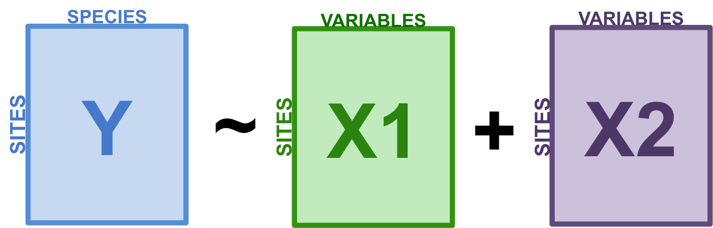

```{r setup, echo = FALSE}
knitr::opts_chunk$set(
  comment = "#",
  collapse = TRUE,
  warning = FALSE,
  message = FALSE,
  cache = FALSE,
  fig.width = 6, fig.height = 6,
  fig.retina = 3,
  fig.align = 'center'
)
options(repos=structure(c(CRAN="http://cran.r-project.org")))
```

```{r output-lines, echo = FALSE}
# sometimes cache needs to be set to true in the knitr setup chunk for this to take effect
# in xaringan::infinite_moon_reader()
library(knitr)
hook_output <- knit_hooks$get("output")
knit_hooks$set(output = function(x, options) {
   lines <- options$output.lines
   if (is.null(lines)) {
     return(hook_output(x, options))  # pass to default hook
   }
   x <- unlist(strsplit(x, "\n"))
   more <- "..."
   if (length(lines)==1) {        # first n lines
     if (length(x) > lines) {
       # truncate the output, but add ....
       x <- c(head(x, lines), more)
     }
   } else {
     x <- c(more, x[lines], more)
   }
   # paste these lines together
   x <- paste(c(x, ""), collapse = "\n")
   hook_output(x, options)
 })
```


class: inverse, center, middle

```{r install_pkgs, message=FALSE, warning=FALSE, include=FALSE, results=0}
# Standard procedure to check and install packages and their dependencies, if needed.

# remotes::install_github("cran/mvpart")

list.of.packages <- c("remotes", "Hmisc", "labdsv", "MASS", "vegan", "ggplot2"
                      #"mvpart"
                      )

new.packages <- list.of.packages[!(list.of.packages %in% installed.packages()[,"Package"])]

if(length(new.packages) > 0) {
  install.packages(new.packages, dependencies = TRUE)
  print(paste0("The following package was installed:", new.packages))
} else if(length(new.packages) == 0) {
    print("All packages were already installed previously")
  }

# Load all required libraries at once
lapply(list.of.packages, require, character.only = TRUE, quietly = TRUE)
```

# À propos de cet atelier

[](https://r.qcbs.ca/workshop10/pres-fr/workshop10-pres-fr.html)    [](https://r.qcbs.ca/workshop10/book-fr/workshop10-script-fr.R) 
[](https://r.qcbs.ca/workshop10/book-fr/index.html)
[](https://r.qcbs.ca/fr/workshops/r-workshop-10/)
[](https://github.com/QCBSRworkshops/workshop10) 

---

<p style="font-size:75%">

.center[
**Membres du CSBQ qui ont contribué à cet atelier**

en modifiant et en améliorant son contenu dans le cadre du <br> Prix d'apprentissage et de développement (*Le*arning *a*nd *D*evelopment *A*ward)
]

.pull-left[
.right[

**2022** - **2021** - **2020**

Mathieu Vaillancourt

Katherine Hébert

Pedro Henrique P. Braga

Gabriel Muñoz

Kevin Cazelles

Marie Hélène Brice  


**2019** - **2018** - **2017**

Marie Hélène-Brice

Pedro Henrique P. Braga

Katherine Hébert

<br>
]
]

.pull-right[
.left[

**2016** - **2015** - **2014**

Monica Granados

Emmanuelle Chrétien

Bérenger Bourgeois

Amanda Winegardner

Xavier Giroux-Bougard

Vincent Fugère

]
]
</p>

<br>
.center[
__Si vous voulez contribuer aussi__, visitez [r.qcbs.ca/fr/contributing](https://r.qcbs.ca/fr/contributing/) <br> et n'hésitez pas à [nous contacter](mailto:csbq.qcbs.r@gmail.com)!
]

---

# Matériel requis

Cet atelier requiert les dernières versions de [RStudio](https://rstudio.com/products/rstudio/download/#download) et de [R](https://cran.rstudio.com/).

<br>
Vous devez également avoir installé ces librairies R:
* [Hmisc](https://cran.r-project.org/package=Hmisc)
* [labdsv](https://cran.r-project.org/package=labdsv)
* [MASS](https://cran.r-project.org/package=MASS)
* [vegan](https://cran.r-project.org/package=vegan)
* [ggplot2](https://cran.r-project.org/package=ggplot2)

<br>

```R
install.packages(c('Hmisc', 'labdsv', 'MASS', 'vegan', 'ggplot2'))
```

<br><br>
Vous pouvez télécharger les jeux de données sur [r.qcbs.ca/fr/workshops/r-workshop-10](http://r.qcbs.ca/fr/workshops/r-workshop-10/).


???

Paquets non-utilisés dans la version de 3 heures
[`mvpart`](https://cran.r-project.org/package=mvpart)
remotes::install_github("cran/mvpart")

---
# Objectifs d'apprentissage

__Objectif__: Réaliser des analyses multivariées avancées sur des données de communauté.

--

<br>

En utilisant des méthodes d'ordination sous contrainte, nous apprendrons à:


- Explorer comment les variables environnementales __expliquent__ des patrons de composition en espéces à travers différents sites.

--

- __Décrire et prédire__ ces tendances entre la composition des communautés et des variables environnementales.


---
class: inverse, center, middle

# Introduction


---

# Introduction

Cet atelier est une continuation de l'atelier précédent (#9), qui a offert un aperçu des analyses multivariées non-contraintes:

* Mesures de distances et transformations de données
* Groupement hiérarchique
* Ordinations non-contraintes (PCA, PCoA, CA, nmDS)
<br>

Celles-ci permettent de relever des ***patrons*** dans la structure des communautés d'espèces ou des descripteurs.
<br>

L'atelier #10 montre des analyses permettant d'explorer comment les variables environnementales ***expliquent*** ces patrons.

---
# Introduction

Cet atelier se concentrera sur les analyses .alert[**sous contraintes**]:

* Analyse canonique de redondances (ACR ou RDA)
* Analyse canonique de redondances partielle (ACR partielle ou RDA partielle)
* Partitionnement de la variation
* Analyse linéaire discriminante (ALD ou LDA)
<br><br>

Ces analyses nous permettrons de **décrire** et de **prédire** les relations entre la structure des communautés et les variables environnementales.
<br>

On pourra alors ***tester des hypothèses***!

???

Pas présenté dans la version de 3 heures:
Arbre de régression multivarié (ARM ou MRT)


---
# Code et données

Lien vers le matériel de l'atelier:[ github.com/QCBSRworkshops/workshop10](https://github.com/QCBSRworkshops/workshop10).

Téléchargez le code R et les données requises pour cet atelier:
* [Code R](https://qcbsrworkshops.github.io/workshop10/book-fr/workshop10-script-fr.R)
* Données:
  * [DoubsEnv](https://raw.githubusercontent.com/QCBSRworkshops/workshop10/main/pres-fr/data/doubsenv.csv)
  * [DoubsSpe](https://raw.githubusercontent.com/QCBSRworkshops/workshop10/main/pres-fr/data/doubsspe.csv)
  * [DoubsSpa](https://raw.githubusercontent.com/QCBSRworkshops/workshop10/main/pres-fr/data/doubsspa.csv)
  * [Données test pour l'analyse linéaire discriminante](https://raw.githubusercontent.com/QCBSRworkshops/workshop10/main/pres-fr/data/classifyme.csv)

<br><br><br><br><br><br><br>
.small[.comment[Pour télécharger les données, faire `clic droit + Sauvegarder` sur la page qui ouvre.]]

---
# Librairies R

Assurez-vous de télécharger, d'installer et de charger les librairies suivants:
* [Hmisc](https://cran.r-project.org/package=Hmisc)
* [labdsv](https://cran.r-project.org/package=labdsv)
* [MASS](https://cran.r-project.org/package=MASS)
* [vegan](https://cran.r-project.org/package=vegan)

???

Unused packages in 3-hr version:
.comment[mvpart] package .alert[(voir code R)]

---
# Suivre l'atelier

Quelques conseils:
* Créez votre propre code (ou commentez le code R fourni);
* Évitez de copier-coller, ou d'exécuter le code directement du script fourni;
* N'oubliez pas de bien définir votre répertoire de travail vers le dossier contenant les fichiers requises pour l'atelier.

---
class: inverse, center, middle

# Exploration et préparation des données

---
# Introduction aux données

#### Rivière Doubs (Verneaux 1973)

.pull-left[Données d'abondances d'espèces de communautés de poissons de la rivière Doubs.
 * 27 espèces
 * 30 sites
 * 11 variables environnementales


 ]

.pull-right[

]

---
# Charger les données

.alert[Assurez-vous que les fichiers se trouvent dans votre répertoire de travail!]

Chargez la matrice d'abondances d'espèces (`doubsspe.csv`).

```{r, echo = TRUE}
# Assurez vous que les fichiers se trouvent dans votre répertoire de travail!
spe <- read.csv("data/doubsspe.csv", row.names = 1)
spe <- spe[-8,] # Supprimer site 8 (pas d'espèces).
```

Chargez la matrice de données environnementales (`doubsenv.csv`).

```{r, echo = TRUE}
env <- read.csv("data/doubsenv.csv", row.names = 1)
env <- env[-8,] # Supprimer site 8 (pas d'espèces).
```

.alert[Note]: N'exécuter qu'une seule fois!

---
# Données d'abondances d'espèces

Explorons la matrice des abondances de poissons.

```{r, echo = TRUE}
names(spe) # noms d'objets (espèces)
dim(spe) # dimensions de la matrice
```

Et, si on veut plus de détails sur les espèces:

```{r, echo = TRUE, results = 'hide'}
head(spe) # 5 premières lignes
str(spe) # structure d'objets de la matrice
summary(spe) # statistiques descriptives des objets (min, moyenne, max, etc.)
```

---
# Distribution des abondances d'espèces

Explorons la structure de la communauté.

```{r, echo = TRUE, results = 'hide', fig.width = 6, fig.height = 3.5}
# Compter la fréquence d'espèces dans chaque classe d'abondance
ab <- table(unlist(spe))
# Visualiser cette distribution
barplot(ab, las = 1,
        xlab = "Abundance class", ylab = "Frequency",
        col = grey(5:0/5))
```
.alert[Note]: Il y a beaucoup de zéros.

---
# Distribution des abondances d'espèces

Combien y a-t-il de zéros?
```{r}
sum(spe == 0)
```
<br>

Quelle proportion de l'ensemble des données cela représente-t-il ?

```{r}
sum(spe == 0)/(nrow(spe)*ncol(spe))
```

---
# Transformation des données d'abondances

.alert[**Plus de 50%**] des données d'abondances sont en fait des absences. C'est élevé, mais pas inhabituel pour ce type de données.

--

Par contre, on ne veut pas que les **double zéros** amplifient artificiellement la similarité entre sites.
* Pour éviter ceci, on peut .alert[transformer] les données d'abondances.


Nous appliquerons alors une transformation .alert[Hellinger]:

```{r}
# la fonction decostand() dans la libraire vegan nous facilite la tâche:
library(vegan)
spe.hel <- decostand(spe, method = "hellinger")
```

---
# Données environnementales

Explorons les données environnementales.

```{r, echo = TRUE}
names(env) # noms des objets (variables environnementales)
dim(env) # dimensions de la matrice
head(env) # 5 premières lignes
```

Et, si on veut plus de détails sur les variables environnementales:

```{r, echo = TRUE, eval = FALSE}
str(env) # structure des objets
summary(env) # statistiques descriptives (min, moyenne, max, etc.)
```

---
# Colinéarité

.small[
```{r, fig.height = 4, fig.width = 8}
# On peut également détecter (visuellement) les colinéarités entres variables:
heatmap(abs(cor(env)), # corrélation de Pearson (note: ce sont des valeurs absolues!)
        col = rev(heat.colors(6)),
        Colv = NA, Rowv = NA)
legend("topright",
       title = "R de Pearson",
       legend =  round(seq(0,1, length.out = 6),1),
       y.intersp = 0.7, bty = "n",
       fill = rev(heat.colors(6)))
```
]
.alert[Note:] Colinéarité entre quelques variables... .small[(das vs. alt, das vs. deb, das vs. dur, das vs. nit, oxy vs. dbo, etc.)]

---
# Standardisation des données

Il est impossible de comparer les effets de variables  qui ont des unités différentes.

Avant d'effectuer les analyses qui suivent, les données doivent donc être .alert[standardisées].

```{r}
# standardiser les données
env.z <- decostand(env, method = "standardize")

# centrer les données (moyenne ~ 0)
round(apply(env.z, 2, mean), 1)

# réduire les données (écart type = 1)
apply(env.z, 2, sd)
```

---

class: inverse, center, middle

# Analyses canoniques

---
# Analyses canoniques

Les analyses canoniques nous permettent:
- d'identifier les **relations** entre un ensemble de variables réponses et un ensemble de variables explicatives
- de tester des .alert[hypothèses écologiques] à propos de ces relations
- de faire des prédictions

---

class: inverse, center, middle

# Analyses canoniques
## Analyse canonique de redondances (RDA)

---
# Analyse canonique de redondances (RDA)

L'analyse canonique de redondances est une ordination sous contraintes.
- La RDA est une extension directe de la régression multiple.
- Elle modélise l’effet d’une matrice explicative sur une matrice réponse .comment[(au lieu d'une seule variable réponse)].

.center[ ]

Les variables peuvent être quantitatives, qualitatives, ou binaires (0/1).
- .alert[transformez] et .alert[standardisez] les variables avant d'effectuer une RDA.

---
# Effectuer une RDA dans R

**Étape 1**: Transformer et/ou standardiser les données.

```{r}
# On utilisera nos données explicatives standardisées
# Enlever la variable "distance from the source" (colinéarité avec autres variables)
env.z <- subset(env.z, select = -das)
```

--
**Étape 2**: Effectuer une RDA.
```{r}
# Modèlise l'effect de tous les variables environnementales sur la composition en espèces des communautés
spe.rda <- rda(spe.hel ~ ., data = env.z)
```

--

**Étape 3**: Extraire les résultats de la RDA.
```{r, output.lines = 5:9}
summary(spe.rda)
```

---
# RDA output in R

Pour interpréter les résultats d'une RDA, on peut d'abord se concentrer sur cette partie clé de la sortie:

```{r, output.lines = 5:9, echo = FALSE}
summary(spe.rda)
```

<br>
* **Constrained Proportion**: variance de $Y$ expliquée par $X$ .alert[(73.41%)]
* **Unconstained Proportion**: variance in $Y$ non expliquée par .alert[(26.59%)]

<br><br>
Comment présenteriez-vous ces résultats?

--

* .comment[Les variables environnementales mesurées expliquent .alert[73.41%] de la variation dans la composition en espèces des communautés de poissons dans la rivière Doubs.]

---
# Sélection de variables

Une .alert[sélection progressive] peut être effectuée afin de sélectionner les variables explicatives significatives.

<br>
**Quelles variables contribuent de façon significative au pouvoir explicatif du modèle?**
--
```{r}
# Sélection progressive de variables:
fwd.sel <- ordiR2step(rda(spe.hel ~ 1, data = env.z), # modèle le plus simple
               scope = formula(spe.rda), # modèle "complet"
               direction = "forward",
               R2scope = TRUE, # limité par le R2 du modèle "complet"
               pstep = 1000,
               trace = FALSE) # mettre TRUE pour voir le processus du sélection!
```

.small[Essentiellement, on ajoute une variable à la fois au modèle, et on retient la variable si elle augmente significativement le $R^2$ ajusté du modèle.]

???

Notez que la sélection progressive est un outil d'aide à la décision, mais ne remplace pas votre jugement éclairé! La sélection finale des variables doit s'appuyer sur un raisonnement écologique. Ce n'est pas parce qu'une variable d'intérêt écologique n'est pas sélectionnée par sélection progressive qu'il faut nécessairement l'exclure.

---
# Sélection de variables

- Quelles variables ont été sélectionnées?
```{r}
fwd.sel$call
```

--

- Quel est le R2 ajusté d'une RDA incluant seulement les variables significatives?
```{r}
# Écrire notre nouveau modèle
spe.rda.signif <- rda(spe.hel ~ alt + oxy + dbo, data = env.z)
# vérifier son R2 ajusté
RsquareAdj(spe.rda.signif)
```

---
# Tester la significativité d'une RDA

Utilisez `anova.cca()` pour tester la significativité globale de notre RDA.
```{r, output.lines = 6:9}
anova.cca(spe.rda.signif, permutations = 1000)
```

On peut aussi tester la significativité de chaque variable avec `by = 'term'`!
```{r, output.lines = 6:11}
anova.cca(spe.rda.signif, permutations = 1000, by = "term")
```

---
# Représentation graphique des RDAs

Une RDA permet la **visualisation simultanée** des variables réponses et explicatives .comment[(i.e. espèces et variables environnementales)].
<br>
--
<br>
Comme pour la PCA, on doit choisir entre deux options de cadrage:
<br>

| Type 1                                           | Type 2                                            |
| -------------------------------------------------|---------------------------------------------------|
| distances entre objets ≈ distances euclidiennes  |    angles entre variables ≈ leur corrélation      |


---
# Triplot RDA: Cadrage de type 1

.pull-left[
```{r, fig.height = 6.5, fig.width = 6, strip.white = TRUE}
ordiplot(spe.rda.signif,
         scaling = 1,
         type = "text")
```
]

.pull-right[
######Le cadrage 1 permet d'interpréter les distances entre les objets dans la **matrice réponse**.

.small[
* Les communautés dans les sites (chiffres) .alert[plus rapprochés] ont des compositions *plus similaires*.
* Les espèces .alert[plus rapprochées] occupent souvent les *mêmes sites*.
]
]

---
# Triplot RDA: Cadrage de type 2

.pull-left[
```{r, fig.height = 6.5, fig.width = 6, strip.white = TRUE}
ordiplot(spe.rda.signif,
         scaling = 2,
         type = "text")
```
]

.pull-right[
######Le cadrage 2 montre les effets des **variables explicatives**.
.small[
* .alert[Longues] flèches = cette variable explique fortement la variation dans la matrice d'abondances.
* Flèches pointant des .alert[directions opposées] = montrent une relation *négative*.
* Flèches pointant la .alert[même direction] = montrent une relation *positive*.
]
]

---
# Configuration des triplots RDA

Les fonctions `plot()` et `ordiplot()` produisent des triplots rapidement et facilement, mais on peut aussi configurer les graphiques avec l'extraction de scores avec `scores()` et leur visualisation avec `points()`, `text()`, et `arrows()`.

```{r, echo = FALSE}
## extrait le % expliqué par les 2 premiers axes
perc <- round(100*(summary(spe.rda.signif)$cont$importance[2, 1:2]), 2)

## scores - ceux-ci sont des coordonnées dans l'espace RDA
sc_si <- scores(spe.rda.signif, display="sites", choices=c(1,2), scaling=1)
sc_sp <- scores(spe.rda.signif, display="species", choices=c(1,2), scaling=1)
sc_bp <- scores(spe.rda.signif, display="bp", choices=c(1, 2), scaling=1)

## Configuration du graphique

# Commencer avec un graphique vide avec le cadrage, les axes, et des titres
plot(spe.rda.signif,
     scaling = 1, # type de cadrage
     type = "none", # garder le graphique vide pour l'instant
     frame = FALSE,
     # fixer les limites des axes
     xlim = c(-1,1),
     ylim = c(-1,1),
     # ajouter des titres au graphique et aux axes
     main = "Triplot RDA - cadrage 1",
     xlab = paste0("RDA1 (", perc[1], "%)"),
     ylab = paste0("RDA2 (", perc[2], "%)")
)
# ajouter des points pour les scores des sites
points(sc_si,
       pch = 21, # fixer le symbole (ici, un cercle rempli avec une couleur)
       col = "black", # couleur de la bordure du cercle
       bg = "steelblue", # couleur pour remplir le cercle
       cex = 1.2) # taille du cercle
# ajouter des points pour les scores des espèces
points(sc_sp,
       pch = 22, # fixer le symbole (ici, un carré rempli avec une couleur)
       col = "black",
       bg = "#f2bd33",
       cex = 1.2)
# ajouter du texte pour identifier les espèces
text(sc_sp + c(0.03, 0.09), # ajuster les coordonnées pour éviter des chevauchements
     labels = rownames(sc_sp),
     col = "grey40",
     font = 2, # gras
     cex = 0.6)
# ajouter des flèches pour les effets des variables explicatives
arrows(0,0, # chaque flèche commence à (0,0)
       sc_bp[,1], sc_bp[,2], # et finit au score de la variable
       col = "red",
       lwd = 3)
# ajouter du texte pour identifier les variables explicatives
text(x = sc_bp[,1] -0.1, # ajuster les coordonnées pour éviter des chevauchements
     y = sc_bp[,2] - 0.03,
     labels = rownames(sc_bp),
     col = "red",
     cex = 1,
     font = 2)
```

Voir le script et le [livre](https://qcbsrworkshops.github.io/workshop10/book-fr/index.html) de l'atelier 10 pour coder la figure!


---
# Défi 1 

Effectuez une RDA pour modéliser les effets des variables environnementales sur l’abondance des espèces d'acariens.
<br>

.small[
Pour commencer, chargez les données:
```{r}
# Charger les données d'abondance des espèces d'acariens
data("mite")

# Charger les données environnementales
data("mite.env")
```

Rappel de fonctions utiles:
```{r, eval = FALSE}
decostand()
rda()
ordiR2step()
anova.cca()
ordiplot()
```
]

---
# Défi 1: Solution

**Étape 1:** Transformer et standardiser les données.
```{r}
# Transformer les données d'abondances
mite.spe.hel <- decostand(mite, method = "hellinger")

# Standardiser les données environmentales quantiatives
mite.env$SubsDens <- decostand(mite.env$SubsDens, method = "standardize")
mite.env$WatrCont <- decostand(mite.env$WatrCont, method = "standardize")
```

---
# Défi 1: Solution

**Étape 2:** Sélectionner les variables environnementales.
```{r}
# RDA avec tous les variables environnementales
mite.spe.rda <- rda(mite.spe.hel ~ ., data = mite.env)

# Sélection progressive des variables environnementales significatives
fwd.sel <- ordiR2step(rda(mite.spe.hel ~ 1, data = mite.env),
                      scope = formula(mite.spe.rda),
                      direction = "forward",
                      R2scope = TRUE, pstep = 1000, trace = FALSE)
fwd.sel$call
```

---
# Défi 1: Solution

**Étape 3:** Effectuer la RDA et extraire le R2 ajusté.
```{r}
# Refaire la RDA avec seulement les variables significatives
mite.spe.rda.signif <- rda(mite.spe.hel ~ WatrCont + Shrub +
                           Substrate + Topo + SubsDens,
                           data = mite.env)

# Calculer le R2 ajusté
RsquareAdj(mite.spe.rda.signif)$adj.r.squared

```

---
# Défi 1: Solution

**Étape 4:** Tester la significativité globale du modèle.
```{r}
anova.cca(mite.spe.rda.signif, step = 1000)
```

Les variables environnementales sélectionnées expliquent .alert[43.7% (p = 0.001)] de la variation dans la composition de communautés des acariens.

---
# Défi 1: Solution

**Étape 5:** Visualiser le modèle à l'aide d'un triplot!
.pull-left[
```{r, fig.height = 6, fig.width = 5.8}
ordiplot(mite.spe.rda.signif,
         scaling = 1,
         frame = F,
         main = "Cadrage 1")
```
]
.pull-right[
```{r, fig.height = 5.8, fig.width = 6}
ordiplot(mite.spe.rda.signif,
         scaling = 2,
         frame = F,
         main = "Cadrage 2")
```
]


---

class: inverse, center, middle

# Analyses canoniques
## RDA partielle

---
# RDA partielle

La RDA partielle est un cas particulier de la RDA qui permet de tenir compte de **covariables**.

En d'autres mots, on peut modéliser les effets linéaires de la matrice $X$ sur la matrice $Y$, tout en contrôlant pour l'effet de la matrice de covariables $W$.

.center[ ]

---
# Applications de la RDA partielle

Puisque la RDA partielle contrôle pour l'effet de covariables, on peut:

* Évaluer l’effet de variables environnementales sur la composition des communautés en prenant en compte des covariables de **moindre intérêt**.
* **Isoler** les effets d'un ou plusieurs groupes de variables explicatives.

.center[ ]

--
.center[.comment[Par exemple, la RDA partielle est souvent utilisée pour séparer les effets de variables environnementales des effets de variables spatiales.]]

---
# Exemple: RDA partielle sur les données Doubs

Dans `R`, on peut faire une RDA partielle avec la fonction `rda()`.

Par exemple, évaluons l'effet de la chimie de l'eau sur l’abondance des poissons (`spe.hel`) en tenant compte de covariables topographiques.

```{r}
# Divisez le tableau de données environnementales en deux:
# variables topographiques et chimiques
env.topo <- subset(env.z, select = c(alt, pen, deb))
env.chem <- subset(env.z, select = c(pH, dur, pho, nit, amm, oxy, dbo))

# Faire la RDA partielle
spe.partial.rda <- rda(spe.hel, env.chem, env.topo)
```

--

<br>
.small[
**Note:** On peut aussi utiliser une syntaxe de formule comme `Y ~ X + Condition(W)`, où `Condition()` permet de tenir compte de covariables.

```{r, eval = FALSE}
spe.partial.rda <- rda(spe.hel ~ pH + dur + pho + nit + amm + oxy + dbo +
                       Condition(alt + pen + deb), # covariables ici
                       data = env.z)
```
]

---
# Interprétation de la sortie d'une RDA partielle

```{r, eval = TRUE, collapse=FALSE, output.lines=(5:10)}
summary(spe.partial.rda)
```
<br>

* **Conditioned Proportion**:  variance de $Y$ expliquée par $W$ .alert[(41.53%)]
* **Constrained Proportion**: variance de $Y$ expliquée par $X$ .alert[(31.89%)]
* **Unconstained Proportion**: variance de $Y$ non expliquée .alert[(26.59%)]
<br>
<br>
.center[Comment présenteriez-vous ces résultats?]


--

.center[.comment[La chimie de l’eau explique .alert[31.89%] de l’abondance des espèces de poissons, tandis que la topographie explique .alert[41.53%] de la variation en abondances des poissons.]]

---
# Interprétation d'une RDA partielle

Il nous manque encore quelques détails importants pour notre interprétation du modèle!
<br>
<br>
.pull-left2[
1\. Quel est le **pouvoir explicatif** du modèle?
```{r}
# Extraire le R2 ajusté du modèle
RsquareAdj(spe.partial.rda)$adj.r.squared
```
]

--

.pull-right2[
<br>
.small[.comment[Notre modèle explique .alert[24.1%] de la variation en abondance de poissons entre sites.]]
]

--

.pull-left2[
2\. Est-ce que le modèle est **significatif**?
```{r output.lines=-c(2,9,10)}
# Évaluer la significativité statistique du modèle
anova.cca(spe.partial.rda, step = 1000)
```
]

--

.pull-right2[
<br>
<br>
.small[.comment[Oui (.alert[p = 0.001])!]]
]

---
# Représentation graphique

On peut visualiser les effets des variables environnementales sur la communauté de poissons avec la fonction `ordiplot()`.

.small[
```{r, fig.height=4.5, fig.width=4.5}
ordiplot(spe.partial.rda,
         scaling = 2,
         main = "Rivière Doubs - Cadrage 2")
```
]

--

.alert[Note]: Les variables topographiques ne sont pas représentées. Pourquoi?

???

Le cadrage 2 montre les effets des variables explicatives, donc de la matrice X sur la matrice Y. L'effet des covariables est 'pris en compte', et n'est pas réellement d'intérêt dans le modèle.

Rappel: En cadrage 2, la longueur des flèches montre l'amplitude de l'effet, leur direction montre la direction de la relation (direction opposée = négative, même direction = positive).

---
# Défi 2 

.small[
Effectuez une RDA partielle de l’abondance des espèces de mites (`mite.spe.hel`) en fonction des variables environnementales tenant compte de l’effet du substrat (`SubsDens`, `WaterCont` and `Substrate`).
* Quel pourcentage de variance est expliqué par les variables environnementales?
* Le modèle est-il significatif?
* Quels sont les axes significatifs?

<br>

Rappel des données et fonctions utiles:
```{r, eval = FALSE}
rda()
summary()
RsquareAdj()
anova.cca() # voir l'argument 'by' dans ?anova.cca
```
]

---
# Défi 2: Solution

**Étape 1:** Transformer et standardiser les données.

.comment[Nos données sont déjà transformés et standardisés!]


**Étape 2:** Faire la RDA partielle:
```{r, output.lines=c(5:10)}
mite.spe.subs <- rda(mite.spe.hel ~ Shrub + Topo
                     + Condition(SubsDens + WatrCont + Substrate),
                     data = mite.env)

# Extraire les résultats
summary(mite.spe.subs)
```
--
Shrub et Topo expliquent .alert[9.8%] de la variation de l’abondance de mites, tandis que le substrat explique .alert[42.8%] de cette variation.

---
# Défi 2: Solution

**Étape 3:** Interpréter les résultats!

* Quel pourcentage de la variance est expliqué par les variables environnementales?
```{r}
RsquareAdj(mite.spe.subs)$adj.r.squared
```
--
<br>
* Le modèle est-il significatif?
```{r}
anova.cca(mite.spe.subs, step = 1000)
```

---
# Défi 2: Solution

* Quels axes sont significatifs?
```{r}
anova.cca(mite.spe.subs, step = 1000, by = "axis")
```

---

class: inverse, center, middle

# Analyses canoniques
## Partitionnement de la variation

---
# Partitionnement de la variation

Divise la variation d’une matrice de variables réponses en 2, 3, ou 4 matrices de variables explicatives.
* e.g. variables locales vs. à large échelle
* e.g. abiotique vs. biotique

<br>
.center[]

---
# Partitionnement de la variation

.center[]

---
# Partitionnement de la variation dans R

Pour démontrer le partitionnement de la variation dans `R`, nous allons partitionner la variation de la composition des espèces de poissons entre les variables chimiques et topographiques.

.small[.alert[Note]: Assurez-vous que la libraire *vegan* est chargée!

```{r}
spe.part.all <- varpart(spe.hel, env.chem, env.topo)
spe.part.all$part # extraire résultats
```
]

---
# Diagramme de Venn

```{r, strip.white = TRUE, fig.width = 6, fig.height = 6}
plot(spe.part.all,
     Xnames = c("Chem", "Topo"), # noms des matrices explicatives
     bg = c("seagreen3", "mediumpurple"), alpha = 80,
     digits = 2,
     cex = 1.5)
```

---
# Tester la significativité

.center[]

* La significativité de la fraction partagée [b] ne peut .alert[pas] être testée.
* Mais, on peut tester la significativité des autres fractions!

---
# Significativité: X1 [a+b]

.center[]

.small[
[a+b] Chimie sans tenir compte de topographie
```{r}
anova.cca(rda(spe.hel, env.chem))
```
]

---
# Significativité: X2 [b+c]

.center[]

.small[
[b+c] Topographie sans tenir compte de chimie
```{r}
anova.cca(rda(spe.hel, env.topo))
```
]

---
# Significativité: Fractions individuelles

.center[]
.small[
[a] Chimie (ajusté pour tenir compte de topographie)
```{r}
anova.cca(rda(spe.hel, env.chem, env.topo))
```

.alert[Note:] Remarquez qu'il s'agit d'une RDA partielle!
]

---
# Significativité: Fractions individuelles

.center[]

.small[
[c] Topographie (ajusté pour tenir compte de chimie)
```{r}
anova.cca(rda(spe.hel, env.topo, env.chem))
```
]

---
# Défi 3 

.small[
**Partitionnez la variation de l’abondance des espèces de mites entres des variables de substrat (`SubsDens`, `WatrCont`) et des variables spatiales significatives.**
* Quelle est la proportion de variance expliquée par le substrat? par l'espace?
* Quelles sont les fractions significatives?
* Diagramme de Venn des résultats!


Chargez les variables spatiales:
```{r}
data("mite.pcnm")
```

Rappel de fonctions utiles:
```{r, eval = FALSE}
ordiR2step()
varpart()
anova.cca(rda())
plot()
```
]

---
# Défi 3: Solution

**Étape 1:** Sélection de variables spatiales significatives

```{r}
# Modèle RDA avec tous les variables spatiales
full.spat <- rda(mite.spe.hel ~ ., data = mite.pcnm)

# Sélection progressive des variables spatiales
spat.sel <- ordiR2step(rda(mite.spe.hel ~ 1, data = mite.pcnm),
               scope = formula(full.spat),
               R2scope = RsquareAdj(full.spat)$adj.r.squared,
               direction = "forward",
               trace = FALSE)
spat.sel$call
```

---
# Défi 3: Solution

**Étape 2:** Créer des sous-groupes de variables explicatives.

```{r}
# Variables de substrat
mite.subs <- subset(mite.env, select = c(SubsDens, WatrCont))

# Variables spatiales significatives
mite.spat <- subset(mite.pcnm,
                    select = names(spat.sel$terminfo$ordered))
                    # pour rapidement accèder aux variables sélectionnées
```

---
# Défi 3: Solution

**Étape 3:** Partitionnement de la variation de la matrice d'abondances.

```{r}
mite.part <- varpart(mite.spe.hel, mite.subs, mite.spat)
mite.part$part$indfract # extraire résultats
```

* Quelle est la proportion de variance expliquée par le substrat?
 * .alert[5.9%]

* Quelle est la proportion de variance expliquée par l'espace?
  * .alert[19.4%]

---
# Défi 3: Solution

**Étape 4:** Quelles sont les fractions significatives?

**[a]: Substrat seulement**
```{r, output.lines = 5:8}
anova.cca(rda(mite.spe.hel, mite.subs, mite.spat))
```


**[c]: Espace seulement**
```{r, output.lines = 5:8}
anova.cca(rda(mite.spe.hel, mite.spat, mite.subs))
```

---
# Défi 3: Solution

**Étape 5:** Visualiser les résultats avec un diagramme de Venn.
```{r, fig.height=6, fig.width=6}
plot(mite.part,
     digits = 2,
     Xnames = c("Subs", "Space"), # titre des fractions
     cex = 1.5,
     bg = c("seagreen3", "mediumpurple"), # ajoutez des couleurs!
     alpha = 80)
```

---
# Défi 3: Solution

**Alors, quels sont les effets du substrat et de l'espace sur les abondances d'espèces de mites?**

En groupes, résumez et interprétez ces résultats comme si vous écriviez un article. **Indice:** Pourquoi trouve-t-on un effet si important de l'espace?

--

<br>.comment[
L'espace explique la plupart de la variation dans la communauté: elle explique **19.4%** de la variation à elle seule, alors que le substrat à lui seul n'en explique que **~6%**. **24.8%** de la variation est expliqué *conjointement* par l'espace et le substrat.

L'effet de l'espace survient peut-être parce que:
* un processus spatial influence la communauté, comme la dispersion
* ou encore il manque une variable environnementale importante dans notre modèle, qui varie elle-même dans l'espace
]

???

Salles de répartition: 5-10 minutes.

Réponse: Cet effet important de l'espace pourrait être un signe qu'un processus écologique spatial est important ici (comme la dispersion, par exemple). Cependant, il pourrait également nous indiquer qu'il manque une variable environnementale importante dans notre modèle, qui varie elle-même dans l'espace !

Notez également que la moitié de la variation n'est pas expliquée par les variables que nous avons incluses dans le modèle (regardez les résidus !), le modèle pourrait donc théoriquement être amélioré.

---
exclude: true

class: inverse, center, middle
# Arbre de régression multivarié (MRT)

---
exclude: true

# Arbre de régression multivarié (MRT)

.center[]

L'arbre de régression multivarié (ARM ou MRT) est une méthode de groupement hiérarchique sous contrainte.
* Partitionne une matrice réponse quantitative (Y) en sous-groupes sous la contrainte d'une matrice de variables explicatives (X).

---
exclude: true

# Arbre de régression multivarié (MRT)

.center[]

L'arbre de régression multivarié est formé de:
* .alert[Branches]: chacune des divisions d'un noeud
* .alert[Noeuds]: points où les données se divisent en 2 groupes (caractérisés par une valeur limite d'une variable explicative)
* .alert[Feuilles]: groupes terminaux de sites

---
exclude: true

# Arbre de régression multivarié (MRT)

Plusieurs avantages:
* Ne présume pas l'existence d'une relation linéaire entre les matrices Y et X
* Facile à interpréter et à visualiser
* Robuste en présence de valeurs manquantes ou de colinéarité(s) entre les descripteurs
* Les valeurs brutes peuvent être utilisées (sans transformation)

---
exclude: true

# MRT: La méthode

La méthode implique deux volets s'effectuant en parallèle:
1. .comment[Partitionnement] des données sous contrainte
2. .comment[Validation croisée] pour identifier l'arbre ayant le meilleur pouvoir prédictif.
<br>

Choisissez l'arbre selon les objectifs de votre étude. Généralement, on veut un arbre:
* .comment[parcimonieux]
* mais avec un nombre .comment[informatif] de groupes
* Essentiellement: quel arbre répond à votre question?


---
exclude: true

# MRT dans R

Dans ce qui suit, nous allons utiliser .alert[`mvpart` qui est archivé sur le CRAN]. Nous l'installons depuis GitHub avec le package remotes:

```{R mvpart_install, eval=FALSE, echo=TRUE}
remotes::install_github("cran/mvpart")

library(mvpart)
```


---
exclude: true

# MRT dans R

```{r, results = 'hide', fig.show = 'hide', eval = TRUE}
# Enlever la variable “distance from source”
# Remove this chunk when LDA is back in. It is needed for the LDA (just switch next chunk to true).
env <- subset(env, select = -das)
```

```{r, results = 'hide', fig.show = 'hide', eval = F}
# Enlever la variable “distance from source”
env <- subset(env, select = -das)

# Créer l'arbre de regression multivarié
# library(mvpart)
doubs.mrt <- mvpart(as.matrix(spe.hel) ~ ., data = env,
                    xv = "pick", # selection graphique intéractive
                    xval = nrow(spe.hel), # nombre de validations
                    xvmult = 100, # nombre de validations multiples
                    which = 4, # identifier les noeuds
                    legend = FALSE, margin = 0.01, cp = 0)
```

---
exclude: true

# MRT dans R: Processus de sélection

```{r, echo = FALSE, results = 'hide', fig.height = 5, fig.width = 5.5, fig.align = 'center', eval = F}
doubs.mrt <- mvpart(as.matrix(spe.hel) ~ ., data = env,
                    xv = "pick",
                    xval = nrow(spe.hel),
                    xvmult = 100,
                    which = 4,
                    legend = FALSE, margin = 0.01, cp = 0, plot.add = FALSE)
```
.small[
* Points verts: erreur relative
* Points bleus: erreur relative de validation croisée (CVRE)
* Point rouge: arbre avec la valeur minimale de CVRE
* Point orange: l'arbre le plus petit ayant un CVRE à 1 écart type du CVRE minimal
* Barres vertes: nombre de fois que chaque taille d'arbre a été choisie
]

---
exclude: true

# MRT dans R: Processus de sélection

```{r, echo = FALSE, results = 'hide', fig.height = 5, fig.width = 5.5, fig.align = 'center', eval =FALSE}
doubs.mrt <- mvpart(as.matrix(spe.hel) ~ ., data = env,
                    xv = "pick",
                    xval = nrow(spe.hel),
                    xvmult = 100,  cross-validations
                    which = 4,
                    legend = FALSE, margin = 0.01, cp = 0,
                    plot.add = FALSE)
```

.small[
* Cliquez sur le point bleu correspondant à la taille de l'arbre choisie!
* Puisqu'on ne sait pas *a priori* comment partitionner ces données, on choisira .comment[l'arbre le plus petit ayant un CVRE à 1 écart type du CVRE minimal] (i.e. le point orange).
]

---
exclude: true

# MRT dans R: Visualisation

```{r, echo = FALSE, results = 'hide', fig.height = 5.5, fig.width = 5.5, eval = F}
doubs.mrt <- mvpart(as.matrix(spe.hel) ~ ., data = env,
                    xv = "1se",
                    xval = nrow(spe.hel),
                    xvse = 1,
                    xvmult = 100,
                    which = 4,
                    legend = FALSE, margin = 0.01, cp = 0, prn = FALSE)
```
.small[
* La matrice d'abondances est partitionnée selon un seuil d'.alert[altitude (361.5)].
  * "Barplots": abondances d'espèces incluses dans chaque groupe
* Erreur résiduelle = 0.563, alors le R2 du modèle est .alert[43.7%]
]

---
exclude: true

# MRT dans R: Comparaison d'arbres

Pour choisir un arbre, on peut aussi comparer plusieurs solutions possibles.

Par exemple, considérons une solution à 10 groupes!
```{r, echo = FALSE, results = 'hide', fig.height = 4.5, fig.width = 12, eval = F}
mvpart(as.matrix(spe.hel) ~ ., data = env,
        xv = "none", # no cross-validation
        size = 10, # set tree size
        which = 4,
        legend = FALSE, margin = 0.01, cp = 0, prn = FALSE)
```

.small[
* L'interprétation est .alert[plus difficile].
* Plus grand pouvoir explicatif, MAIS le pouvoir prédictif (CV Error = 0.671) ressemble à la solution précédente (CV Error = 0.673).
]

---
exclude: true

# MRT dans R: Comparaison d'arbres

Considérons une solution avec moins de groupes (4)!
.tiny[
```{r, echo = FALSE, results = 'hide', fig.height = 4.5, fig.width =8, eval = F}
mvpart(as.matrix(spe.hel) ~ ., data = env,
        xv = "none", # no cross-validation
        size = 4, # set tree size
        which = 4,
        legend = FALSE, margin = 0.01, cp = 0, prn = FALSE)
```
]
.small[
* Plus facile à interpréter!
* Plus grand pouvoir explicatif .alert[(Error)] que notre solution originale
* .alert[Plus grand pouvoir prédictif] que les 2 solutions précédentes (CV Error)
]

---
exclude: true

# MRT dans R: Paramètre de complexité

Le .comment[paramètre de complexité (CP)] représente la variance expliquée par chaque noeud.
```{r, eval = F}
doubs.mrt$cptable
```

* CP @ nsplit 0 = R2 de l'arbre au complet
* CP @ autres neouds = R2 de chaque noeud (voir sommaire complet pour la valeur de seuil de chaque noeud)

---
exclude: true

# MRT dans R: Sommaire des résultats

Pour accéder au sommaire des résultats:
.tiny[
```{r, eval = FALSE}
summary(doubs.mrt)
```
]

---
exclude: true

# MRT dans R: Espèces discriminantes

Pour déterminer les espèces discriminantes .alert[significatives] pour chaque groupe de sites:

.tiny[
```{r, eval = FALSE}
library(labdsv)

# Calcul d'une valeur indval pour chaque espèce
doubs.mrt.indval <- indval(spe.hel, doubs.mrt$where)

# Extraire les espèces indicatrices à chaque noeud
doubs.mrt.indval$maxcls[which(doubs.mrt.indval$pval <= 0.05)]

# Extraire leur valeur indval
doubs.mrt.indval$indcls[which(doubs.mrt.indval$pval <= 0.05)]
```
]

* Les principales espèces discriminantes au premier noeud sont TRU, VAI et ABL.
* TRU et VAI contribuent beaucoup à la branche de gauche, alors que ABL est davantage indicatrice des sites à basse altitude (<361.5m).

---
exclude: true

# Défi 4 

.small[
Créez un arbre de régression multivarié pour les données .comment[mite].
* Choisir l'arbre le plus petit à 1 écart type du CVRE minimal.
* Quelle est la variance totale expliquée par cet arbre?
* Combien y a-t-il de feuilles?
* Quelles sont les 3 principales espèces discriminantes?
]
<br>
.small[
Rappel: chargez les données!
```{r, eval = FALSE}
data("mite")
data("mite.env")
```

Rappel de fonctions utiles:
```{r, eval = FALSE}
?mvpart() # argument 'xv'!
summary()
```
]
---
exclude: true

# Défi 4: Solution

**Étape 1:** Créer un arbre de régression multivarié.
```{r, results = 'hide', fig.height = 4.5, fig.width = 4.5, eval = FALSE}
mite.mrt <- mvpart(as.matrix(mite.spe.hel) ~ ., data = mite.env,
                   xv = "1se",
                   xval = nrow(mite.spe.hel),
                   xvmult = 100,
                   which = 4, legend = FALSE, margin = 0.01, cp = 0,
                   prn = FALSE)
```

---
exclude: true

# Défi 4: Solution

```{r, echo = FALSE, results = 'hide', fig.height = 5, fig.width = 5, eval = FALSE}
mite.mrt <- mvpart(as.matrix(mite.spe.hel) ~ ., data = mite.env,
                   xv = "1se", # choose smallest tree within 1 SE
                   xval = nrow(mite.spe.hel),
                   xvmult = 100,
                   which = 4, legend = FALSE, margin = 0.01,
                   cp = 0, prn = FALSE)
```
.small[
* Quelle est la variance totale expliquée (R2) par cet arbre?
  * 1 - Error = 0.252, alors l'arbre explique .alert[25.2%] de la variation dans la matrice d'abondances.

* Combien y a-t-il de feuilles?
  * 2 feuilles
]

---
exclude: true

# Défi 4: Solution

**Étape 2**: Identifier les espèces indicatrices.

Quelles sont les .alert[espèces indicatrices] pour chaque groupe de sites?

```{r, results = 'hide',  eval=F}
# Calcul d'une valeur indicatrice pour chaque espèce
mite.mrt.indval <- indval(mite.spe.hel, mite.mrt$where)

# Extraire les espèces indicatrices à chaque noeud
mite.mrt.indval$maxcls[which(mite.mrt.indval$pval <= 0.05)]

# Extraire leur valeur indval
mite.mrt.indval$indcls[which(mite.mrt.indval$pval <= 0.05)]
```

---

class: inverse, center, middle
# Analyse discriminante linéaire (LDA)

---
# Analyse discriminante linéaire (LDA)

Une LDA divise une variable réponse en groupes selon un facteur en trouvant une combinaison de variables qui donne la **meilleure séparation possible entre les groupes**. Ceci est utile parce que:
* La LDA détermine si une matrice de variables indépendantes explique bien un groupement établi *a priori*;
* Et permet donc de prédire la classification de nouvelles données!

  .comment[.small[e.g. prédire l’appartenance d’une espèce de poisson à un groupe (marin vs. eau douce) selon sa morphologie]]

.center[]

???
Le regroupement est effectué en maximisant la dispersion entre les groupes par rapport à la dispersion à l'intérieur des groupes.

---
# LDA dans R: Rivière Doubs

<br>
Généralement, les variables environnementales changent avec la latitude. On peut donc poser la question suivante:

<br>
--

<br><br><br><br>
.center[
**Si on classifie les sites de la rivière Doubs en fonction de leur latitude, à quel point les variables environnementales expliquent-elles ces groupements?**

.comment[Une LDA permet de répondre à cette question!]

]

---
# LDA dans R: Rivière Doubs

Commençons par charger les données spatiales des sites:
```{r}
# charger les données spatiales des sites Doubs:
spa <- read.csv("data/doubsspa.csv", row.names = 1)
spa$site <- 1:nrow(spa) # assigner un chiffre par site
spa <- spa[-8,] # enlever le site #8
```

--

<br><br>

Ensuite, on peut classifier les sites dans 3 groupes de latitudes:
```{r}
spa$group <- NA # créer colonne "group"
spa$group[which(spa$y < 82)] <- 1
spa$group[which(spa$y > 82 & spa$y < 156)] <- 2
spa$group[which(spa$y > 156)] <- 3
```

---
# LDA dans R: Rivière Doubs

Visualisons ces regroupements par latitude:
<br><br>

```{r, fig.width = 7.5, fig.height = 6, echo = FALSE}
ggplot(data = spa) +
  geom_point(aes(x = x,
                 y = y,
                 col = as.factor(group)),
             size = 4) +
  labs(color = "Groupes",
       x = "Longitude",
       y = "Latitude") +
  scale_color_manual(values = c("#3b5896", "#e3548c", "#ffa600")) +
  theme_classic() + # configuration
  theme(axis.title = element_text(size = 18),
        axis.text = element_text(size = 16),
        legend.title = element_text(size = 20),
        legend.text = element_text(size = 18))
```

---
# LDA dans R

.alert[Note]: Normalement, nous devons vérifier que les matrices de covariance des variables explicatives sont homogènes (voir Borcard et al. 2011). Au besoin, on peut utiliser la fonction `betadisper()` du paquet `vegan`.

Pour les besoins de l'atelier, on passera directement à la LDA:
```{r}
# charger la libraire requise
library(MASS)

# faire la LDA
LDA <- lda(env, spa$group)
```

---
# LDA dans R

Nos sites sont maintenant réorganisés en groupes qui sont les plus distincts possibles, à partir des variables environnementales.

```{r}
# prédire les groupes à partir de la LDA
lda.plotdf <- data.frame(group = spa$group, lda = predict(LDA)$x)
```
<br>
```{r echo = FALSE, fig.width = 6.5, fig.height = 5.5}
library(ggplot2)
# Visualiser les sites réorganisés à partir de la LDA
ggplot(lda.plotdf) +
  geom_point(aes(x = lda.LD1,
                 y = lda.LD2,
                 col = factor(group)),
             size = 4) +
  labs(color = "Groupes") +
  scale_color_manual(values = c("#3b5896", "#e3548c", "#ffa600")) +
  theme_classic() + # configuration de la figure pour la rendre plus belle
  theme(axis.title = element_text(size = 18),
        axis.text = element_text(size = 16),
        legend.title = element_text(size = 20),
        legend.text = element_text(size = 18))
```

---
# LDA dans R: Exactitude du groupement

On peut ensuite voir comment les sites sont classifiés en groupes, et si cette classification est exacte.

.small[
```{r}
# classification des objets en fonction de la LDA
spe.class <- predict(LDA)$class

# probabilités que les objets appartiennent à chaque groupe a posteriori
spe.post <- predict(LDA)$posterior

# tableau des classifications a priori et prédites
(spe.table <- table(spa$group, spe.class))

# proportion de classification correcte
diag(prop.table(spe.table, 1))
```
]

Tous les sites ont été correctement classifiés dans leur groupe de latitude en fonction des variables environnementales.

---
# LDA dans R: Prédictions

On peut maintenant utiliser la LDA pour classifier de **nouveaux** sites dans les groupes de latitude.

--

Essayons de **prédire la classification** de cinq nouveaux sites à l'aide de la LDA:
.small[
```{r}
# charger les nouvelles données
classify.me <- read.csv("data/classifyme.csv", header = TRUE)
# enlever das
classify.me <- subset(classify.me, select = -das)

# prédire le groupement des nouvelles données
predict.group <- predict(LDA, newdata = classify.me)

# prédire la classification pour chaque site
predict.group$class
```
]

???

Nos nouveaux sites, dans l'ordre, ont été classés dans les groupes 1, 1, 1, 3 et 3.

---
# Défi 4 

.small[Créez quatre groupes de latitude avec des étendues égales à partir des données `mite.xy`. Ensuite, faites une LDA sur les données environnementales `mite.env` des acariens (`SubsDens` et `WatrCont`).

**Quelle proportion de sites ont été classifiés correctement dans le groupe 1? Le groupe 2?**

<br>
Pour commencer, chargez les données `mite.xy`:
```{r}
data(mite.xy)
```

<br>
Rappel de fonctions utiles:
```{r, eval = FALSE}
lda()
predict()
table()
diag()
```
]

???

Si vous manquez de temps, passez directement à la prochaine diapo pour montrer les groupes de latitudes.

---
# Défi 4: Solution

**Étape 1:** Créer quatre groupes de latitude avec des étendues égales.

```{r}
# numéroter les sites
mite.xy$site <- 1:nrow(mite.xy)

# trouver une étendue égale de latitudes par groupe
(max(mite.xy[,2])-min(mite.xy[,2]))/4

# classifier les sites dans 4 groupes de latitude
mite.xy$group <- NA # nouvelle colonne "group"
mite.xy$group[which(mite.xy$y < 2.5)] <- 1
mite.xy$group[which(mite.xy$y >= 2.5 & mite.xy$y < 4.9)] <- 2
mite.xy$group[which(mite.xy$y >= 4.9 & mite.xy$y < 7.3)] <- 3
mite.xy$group[which(mite.xy$y >= 7.3)] <- 4
```

---
# Défi 4: Solution

**Étape 2:** Faire la LDA.
.small[
```{r}
LDA.mite <- lda(mite.env[,1:2], mite.xy$group)
```
]

--

**Étape 3:** Vérifier l'exactitude du groupement.

.small[
```{r}
# classification des objects en fonction de la LDA
mite.class <- predict(LDA.mite)$class
# tableeau de classifications  (prior versus predicted)
(mite.table <- table(mite.xy$group, mite.class))
# proportion de classifications exactes
diag(prop.table(mite.table, 1))
```
]

---
# Défi 4: Solution

On peut maintenant répondre à la question du défi avec cette partie du code:

```{r}
# proportion of correct classification
diag(prop.table(mite.table, 1))
```

<br>
**Alors, quelle proportion de sites ont été classifiés correctement dans le groupe 1? Le groupe 2?**

--

* .alert[60%] des sites ont été classifiés correctement dans le groupe 1, et .alert[64.7%] dans le groupe 2.

<br><br>

.center[*C'est ça! On a réussi!*]

---

class: inverse, center, bottom

# Merci d'avoir participé à cet atelier!


