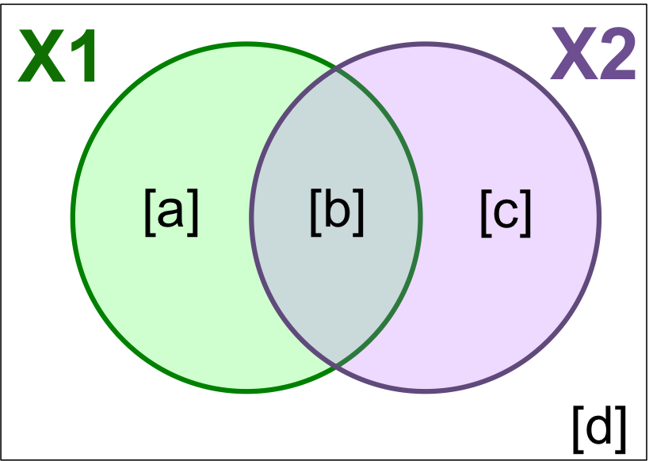
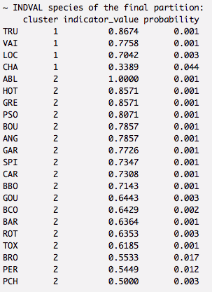
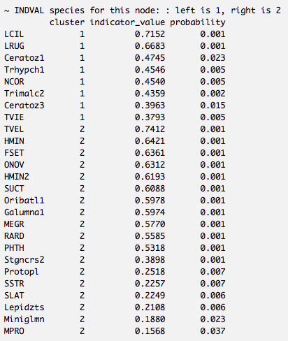

```{r setup, echo = F}
knitr::opts_chunk$set(
  comment = "#",
  collapse = TRUE,
  warning = FALSE,
  message = FALSE,
  cache = TRUE,
  fig.width=6, fig.height=6,
  fig.retina = 3,
  fig.retina = 3,
  fig.align = 'center'
)
```


```{r, echo =F}
options(repos=structure(c(CRAN="http://cran.r-project.org")))
```

```{r, include = FALSE}
if (!require(vegan)) install.packages("vegan")
library(vegan)
if (!require(MASS)) install.packages("MASS")
library(MASS)
if (!require(labdsv)) install.packages("labdsv")
library(labdsv)
if (!require(devtools)) install.packages("devtools")
library(devtools)

if (!suppressPackageStartupMessages(require(mvpart))) {
  # file name
  f = file.path(tempdir(), "mvpart")
  # download package file
  download.file('https://cran.r-project.org/src/contrib/Archive/mvpart/mvpart_1.6-2.tar.gz', destfile = f, method = 'curl')
  # install from source
  system(paste('R CMD INSTALL', f))
}

# Dependendies for MVPARTwrap
if (!require(fBasic)) install.packages("fBasics")
library(fBasic)

if (!require(ade4)) install.packages("ade4")
library(ade4)

if (!suppressPackageStartupMessages(require(MVPARTwrap))) {
  # file name
  f = file.path(tempdir(), "MVPARTwrap")
  # download package file
  download.file('https://cran.r-project.org/src/contrib/Archive/MVPARTwrap/MVPARTwrap_0.1-9.2.tar.gz', destfile = f, method = 'curl')
  # install from source
  system(paste('R CMD INSTALL', f))
}
```

## Introduction

L'atelier précédent (#9) a offert un aperçu des analyses multivariées de base:

* Mesures de distances et transformations de données
* Groupement hiérarchique
* Ordinations sans contraintes (PCA, PCoA, CA, nmDS)  
<br>

Celles-ci permettent de relever des .alert[tendances] dans la structure des communautés d'espèces ou des descripteurs.
<br>

L'atelier #10 montre des analyses permettant d'explorer comment les variables environnementales .alert[**expliquent**] ces tendances.

---

## Introduction

Le présent atelier se concentrera sur les analyses .alert[**sous contraintes**]:

* Analyse canonique de redondances (ACR ou RDA)
* Partitionnement de la variation
* Arbre de régression multivarié (ARM ou MRT)
* Analyse linéaire discriminante (ALD ou LDA)
<br>

Ces analyses nous permettrons de .alert[**décrire**] et de .alert[**prédire**] les relations entre la structure des communautés et les variables environnementales.
<br>

On pourra alors .alert[**tester des hypothèses**]!

---

## Code et données

Lien vers le code et les jeux de données: [qcbs.ca/wiki/r_workshop10](http://qcbs.ca/wiki/r_atelier10)

Téléchargez le code R et les données requises pour cet atelier:
* Code R
* Données:
  * DoubsEnv
  * DoubsSpe
  * DoubsSpa
  * Données test pour l'analyse linéaire discriminante

---

## Librairies

Assurez-vous d'installer et d'importer les librairies suivantes dans R Studio (procédure fournie dans le code R):
* .comment[vegan] .small[(for multivariate analyses)]
* .comment[labdsv] .small[(pour identification d'espèces indicatrices pour l'arbre de régression multivarié))]
* .comment[plyr] .small[(classification pour l'analyse linéaire discriminante)]
* .comment[MASS] .small[(for l'analyse linéaire discriminante)]
* .comment[rdaTest] package .alert[(voir code R)]
* .comment[mvpart] package .alert[(voir code R)]
* .comment[MVPARTwrap] package .alert[(voir code R)]

---

## Suivre l'atelier

Quelques conseils:
* Créez votre propre code (ou commentez le code R fourni)
* Évitez de copier-coller, ou d'exécuter le code directement du script fourni
* N'oubliez pas de bien définir votre répertoire de travail (le dossier contenant les fichiers requises pour l'atelier)

---

class: inverse, center, middle

# Exploration et préparation des données

---

## Introduction aux données  

#### Rivière Doubs (Verneaux 1973)

.pull-left[Données d'abondances d'espèces de communautés de poissons de la rivière Doubs.
 * 27 espèces
 * 30 sites
 * 11 variables environnementales


 ]

.pull-right[

]

---

## Charger les données

.alert[Assurez-vous que les fichiers se trouvent dans votre répertoire de travail!]

Chargez la matrice d'abondances d'espèces (*doubsspe.csv*):  

```{r, echo = TRUE}
# Assurez vous que les fichiers se trouvent dans votre répertoire de travail!
spe <- read.csv("data/doubsspe.csv", row.names = 1)
spe <- spe[-8,] # Supprimer site 8 (pas d'espèces).
```

Chargez la matrice de données environnementales (*doubsenv.csv* ):  

```{r, echo = TRUE}
env <- read.csv("data/doubsenv.csv", row.names = 1)
env <- env[-8,] # Supprimer site 8 (pas d'espèces).
```  

.alert[Note]: N'exécuter qu'une seule fois!

---

## Données d'abondances d'espèces

Explorons la matrice des abondances d'espèces:
```{r, echo = TRUE, results = 'hide'}
names(spe) # voir les noms des colonnes (espèces)
dim(spe) # dimensions de la matrice
head(spe) # 5 premières lignes
str(spe) # structure interne de la matrice
summary(spe) # statistiques descriptives des objets (min, moyenne, max, etc.)
```

```{r, echo = FALSE}
dim(spe)
```
---

## Distribution des abondances d'espèces

Explorons la structure de la communauté:
```{r, echo = TRUE, results = 'hide', fig.width = 6, fig.height = 3.5}
# Compter la fréquence d'espèces dans chaque classe d'abondance
ab <- table(unlist(spe))
# Visualiser cette distribution
barplot(ab, las = 1,
        xlab = "Abundance class", ylab = "Frequency",
        col = grey(5:0/5))
```
.alert[Notice]: Il y a beaucoup de zéros.

---

## Distribution des abondances d'espèces

Comptez le nombre absences dans les données d'abondances.
```{r}
sum(spe == 0)
```
<br>
Regardez la proportion d'absences dans les données d'abondances.
```{r}
sum(spe == 0)/(nrow(spe)*ncol(spe))
```

---

## Transformation des données d'abondances

.alert[**Plus de 50%**] des données d'abondances consiste d'absences. C'est élevé, mais pas inhabituel pour ce type de données.
<br>  
Par contre, il faut éviter que les **double zéros** soient considérés comme une similarité entre sites.
* Nous appliquerons alors une .alert[transformation Hellinger] aux données d'abondances d'espèces.
<br>  
```{r}
# a fonction decostand() dans la libraire vegan nous facilite la tâche:
library(vegan)
spe.hel <- decostand(spe, method = "hellinger")
```

---

## Données environnementales

Explorons les données environnementales:
```{r, echo = TRUE, results = 'hide'}
names(env) # noms des objets (variables environnementales)
dim(env) # dimensions de la matrice
head(env) # 5 premières lignes
str(env) # structure des objets
summary(env) # statistiques descriptives (min, moyenne, max, etc.)
```

```{r, echo = FALSE}
names(env) # noms des objets (variables environnementales)
dim(env) # structure des objets
```

---

## Colinéarité

```{r, fig.height = 5, fig.width = 9}
# On peut également détecter (visuellement) les colinéarités entres variables:
pairs(env)
```
.alert[Note:] Colinéarité entre quelques variables... .small[(das vs. alt, das vs. deb, das vs. dur, das vs. nit, oxy vs. dbo, etc.)]

---
## Standardisation des données

Il est impossible de comparer les effets de variables d'unités différentes.  
<br>
Avant d'effectuer les analyses qui suivent, les données doivent donc être .alert[standardisées].

```{r}
# standardiser les données
env.z <- decostand(env, method = "standardize")

# centrer les données (moyenne ~ 0)
round(apply(env.z, 2, mean), 1)

# réduire les données (écart type = 1)
apply(env.z, 2, sd)
```

---

class: inverse, center, middle

# Analyses canoniques

---

## Analyses canoniques

Les analyses canoniques nous permettent:
- d'identifier les .comment[relations] entre un ensemble de variables réponses et un ensemble de variables explicatives
- de tester des .alert[hypothèses écologiques] à propos de ces relations
- de faire des .comment[prédictions]

---

class: inverse, center, middle

# Analyses canoniques
## Analyse canonique de redondances (RDA)

---

## Analyse canonique de redondances (RDA)

L'analyse canonique de redondances est une ordination .alert[sous contraintes].
- extension directe de la régression multiple.
- modélise l’effet d’une matrice X .small[(variables explicatives)] sur une matrice Y .small[(variables réponses)]

.center[ ]

Variables peuvent être quantitatives, qualitatives, ou binaires (0/1).
- .alert[transformez] et .alert[standardisez] les variables avant d'effectuer une RDA.

---
## Effectuer une RDA dans R

Préparer les données
```{r}
# On utilisera nos données explicatives standardisées
# Enlever la variable "distance from the source" (colinéarity avec plusieurs variables)
env.z <- subset(env.z, select = -das)
```

--
Effectuer une RDA
```{r}
# Modèlise l'effect de tous les variables environnementales sur la composition en espèces des communautés
spe.rda <- rda(spe.hel ~ ., data = env.z)
```

--
Extraire les résultats de la RDA
```{r, eval = FALSE, results = 'hide'}
summary(spe.rda, display = NULL)
```

---

## Sortie d'une RDA

.center[ ]

* **Constrained Proportion**: variance de Y expliquée par X .alert[(73.41%)]
* **Unconstained Proportion**: variance in Y non expliquée par .alert[(26.59%)]  

  <br>

.small[Les variables environnementales mesurées expliquent .alert[73.41%] de la variation dans la composition en espèces des communautés de poissons dans la rivière Doubs.]

---

## Sélection de variables

Une .alert[sélection progressive] peut être effectuée afin de sélectionner les variables explicatives significatives.

<br>
.comment[**Quelles variables contribuent de façon significative au pouvoir explicatif du modèle?**]
--
```{r}
# Sélection progressive de variables:
fwd.sel <- ordiR2step(rda(spe.hel ~ 1, data = env.z), # modèle le plus simple
               scope = formula(spe.rda), # modèle "complet"
               direction = "forward",
               R2scope = TRUE, # limité par le R2 du modèle "complet"
               pstep = 1000,
               trace = FALSE) # mettre TRUE pour voir le processus du sélection!
```

.small[Essentiellement, on ajoute une variable à la fois au modèle, et on retient la variable si elle augmente significativement le R2 ajusté du modèle.]

---

## Sélection de variables

- Quelles variables ont été sélectionnées?
```{r}
fwd.sel$call
```

--

- Quel est le R2 ajusté d'une RDA incluant seulement les variables significatives?
```{r}
spe.rda.signif <- rda(spe.hel ~ alt + oxy + dbo, data = env.z)
RsquareAdj(spe.rda.signif)
```

---

## Tester la significativité d'une RDA

Utilisez .alert[anova.cca()] pour tester la significativité globale de notre RDA
```{r}
anova.cca(spe.rda.signif, step = 1000)
```

On peut aussi tester la significativité des axes!
```{r, results = 'hide'}
anova.cca(spe.rda.signif, step = 1000, by = "axis")
```

---

## Représentation graphique des RDAs

Une RDA permet la **visualization simultanée** des variables réponses et explicatives .comment[(i.e. espèces et variables environmentales)].
<br>
--
<br>
Comme pour la PCA, on doit choisir le .alert[cadrage]:
<br>

| Type 1                                           | Type 2                                            |
| -------------------------------------------------|---------------------------------------------------|
| distances entre objects ≈ distances euclidiennes | angles entre variables ≈ leur corrélation         |


---

## Triplot RDA: Cadrage de type 1

.pull-left[
```{r, fig.height = 6.5, fig.width = 6, strip.white = TRUE}
ordiplot(spe.rda.signif,
         scaling = 1,
         type = "text")
```
]

.pull-right[
######Le cadrage 1 permet d'interpréter les .alert[distances] entre objets (espèces).

.small[
* Les communautés dans les sites (chiffres) .comment[plus rapprochés] ont des compositions plus similaires.  
* Les espèces .comment[plus rapprochés] occupent souvent les mêmes sites.  
]
]

---

## Triplot RDA: Cadrage de type 2

.pull-left[
```{r, fig.height = 6.5, fig.width = 6, strip.white = TRUE}
ordiplot(spe.rda.signif,
         scaling = 2,
         type = "text")
```
]

.pull-right[
######Le cadrage 2 permet d’interpréter les .alert[relations] entre variables X et Y.
.small[
* .comment[Longues] flèches = cette variable explique fortement la variation dans la matrice Y d'abondances
* Flèches pointant des .comment[directions opposées] = relation négative
* Flèches pointant la .comment[même direction] = relation positive
]
]

---

## Configuration des triplots RDA

Les fonctions plot() et ordiplot() produisent des triplots rapidement et facilement, mais on peut aussi configurer les graphiques manuellement.

```{r, echo = FALSE}
plot(spe.rda.signif, scaling=1, main="Triplot RDA - scaling 1", type="none", xlab=c("RDA1"), ylab=c("RDA2"), xlim=c(-1,1), ylim=c(-1,1))
points(scores(spe.rda.signif, display="sites", choices=c(1,2), scaling=1),
       pch=21, col="black", bg="steelblue", cex=1.2)
points(scores(spe.rda.signif, display="species", choices=c(1,2), scaling=1),
       pch=22, col="black", bg = "#FEC44F", cex=1.2)
text(x = (scores(spe.rda.signif, display="species", choices=c(1), scaling=1)+0.09),
     y = (scores(spe.rda.signif, display="species", choices=c(2), scaling=1)),
     labels=rownames(scores(spe.rda.signif, display="species", scaling=1)),
     col="black", cex=0.6)    
arrows(0,0,
       scores(spe.rda.signif, display="bp", choices=c(1), scaling=1),
       scores(spe.rda.signif, display="bp", choices=c(2), scaling=1),
       col="#CC3311", lwd = 3)
text(x = scores(spe.rda.signif, display="bp", choices=c(1), scaling=1)-0.1,
     y = scores(spe.rda.signif, display="bp", choices=c(2), scaling=1)-0.03,
     labels=rownames(scores(spe.rda.signif, display="bp", choices=c(2), scaling=1)),
     col="#CC3311", cex=1, font = 2)
```

Voir le wiki pour plus de détails!

---

## Défi 1 

Effectuer une RDA pour modèliser les effect des variables environnementales (.comment[mite.env]) sur l’abondance des espèces d'acariens (.comment[mite]).
<br>
.small[
Chargez les données:
```{r}
# Charger les données d'abondance des espèces d'acariens
data("mite")

# Charger les données environnementales
data("mite.env")
```

Rappel de fonctions utiles:
```{r, eval = FALSE}
decostand()
rda()
ordiR2step()
anova.cca()
ordiplot()
```
]

---

## Défi 1: Solution

Étape 1: Préparer les données
```{r}
# Transformer les données d'abondances
mite.spe.hel <- decostand(mite, method = "hellinger")

# Standardiser les données environmentales quantiatives
mite.env$SubsDens <- decostand(mite.env$SubsDens, method = "standardize")
mite.env$WatrCont <- decostand(mite.env$WatrCont, method = "standardize")
```

---

## Défi 1: Solution

Étape 2: Sélectionner les variables environnementales
```{r}
# RDA avec tous les variables environnementales
mite.spe.rda <- rda(mite.spe.hel ~ ., data = mite.env)

# Sélection progressive des variables environnementales significatives
fwd.sel <- ordiR2step(rda(mite.spe.hel ~ 1, data = mite.env),
                      scope = formula(mite.spe.rda),
                      direction = "forward",
                      R2scope = TRUE, pstep = 1000, trace = FALSE)
fwd.sel$call
```

---

## Défi 1: Solution

Étape 3: Effectuer l'RDA et extraire le R2 ajusté
```{r}
# Refaire la RDA avec seulement les variables significatives
mite.spe.rda.signif <- rda(mite.spe.hel ~ WatrCont + Shrub +
                           Substrate + Topo + SubsDens,
                           data = mite.env)

# Calculer le R2 ajusté
RsquareAdj(mite.spe.rda.signif)$adj.r.squared

```

---

## Défi 1: Solution

Étape 4: Tester la significativité globale du modèle
```{r}
anova.cca(mite.spe.rda.signif, step = 1000)
```

Les variables environnementales sélectionnées expliquent .alert[43.7% (p = 0.001)] de la variation dans la composition de communautés des acariens.

---

## Défi 1: Solution

Étape 5: Triplot!
.pull-left[
```{r, fig.height = 6.5}
ordiplot(mite.spe.rda.signif,
         scaling = 1,
         main = "Cadrage 1")
```
]
.pull-right[
```{r, fig.height = 6.5}
ordiplot(mite.spe.rda.signif,
         scaling = 2,
         main = "Cadrage 2")
```

]

---

class: inverse, center, middle

# Analyses canoniques
## RDA partielle

---

## RDA partielle

* Cas particulier de la RDA en présence d’une matrice W de variables explicatives additionnelles, appelées co-variables
  * Modèle linéaire de l’effet de X sur Y, ajusté pour tenir compte de l’effet des .alert[co-variables W].

.center[ ]

---

## Applications de la RDA partielle

* Évaluer l’effet de variables environnementales sur la composition des communautés, prenant en compte l'.alert[effet de covariables] de moindre intérêt.
* .alert[Isoler] les effets d'un ou plusieurs groupes de variables explicatives.

.center[ ]

---
## RDA partielle: données Doubs

Évaluons l'effet de la .comment[chimie de l'eau] (X) sur l’abondance des poissons en tenant compte de .comment[covariables topographiques] (W).

```{r}
# Divisez le tableau de données environnementales en deux:
# variables topographiques et chimiques
env.topo <- subset(env.z, select = c(alt, pen, deb))
env.chem <- subset(env.z, select = c(pH, dur, pho, nit, amm, oxy, dbo))

# Faire la RDA partielle
spe.partial.rda <- rda(spe.hel, env.chem, env.topo)
```

--

.small[
.alert[Note]: Syntaxe alternative pour une RDA partielle:
```{r, eval = FALSE}
spe.partial.rda <- rda(spe.hel ~ pH + dur + pho + nit + amm + oxy + dbo +
                       Condition(alt + pen + deb),
                       data = env.z)
```
]

---
## Résultats d'une RDA partielle

```{r, eval = FALSE, results = 'hide'}
# Extraire les résultats
summary(spe.partial.rda, display = NULL)
```

.center[ ]

.small[
* **Conditioned Proportion**:  variance de Y expliquée par W .alert[(41.53%)]
* **Constrained Proportion**: variance de Y expliquée par X .alert[(31.89%)]
* **Unconstained Proportion**: variance de Y non expliquée .alert[(26.59%)]  

  <br>
.comment[La chimie de l’eau explique .alert[31.89%] de l’abondance des espèces de poissons, tandis que la topographie explique .alert[41.53%] de la variation en abondances des poissons.]
]

---

## Tester la significativité

Extraire le R2 ajusté du modèle:
```{r}
RsquareAdj(spe.partial.rda)$adj.r.squared
```

--

Ensuite, tester la significativité globale de notre RDA partielle
```{r}
anova.cca(spe.partial.rda, step = 1000)
```

---

## Représentation graphique

.small[
```{r}
ordiplot(spe.partial.rda, scaling = 2,
         main = "Doubs River partial RDA - Scaling 2")
```
--

.alert[Note]: Les variables topographiques ne sont pas représentées. Pourquoi?]

---

## Défi 2 

.small[
Effectuez une RDA partielle de l’abondance des espèces de mites en fonction des variables environnementales, tenant compte de l’effet du substrat (SubsDens, WaterCont and Substrate).
* Quel pourcentage de variance est expliqué par les variables environnementales?
* Le modèle est-il significatif?
* Quels sont les axes significatifs?

<br>

Rappel des données et fonctions utiles:
```{r, eval = FALSE}
mite.spe.hel
mite.env
rda()
summary()
RsquareAdj()
anova.cca()
```
]

---

## Défi 2: Solution

Nos données sont déjà transformés et standardisés.
<br>
Commençons alors par la RDA partielle:
```{r, results = 'hide'}
mite.spe.subs <- rda(mite.spe.hel ~ Shrub + Topo
                     + Condition(SubsDens + WatrCont + Substrate),
                     data = mite.env)

# Extraire les résultats
summary(mite.spe.subs, display = NULL)
```
--
Shrub et Topo expliquent .alert[9.8%] de la variation de l’abondance de mites, tandis que le substrat explique .alert[42.8%] de cette variation.

---

## Défi 2: Solution

* Le modèle est-il significatif?
```{r}
anova.cca(mite.spe.subs, step = 1000)
```

---

## Défi 2: Solution

* Quels sont les axes significatifs?
```{r}
anova.cca(mite.spe.subs, step = 1000, by = "axis")
```

---

class: inverse, center, middle

# Analyses canoniques
## Partitionnement de la variation

---

## Partitionnement de la variation

Divise la variation d’une matrice de variable réponse en 2, 3, ou 4 matrices de variables explicatives.
* e.g. variables locales vs. à large échelle
* e.g. abiotique vs. biotique  

<br>
.center[]

---

## Partitionnement de la variation

.center[]

---

## Partitionnement de la variation dans R

.small[.alert[Note]: Assurez-vous que la libraire *vegan* est chargée!

```{r}
spe.part.all <- varpart(spe.hel, env.chem, env.topo)
spe.part.all$part # extraire résultats
```
]

---

## Diagramme Venn

```{r, strip.white = TRUE, fig.width = 6, fig.height = 6}
plot(spe.part.all,
     Xnames = c("Chem", "Topo"), # noms des matrices explicatives
     bg = c("seagreen3", "mediumpurple"), alpha = 80,
     digits = 2,
     cex = 1.5)
```

---

## Tester la significativité

.center[]

* La significativité de la fraction partagée [b] ne peut .alert[pas] être testée.
* Mais, on peut tester la significativité des autres fractions!

---

## Significativité: X1 [a+b]

.center[]

.small[
[a+b] Chimie sans tenir compte de topographie
```{r}
anova.cca(rda(spe.hel, env.chem))
```
]

---

## Significativité: X2 [b+c]

.center[]

.small[
[b+c] Topographie sans tenir compte de chimie
```{r}
anova.cca(rda(spe.hel, env.topo))
```
]

---

## Significativité: Fractions individuelles

.center[]
.small[
[a] Chimie (ajusté pour tenir compte de topographie)
```{r}
anova.cca(rda(spe.hel, env.chem, env.topo))
```

.alert[Note:] Remarquez qu'il s'agit d'une RDA partielle!
]

---

## Significativité: Fractions individuelles

.center[]

.small[
[c] Topographie (ajusté pour tenir compte de chimie)
```{r}
anova.cca(rda(spe.hel, env.topo, env.chem))
```
]

---

## Défi 3 

.small[
Partitionnez la variation de l’abondance des espèces de mites entres des variables de substrat (SubsDens, WaterCont) et des variables spatiales significatives.
* Quelle est la proportion de variance expliquée par le substrat? par l'espace?
* Quelles sont les fractions significatives?
* Diagramme Venn des résultats!


Chargez les variables spatiales:
```{r}
data("mite.pcnm")
```

Rappel de fonctions utiles:
```{r, eval = FALSE}
ordiR2step()
varpart()
anova.cca(rda())
plot()
```
]

---

## Défi 3: Solution

Étape 1: Sélection de variables spatiales significatives
```{r}
# Modèle RDA avec tous les variables spatiales
full.spat <- rda(mite.spe.hel ~ ., data = mite.pcnm)

# Sélection progressive des variables spatiales
spat.sel <- ordiR2step(rda(mite.spe.hel ~ 1, data = mite.pcnm),
               scope = formula(full.spat),
               R2scope = RsquareAdj(full.spat)$adj.r.squared,
               direction = "forward",
               trace = FALSE)
spat.sel$call
```

---

## Défi 3: Solution

Étape 2: Créer sous-groupes de variables explicatives
```{r}
# Variables de substrat
mite.subs <- subset(mite.env, select = c(SubsDens, WatrCont))

# Variables spatiales significatives
mite.spat <- subset(mite.pcnm,
                    select = names(spat.sel$terminfo$ordered))
                    # pour rapidement accèder aux variables sélectionnées
```

---

## Défi 3: Solution

Étape 3: Partitionnement de la variation
```{r}
mite.part <- varpart(mite.spe.hel, mite.subs, mite.spat)
mite.part$part$indfract # extraire résultats
```

* Quelle est la proportion de variance expliquée par le substrat?  
 * .alert[5.9%]

* Quelle est la proportion de variance expliquée par l'espace?
  * .alert[19.4%]

---

## Défi 3: Solution

Étape 4: Quelles sont les fractions significatives?
```{r, results = 'hide'}
# [a]: Substrat seulement
anova.cca(rda(mite.spe.hel, mite.subs, mite.spat))
# p = 0.001 ***

# [c]: Espace seulement
anova.cca(rda(mite.spe.hel, mite.spat, mite.subs))
# p = 0.001 ***
```

--
.comment[Alors, quels sont les effets de substrat et de l'espace sur les abondances d'espèces de mites?]

---

## Défi 3: Solution

Étape 5: Diagramme Venn
```{r, fig.height=6, fig.width=6}
plot(mite.part, digits = 2, cex = 1.5,
     bg = c("pink", "skyblue"), alpha = 90)
```

---

class: inverse, center, middle
# Arbre de régression multivarié (MRT)

---

## Arbre de régression multivarié (MRT)

.center[]

L'arbre de régression multivarié (ARM ou MRT) est une méthode de groupement hiérarchique sous contrainte.
* Partitionne une matrice réponse quantitative (Y) en sous-groupes sous la contrainte d'une matrice de variables explicatives (X).

---

## Arbre de régression multivarié (MRT)

.center[]

L'arbre de régression multivarié consiste de:
* .alert[Branches]: chaque lignée formée par un noeud
* .alert[Noeuds]: Point où les données se divisent en 2 groupes (caractérisé par une valeur limite d'une variable explicative)
* .alert[Feuilles]: groupe terminal de sites

---

## Arbre de régression multivarié (MRT)

Plusieurs avantages:
* N'assume pas de relation linéaire entre les matrices Y et X
* Facile à interpréter et à visualiser
* Robuste en présence de valeurs manquantes ou de colinéarité(s) entre les descripteurs
* Valeurs brutes peuvent être utilisées (sans transformation)

---

## MRT: La méthode

La méthode implique deux volets s'effectuant en parallèle:
1. .comment[Partitionnement] des données sous contrainte
2. .comment[Validation croisée] pour identifier l'arbre ayant le meilleur pouvoir prédictif.  
<br>  

Choisissez l'arbre selon les objectifs de ton étude. Généralement, on veut un arbre:
* .comment[parcimonieux]
* mais avec un nombre .comment[informatif] de groupes
* Essentiellement: quel arbre répond à ta question?

---
## MRT dans R

```{r, results = 'hide', fig.show = 'hide', eval = F}
# Enlever la variable “distance from source”
env <- subset(env, select = -das)

# Créer l'arbre de regression multivarié
# library(mvpart)
doubs.mrt <- mvpart(as.matrix(spe.hel) ~ ., data = env,
                    xv = "pick", # selection graphique intéractive
                    xval = nrow(spe.hel), # nombre de validations
                    xvmult = 100, # nombre de validations multiples
                    which = 4, # identifier les noeuds
                    legend = FALSE, margin = 0.01, cp = 0)
```

---

## MRT dans R: Choisir un arbre

```{r, echo = FALSE, results = 'hide', fig.height = 5, fig.width = 5.5, fig.align = 'center'}
doubs.mrt <- mvpart(as.matrix(spe.hel) ~ ., data = env,
                    xv = "pick",
                    xval = nrow(spe.hel),
                    xvmult = 100,
                    which = 4,
                    legend = FALSE, margin = 0.01, cp = 0, plot.add = FALSE)
```
.small[
* Points verts: Erreur relative
* Points bleus: Erreur relative de validation croisée (CVRE)
* Point rouge: Arbre avec la valeur minimale de CVRE
* Point orange: l'arbre le plus petit ayant un CVRE à 1 écart type du CVRE minimal
* Barres vertes: # de fois que chaque taille d'arbre a été choisi
]

---

## MRT dans R: Choisir un arbre

```{r, echo = FALSE, results = 'hide', fig.height = 5, fig.width = 5.5, fig.align = 'center', eval =F}
doubs.mrt <- mvpart(as.matrix(spe.hel) ~ ., data = env,
                    xv = "pick",
                    xval = nrow(spe.hel),
                    xvmult = 100,  cross-validations
                    which = 4,
                    legend = FALSE, margin = 0.01, cp = 0,
                    plot.add = FALSE)
```

.small[
* Cliquez sur le point bleu correspondant à la taille de l'arbre choisie!
* Puisqu'on ne sait pas *a priori* comment partitionner ces données, on choisira .comment[l'arbre le plus petit ayant un CVRE à 1 écart type du CVRE minimal] (i.e. le point orange).
]

---

## MRT dans R: Visualisation

```{r, echo = FALSE, results = 'hide', fig.height = 5.5, fig.width = 5.5}
doubs.mrt <- mvpart(as.matrix(spe.hel) ~ ., data = env,
                    xv = "1se",
                    xval = nrow(spe.hel),
                    xvse = 1,
                    xvmult = 100,
                    which = 4,
                    legend = FALSE, margin = 0.01, cp = 0, prn = FALSE)
```
.small[
* La matrice d'abondances est partitionnée selon un seuil d'.alert[altitude (361.5)].
  * "Barplots": abondances d'espèces inclus dans chaque groupe
* Erreur résiduelle = 0.563, alors le R2 du modèle est .alert[43.7%]
]

---

## MRT dans R: Comparaison d'arbres

Pour choisir un arbre, on peut aussi comparer plusieurs solutions possibles.

Par exemple, considérons une solution de 10 groupes!
```{r, echo = FALSE, results = 'hide', fig.height = 4.5, fig.width = 12}
mvpart(as.matrix(spe.hel) ~ ., data = env,
        xv = "none", # no cross-validation
        size = 10, # set tree size
        which = 4,
        legend = FALSE, margin = 0.01, cp = 0, prn = FALSE)
```

.small[
* L'interprétation est .alert[plus difficile].
* Plus grand pouvoir explicatif, MAIS le pouvoir prédictif (CV Error = 0.671) ressemble à la solution précédante (CV Error = 0.673).
]

---

## MRT dans R: Comparaison d'arbres

Considérons une solution avec moins (4) de groupes!
.tiny[
```{r, echo = FALSE, results = 'hide', fig.height = 4.5, fig.width =8}
mvpart(as.matrix(spe.hel) ~ ., data = env,
        xv = "none", # no cross-validation
        size = 4, # set tree size
        which = 4,
        legend = FALSE, margin = 0.01, cp = 0, prn = FALSE)
```
]
.small[
* Plus facile à interpréter!
* Plus grand pouvoir explicatif .alert[(Error)] que notre solution originale
* .alert[Plus grand pouvoir prédictif] que les 2 solutions précédantes (CV Error)
]

---

## MRT dans R: Paramètre de complexité

Le .comment[paramètre de complexité (CP)] représente la variance expliquée par chaque noeud.
```{r}
doubs.mrt$cptable
```

* CP @ nsplit 0 = R2 de l'arbre au complet
* CP @ autres neouds = R2 de chaque noeud (voir sommaire complet pour la valeur de seuil de chaque noeud)

---

## MRT dans R: Sommaire des résultats

Pour accèder au sommaire des résultats:
.tiny[
```{r}
summary(doubs.mrt)
```
]

---

## MRT dans R: Espèces discriminantes

On peut aussi déterminer quels espèces contribuent le plus à la variance expliquée par chaque noeud (.alert[espèces discriminantes]), ou quels sites sont inclus dans chaque feuille (groupe).
<br>  
Pour ceci, on peut utiliser la libraire .comment[MVPARTwrap]:
```{r, results = 'hide'}
# library(MVPARTwrap)

# Créer un sommaire plus informatif et moins dense
doubs.mrt.wrap <- MRT(doubs.mrt, percent = 10, species = colnames(spe.hel))

# Voir le sommaire
summary(doubs.mrt.wrap)
```

---

## MRT dans R: Espèces discriminantes

Pour voir la contribution de chaque espèce à la variance expliquée par noeud:
```{r, eval = FALSE, results = 'hide'}
summary(doubs.mrt.wrap)
```

.center[]

---

## MRT dans R: Espèces discriminantes

Pour déterminer les espèces discriminantes .alert[significatives] pour chaque groupe:

.tiny[
```{r}
library(labdsv)

# Calcul d'une valeur indval pour chaque espèce
doubs.mrt.indval <- indval(spe.hel, doubs.mrt$where)

# Extraire les espèces indicatrices à chaque noeud
doubs.mrt.indval$maxcls[which(doubs.mrt.indval$pval <= 0.05)]

# Extraire leur valeur indval
doubs.mrt.indval$indcls[which(doubs.mrt.indval$pval <= 0.05)]
```
]

* Les principales espèces discriminantes au premier noeud sont TRU, VAI et ABL.
* TRU et VAI contribuent beaucoup à la branche de gauche, alors que ABL est davantage indicatrice des sites à basse altitude (<361.5m).

---

## Défi 4 

.small[
Créez un arbre de régression multivarié pour les données .comment[mite].
* Choisir l'arbre le plus petit à 1 écart type du CVRE minimal.
* Quelle est la variance totale expliquée par cet arbre?
* Combien y a-t-il de feuilles?
* Quels sont les 3 principales espèces discriminantes?
]
<br>
.small[
Rappel: chargez les données!
```{r}
data("mite")
data("mite.env")
```

Rappel de fonctions utiles:
```{r, eval = FALSE}
?mvpart() # argument 'xv'!
?MRT()
summary()
```
]
---

## Défi 4: Solution

Étape 1: Créer un arbre de régression multivarié
```{r, results = 'hide', fig.height = 4.5, fig.width = 4.5}
mite.mrt <- mvpart(as.matrix(mite.spe.hel) ~ ., data = mite.env,
                   xv = "1se",
                   xval = nrow(mite.spe.hel),
                   xvmult = 100,
                   which = 4, legend = FALSE, margin = 0.01, cp = 0,
                   prn = FALSE)
```

---

## Défi 4: Solution

```{r, echo = FALSE, results = 'hide', fig.height = 5, fig.width = 5}
mite.mrt <- mvpart(as.matrix(mite.spe.hel) ~ ., data = mite.env,
                   xv = "1se", # choose smallest tree within 1 SE
                   xval = nrow(mite.spe.hel),
                   xvmult = 100,
                   which = 4, legend = FALSE, margin = 0.01,
                   cp = 0, prn = FALSE)
```
.small[
* Quelle est la variance totale expliquée (R2) par cet arbre?
  * 1 - Error = 0.252, alors l'arbre explique .alert[25.2%] de la variantion dans la matrice d'abondances.

* Combien y a-t-il de feuilles?
  * 2 feuilles
]

---

## Défi 4: Solution


Quels sont les 3 principales espèces discriminantes pour .alert[noeud #1]?
```{r, results = 'hide'}
# Créer sommaire plus informatif
mite.mrt.wrap <- MRT(mite.mrt,
                     percent = 10,
                     species = colnames(mite.spe.hel))

# Voir sommaire (pour voir les espèces discriminantes)
summary(mite.mrt.wrap)
```

---

## Défi 4: Solution

Quels sont les 3 principales espèces discriminantes pour .alert[noeud #1]?
* LCIL, LRUG, Ceratoz1

.center[]

---

class: inverse, center, middle
# Analyse discriminante linéaire (LDA)

---

## Analyse discriminante linéaire (LDA)

* Détermine si une matrice de variables indépendantes explique bien un groupement établi *a priori*
  * e.g. prédire l’appartenance d’une espèce de poisson à un groupe (marin vs. eau douce) selon sa morphologie

.center[]

---

## LDA dans R: Rivière Doubs

Généralement, les variables environnementales changent avec la latitude.  

<br>  
--
.comment[Si on classifie les sites de la rivière Doubs selon la latitude, à quel point les variables environnementales expliquent-elles ces groupements?]  
* Une LDA permet de répondre à cette question.

---

## LDA dans R: Rivière Doubs

Commençons par charger les données spatiales des sites:
```{r}
# charger les données spatiales des sites Doubs:
spa <- read.csv("data/doubsspa.csv", row.names = 1)
spa$site <- 1:nrow(spa) # assigner un chiffre par site
spa <- spa[-8,] # enlever le site #8
```

--

Ensuite, on peut classifier les sites dans 3 groupes de latitudes:
```{r}
spa$group <- NA # créer colonne "group"
spa$group[which(spa$y < 82)] <- 1
spa$group[which(spa$y > 82 & spa$y < 156)] <- 2
spa$group[which(spa$y > 156)] <- 3
```

---

## LDA dans R: Rivière Doubs

Visualisons ces regroupements par latitude:
```{r, fig.width = 5.5, fig.height = 5.5}
plot(spa$x, spa$y, col = spa$group, pch = 16, cex = 1.5)
```

---

## LDA dans R

.alert[Note]: Normalement, nous devons vérifier que les matrices de covariance des variables explicatives sont homogènes (voir Borcard et al. 2011).

Pour les besoins de l'atelier, on passera directement à la LDA:
```{r}
# charger la libraire requise
library(MASS)

# faire la LDA
LDA <- lda(env, spa$group)
```

---

## LDA dans R: Vérification

.small[On peut ensuite voir comment les sites sont classifiés, et si cette classification est exacte.

```{r}
# classification des objets en fonction de la LDA
spe.class <- predict(LDA)$class

# probabilités que les objets appartiennent à chaque groupe a posteriori
spe.post <- predict(LDA)$posterior

# tableau des classifications a priori et prédites
(spe.table <- table(spa$group, spe.class))

# proportion de classification correcte
diag(prop.table(spe.table, 1))
```

Tous les sites ont été correctement classifiés dans leur groupe de latitude en fonction des variables environnementales.]

---

## LDA dans R: Prédictions

On peut maintenant utiliser la LDA pour classifier de nouveaux sites dans les groupes de latitude.
--

Tentons de .alert[prédire la classification] de 5 nouveaux sites à l'aide de notre LDA:
.small[
```{r}
# charger les nouvelles données
classify.me <- read.csv("data/classifyme.csv", header = TRUE)
# classify.me <- classify.me[,-1] # remove das variable

# prédire le groupement des nouvelles données
predict.group <- predict(LDA, newdata = classify.me)

# donner la classification pour chaque site
predict.group$class
```
]

---

## Défi 5 

.small[Créez 4 groupes de latitude à partir des données .comment[mite.xy]. Ensuite, une LDA sur les données environnementales .comment[(mite.env)] des acariens (.comment[SubsDens] et .comment[WatrCont]).
* Quelle proportion de sites ont été classifiés correctement au groupe 1? Au groupe 2?

<br>
Chargez .comment[mite.xy]:
```{r}
data(mite.xy)
```

Rappel de fonctions utiles:
```{r, eval = FALSE}
lda()
predict()
table()
diag()
```
]

---

## Défi 5: Solution

Étape 1: Créer 4 groupes de latitude
.small[
```{r}
# numéroter les sites
mite.xy$site <- 1:nrow(mite.xy)

# trouver une étendue égale de latitudes par groupe
(max(mite.xy[,2])-min(mite.xy[,2]))/4

# classifier les sites dans 4 groupes de latitude
mite.xy$group <- NA # nouvelle colonne "group"
mite.xy$group[which(mite.xy$y < 2.5)] <- 1
mite.xy$group[which(mite.xy$y >= 2.5 & mite.xy$y < 4.9)] <- 2
mite.xy$group[which(mite.xy$y >= 4.9 & mite.xy$y < 7.3)] <- 3
mite.xy$group[which(mite.xy$y >= 7.3)] <- 4
```
]

Étape 2: Faire la LDA
.small[
```{r}
LDA.mite <- lda(mite.env[,1:2], mite.xy$group)
```
]

---

## Défi 5: Solution

Étape 3: Vérifier la classification
.small[
```{r}
# classification des objects en fonction de la LDA
mite.class <- predict(LDA.mite)$class
# tableeau de classifications  (prior versus predicted)
(mite.table <- table(mite.xy$group, mite.class))
# proportion de classifications exactes
diag(prop.table(mite.table, 1))
```

Quelle proportion de sites ont été classifiés correctement au groupe 1? Au groupe 2?
* .alert[60%] des sites ont été classifiés correctement dans group1, et .alert[64.7%] dans group2.]

---

class: inverse, center, bottom

# Merci d'avoir participé à cet atelier!


